# Hacking 101: The Anatomy of Web Application Attacks

Step into the mindset of a hacker and uncover how web application vulnerabilities are identified through web protocols and session behaviors. In this hands-on lab, you'll learn to recognize and exploit critical security weaknesses commonly targeted by attackers. Through a few interactive exercises and a deliberately vulnerable web application, you'll explore real-world attack scenarios and practical demonstrations. This lab will walk you through the process of exploiting these flaws while also teaching you how to defend against them. By the end, not only will you understand how these vulnerabilities are leveraged, you'll understand how to apply secure development practices to build more resilient web applications.

## Learning Objectives
Upon completion of this lab, you will be able to:

- Understand 3 of the Top 10 OWASP web application vulnerabilities 
    - SQL Injection 
    - Cross Site Scripting (XSS)
        - DOM-Based 
        - Reflected
        - Stored
    - Cross Site Request Forgery (CSRF)
- Exploit basic real-world like vulnerabilities in a controlled environment
- Learn how to mitigate these attacks through best practices

## Scenarios
In this lab, you will step into the role of both an ethical hacker and a defender as you explore attacking common web application vulnerabilities in a controlled environment. You will be guided through tasks and steps where you will learn how attackers exploit SQL injection to bypass login forms and extract user data, inject malicious JavaScript via Cross-Site Scripting (XSS), and perform Cross-Site Request Forgery (CSRF) attacks to trick users into making unintended changes. Each attack is paired with practical defense strategies, equipping you to identify, exploit, and fix these common web application flows

## Prerequisites
- Basic understanding of HTTP and HTML
- Familiarity with web browsers and developer tools
- Basic programming knowledge in HTML, Python

## Lab Requirements
- Visual Studio Code (Text Editor)
- Python
- Git

## Disclaimer
This lab is designed to enhance your understanding of common web applications vulnerabilities and improve your cybersecurity skills to better protect your web applications. It may serve as a supplementary resource to help prepare for certifications such as Cisco's Ethical Hacker Certification.

All vulnerability exploitations should be performed in a controlled environment. Unauthorized use of these techniques demonstrated in this lab on systems you do not own or have explicit permission to test is prohibited and may be illegal. 

## Let's Start Hacking!

---

# Getting Started

In this lab, you'll simulate real-world attack scenarios on a deliberate insecure web application. After exploiting each vulnerability, you'll explore how to mitigate them. To begin the lab, you'll download the vulnerable application on to your local machine. Starting the application locally will be the controlled environment to perform the attacks. 

## Step 1: Download Vulnerable Web Application 
1. Navigate to the Vulnerable Web Application repository in GitHub by visiting https://github.com/kourtneya/hacking-101-lab

2. On the homepage of the repository, click the green button that's labeled **Code**
    
        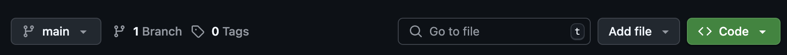{ width="880" }

3. Download the codebase using one of the following options from the drop down menu
    
        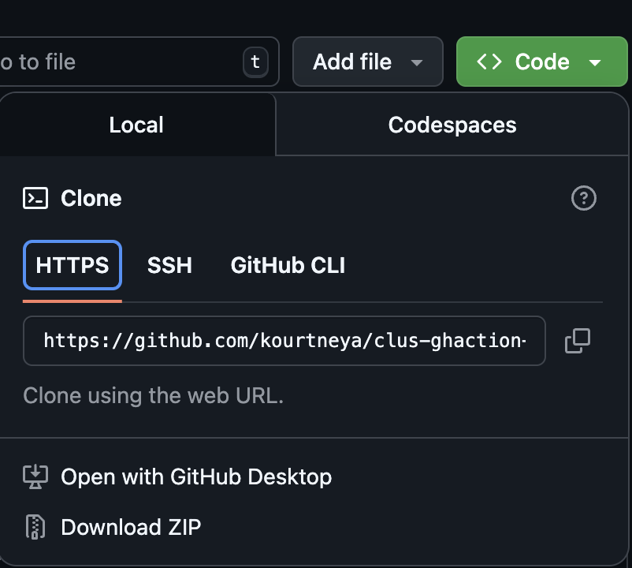{ width="400" }

    - **Zip File**
        - Click **`Download Zip`** and save on the Desktop
        - Double Click, the zip file located on the Desktop to begin extraction 
    - **Git Clone**
        - Open Local Terminal 
            - **MacOS**: Press the <kbd>Command</kbd> + <kbd>Space</kbd> buttons on the keyboard, type `Terminal` and press enter
            - **Windows**: Click the `Start` button (usually Windows icon) at the bottom left corner of the screen. Type `cmd` and press enter
        - Navigate to Desktop Directory in Terminal
            - MacOS
                ```bash
                cd ~/Desktop
                ```
            - Windows
                ```bash
                cd $HOME\Desktop
                ```
        - Clone Repository 
            ```bash
            git clone https://github.com/kourtneya/hacking-101-lab.git
            ```

4. Open Visual Studio Code from Applications Menu or icon on Desktop

5. Open Project Directory
    - Click `File`, in the top tool bar
    - In the dropdown menu, click `Open Folder`
    - Select the `hacking-101-lab`, from the Desktop location

## Step 2: Create a Local Python Virtual Environment 
In Python, it is best practice to create a virtual environment. A virtual environment in python is a self-contained directory that contains a the python interpreter and its installed dependencies. Having this virtual environment scopes the dependencies to this project, avoid conflicts with other projects, and keeps your global python installation clean.

1. In VS Code, open a `Terminal` window
    - Click `View` in the top tool bar
    - Then click, `Terminal`

2. A Terminal window will appear at the bottom of VS Code, at the project's path
    - To test that the terminal is at the projects path, type `pwd` and press enter in the terminal window
    
    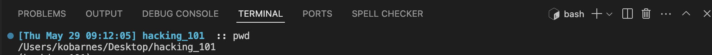{ width="800" }
    

3. Enter the following command to create the virtual environment 
    ```bash
    python -m venv hacking_101
    ```

4. Next, enter in the following command to activate the virtual environment
    - MacOS
    ```bash
    source hacking_101/bin/activate
    ```
    
    - Windows
    ```bash
    hacking_101\Scripts\activate.bat
    ```

## Step 3: Install Python Dependencies
In the project directory is a file named `requirements.txt`. This file list all the dependencies required to run the python application. You need to install these dependencies in the virutal environment so that you can properly run the python application

Install the projects dependencies by entering the following command in the terminal session. 

```bash 
pip install -r requirements.txt
```

## Step 4: Start the Vulnerable Web Application
In the terminal session, enter the following command to start the python application

```bash
python app.py
```
You should see a similar result like the following to ensure your application is running 

```bash
* Serving Flask app 'app'
* Debug mode: on
WARNING: This is a development server. Do not use it in a production deployment. Use a production WSGI server instead.
* Running on all addresses (0.0.0.0)
* Running on http://127.0.0.1:8088
* Running on http://10.26.165.233:8088
Press CTRL+C to quit
* Restarting with stat
* Debugger is active!
* Debugger PIN: 113-761-129
```

## Step 5: Visit the Vulnerable Web Application in Web Browser
Now that the application is running you can now visit the application in your web browser of choice by clicking [http://localhost:8088](http://localhost:8088) or typing the url in the web browser. 

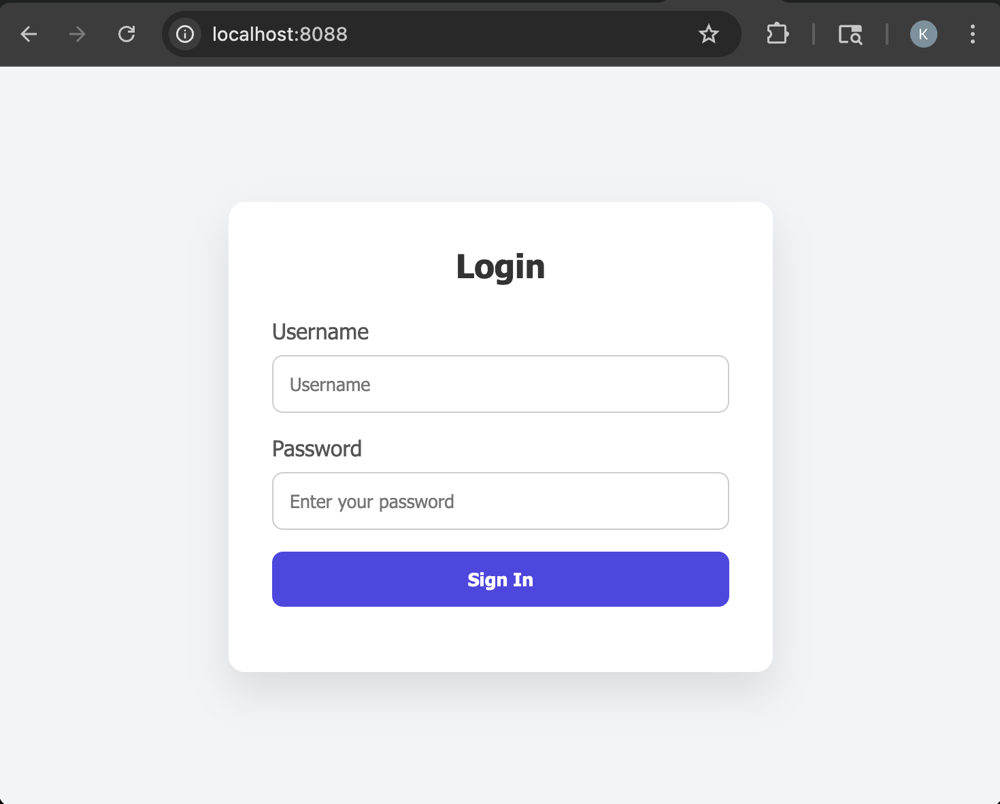{ width="600" }

## Optional: Scan for Vulnerabilities 
>**IMPORTANT:** If using the provided workstations at Cisco Live, please skip this step as the workstations do not have the tools installed to perform vulnerability scanning.
    

While its not required for this lab, you're encouraged to explore how automated tools detect vulnerabilities. It is recommended to use one of the following tools to scan for vulnerabilities within your application

| Tool              | Description                      |
| ----------------- | -------------------------------- |
| [OWASP ZAP](https://www.zaproxy.org/) | Great for intercepting traffic and scanning for common issues |
| [Nikto](https://cirt.net/Nikto2) | Command-line scanner for common web server vulnerabilities |
| [sqlmap](https://sqlmap.org/) | Useful for identifying SQL Injection |
| [Burp Suite](https://portswigger.net/burp/dast) | Great for intercepts and analyzes web traffic to find and exploit vulnerabilities |
| [Wapiti](https://wapiti-scanner.github.io/) | Open-source scanner that detects security flaws like XSS and SQL injection by performing automated black-box testing |

## How to Approach This Lab
This lab is modular and self-paced. Each vulnerability is presented in its own section. You'll follow a consistent pattern in each section: 
- Understand the vulnerability
- Exploit the vulnerability
- Mitigate the issue using secure coding practices

You can complete the modules in order or jump around. However, it is recommended to start with SQL Injection.

## Troubleshooting & Help
- Check for port conflicts (port 8088 is used by default)
- If `app.py` fails to start, ensure dependencies were install correctly
- For Python errors, verify your version is 3.8 or higher
- To rest database, stop the Python application, delete the `database.db` file, recreate the file, and then restart the Python application
- For additional assistance, click the `help` icon in the WIL Assistant so that a team member can be notified ***(Cisco Live Only)***


## You're Ready! 
Jump into [Task 1 - SQL Injection](/task_1) when you are ready to begin! Really dive into the concept and learn deeply by breaking things and attempting to fix them.

---

# Task 1 - SQL Injection

SQL Injection is one of the oldest and most dangerous web application vulnerabilities and it's still prevalent today. It's listed as one of the OWASP Top 10 security risks for good reason. SQL Injection manipulates unsanitized user input which allow attackers to craft SQL queries that trick the database into revealing data, bypassing authorization, or even executing destructive commands. Data breaches caused by SQL Injections have compromised millions of records.

## What You'll Learn
In this section, you'll:

- Understand how SQL Injection works and why it's dangerous through examples
- Manually exploit a login form to bypass authentication
- Try to extract all users from the database
- Techniques to protect against SQL Injection

## Prerequisite 
Before you begin this section, 

- The deliberate vulnerable web application has been downloaded and started. If not, follow the guide in the [Getting Started](/getting_started) section.

## Bypass Login Authentication 
Almost every web application contain a login process to retrieve access to the application or additional features. Bypassing authentication is one of the simplest and most classic examples of how attackers can manipulate SQL queries to perform SQL Injection. 

### Step 1: Login Vulnerable Web Application
Before you begin exploiting the login page, login to the Vulnerable Web application with one of the follow default users. 

1. Navigate to the Vulnerable Web Application by clicking this hyperlink [http://localhost:8088](http://localhost:8088) or by typing this url in your Web Browser of choice

    { width="400" }
    

2. Provide one of the following credentials to login to the application
    - Admin
        - **Username**: `admin`
        - **Password**: `admin`
    - User
        - **Username**: `user`
        - **Password**: `pass`

    
    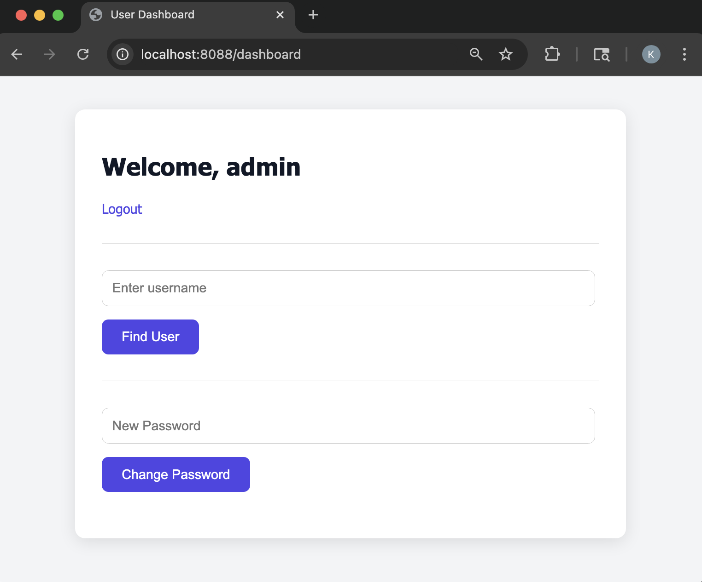{ width="400" }
    

### Step 2: Bypass Login 
Now that you have successfully logged in with a known user and password. Try exploiting the login

1. If you are currently logged in, click the `Logout` button

2. On the Login page, provide the following credentials
    - **Username**: `' OR 1=1--`
    - **Password**: Type, anything as it's irrelevant

    { width="400" }
    

### Step 3: Login Attack Root Cause
More often than not, you will not have access to view an applications source code. In order to education how these attacks occur, take a look at the following source code to see the root cause of this attack. 

1. In VS Code, open the `app.py` file. 

2. Take a look at the following code block 
    ```python
    @app.route('/', methods=['GET', 'POST'])
    def login():
        if request.method == 'POST':
            username = request.form['username']
            password = request.form['password']
            # Vulnerable to SQL Injection
            query = f"SELECT * FROM users WHERE username = '{username}' AND password = '{password}'"
            conn = sqlite3.connect('database.db')
            cursor = conn.cursor()
            cursor.execute(query)
            user = cursor.fetchone()
            conn.close()
            if user:
                session['username'] = username
                session['is_admin'] = user[3]
                return redirect('/dashboard')
            else:
                return render_template('login.html', response="Login Failed")
        return render_template('login.html')
    ```

3. The highlighted `query` is vulnerable to SQL Injection due to string concatenation
    ```python
    query = f"SELECT * FROM users WHERE username = '{username}' AND password = '{password}'"
    ```
4. Passing `' OR 1=1--` as the username will turn the `query` string to 
    ```sql
    SELECT * FROM users WHERE username = '' OR 1=1 --' AND password = '';
    ```

    - `'` will end the original string that started right after the equal sign for the username. Causing the username to be `username = ''`

    - `OR 1=1` first states find the user by `username = ''` OR where `1=1`. The statement `1=1` is always true and will return all rows from the requested table

    - `--` starts a comment in SQL, so the request of the query `' AND password = ''` will be ignored. The leading `'` was the ending of the original username string. Nevertheless, this is why entering a password in the login is irrelevant

5. The `query` will return all rows in the `users` table, letting the attacker bypass the login as the first valid user.

## Extract Data from Database
Before you being protecting SQL Injection attacks, exploit the `Find User` input after logging into the application. 

### Step 1: Find User By Name
First find the `admin` or `user` user to ensure you are receiving the expected response

In the dashboard page, enter `admin` or `user` then press the `Find User` button


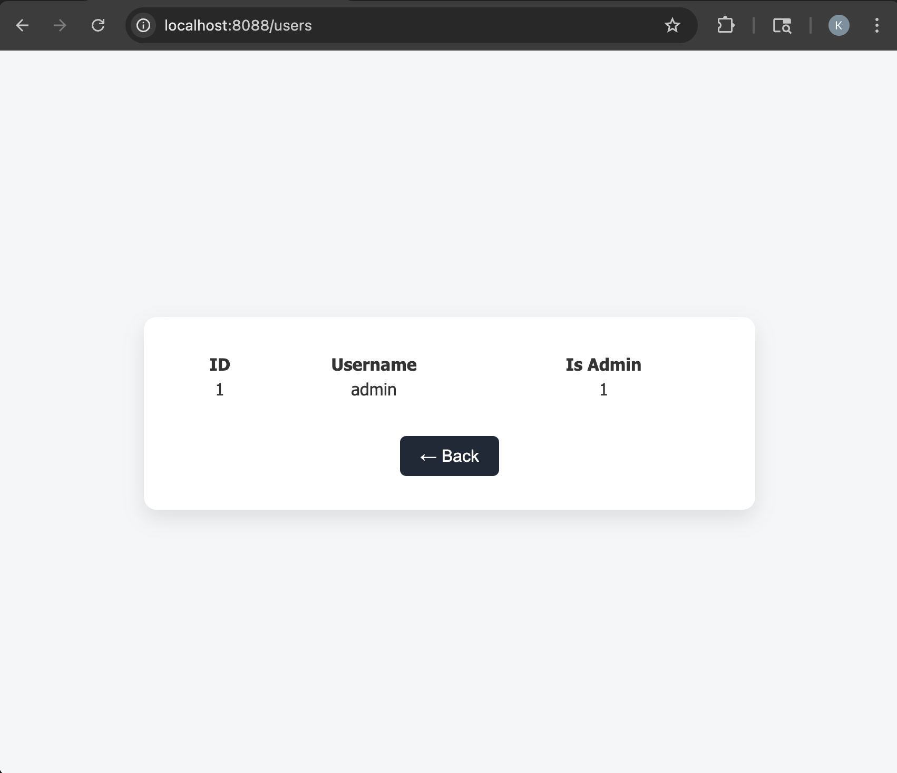{ width="400" }


### Step 2: Find All Users
Perform a SQL Injection attack to find all users in the database.

1. In the dashboard page, enter `' OR 1=1--`, to retrieve a list of all users


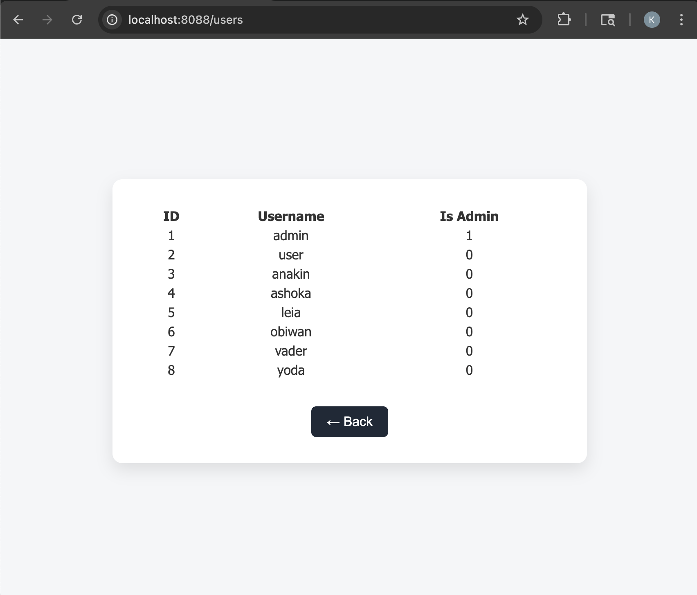{ width="400" }


2. Entering `' OR 1=1--` has the same affect as it did for bypassing the login.

3. In `app.py`, the following code is executed to find the user. The highlighted line is vulnerable to SQL Injection
    ```python
    @app.route('/users', methods=['POST'])
    def find_users():
        username = request.form['username']
        conn = sqlite3.connect('database.db')
        cursor = conn.cursor()
        cursor.execute(f"SELECT * FROM users where username='{username}'")
        users = cursor.fetchall()
        conn.close()

        if not users:
            return render_template('users.html')

        return render_template('users.html', users=users)
    ```

4. The highlighted line was modified to the following query when entering `' OR 1=1--`
    ```python
    SELECT * FROM users where username='' OR 1=1--'
    ```

### Step 3: Delete Users
So far you have perform SQL Injections that bypass authentication and view data that were not expected to be viewed. While those are damaging and can give an attacker access to the application, some attackers perform SQL Injections to corrupt or remove data. Perform the next few steps to remove all users from the database.

1. In the dashboard view after logging into the application, type the following in the `New Password` text box, then click `Change Password`
    ```
    '; DELETE FROM USERS;--
    ```

2. You will see a misleading message like the following
    
    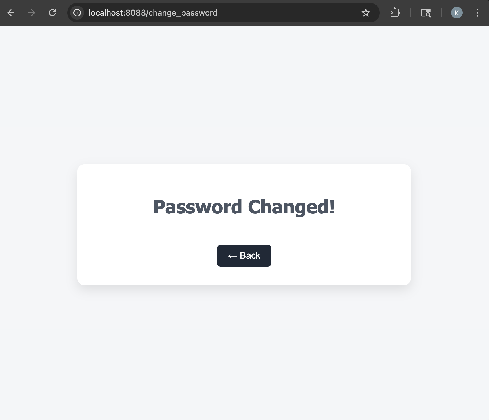{ width="400" }
    

3. Click, the `Back` button

4. In the `Find Users` input field, enter `admin`, then click `Find User` button 
    
    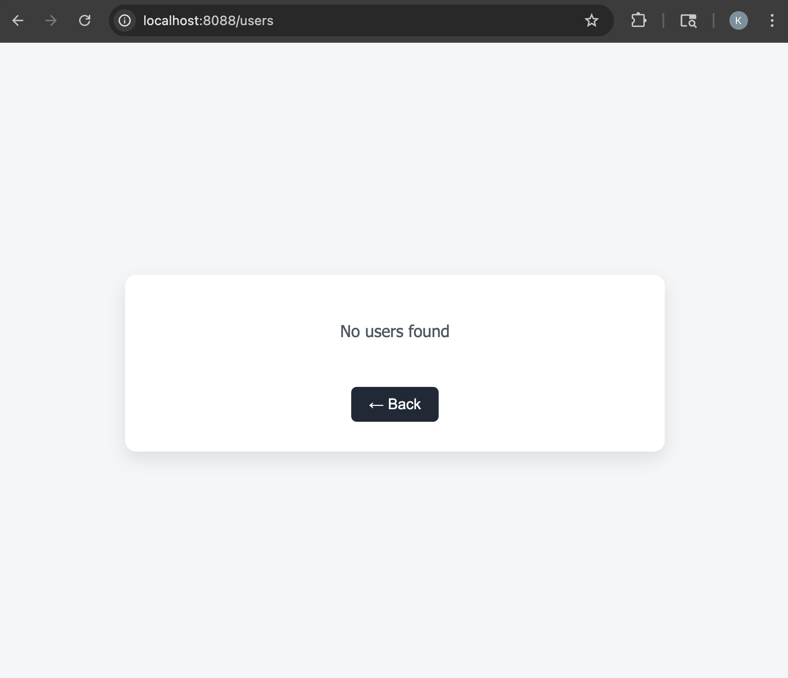{ width="400" }
    

5. You have made a SQL Injection attack to delete all users from the database. Thus if you `Logout` and try to login, you will receive the "Login Failed" message. 
    
    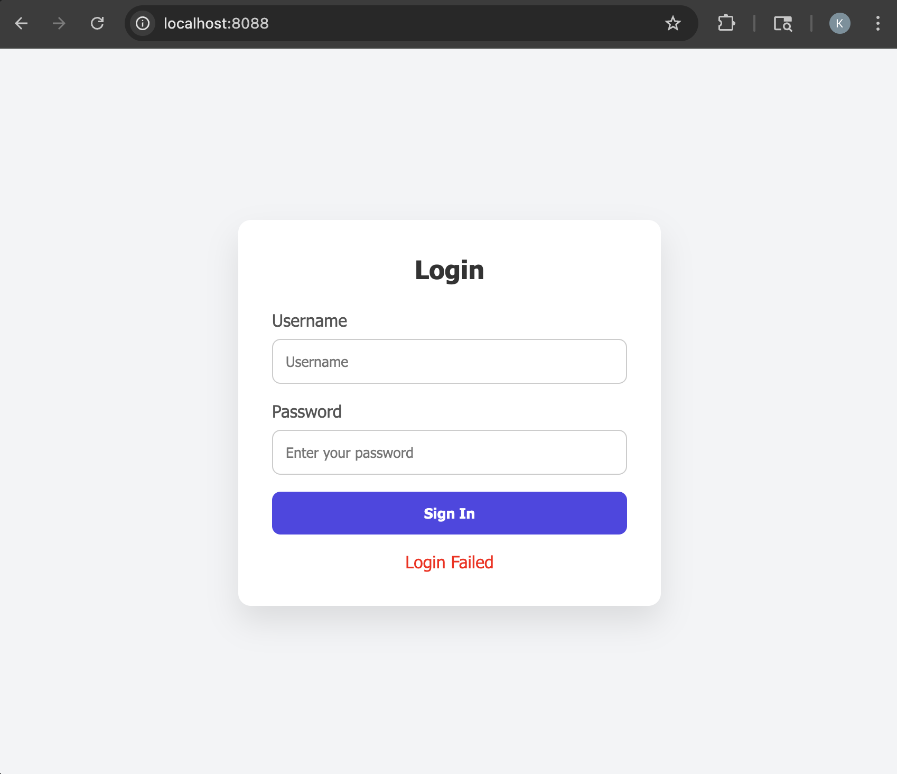{ width="400" }
    

6. In `app.py`, the following code is executed to update the password. The highlighted line is vulnerable to SQL Injection
    ```python
    @app.route('/change_password', methods=['POST'])
    def change_password():
        # CSRF Vulnerability
        new_pass = request.form['new_password']
        conn = sqlite3.connect('database.db')
        cursor = conn.cursor()
        cursor.executescript(f"UPDATE users SET password = '{new_pass}' WHERE username = '{session['username']}'")
        conn.commit()
        conn.close()
        return render_template('response.html', response="Password Changed!")
    ```

7. Passing `'; DELETE FROM USERS;--` as the new password will turn the `query` string to 
    ```sql
    UPDATE users SET password = ''; DELETE FROM USERS;--' WHERE username = '{session['username']}'
    ```

    - `'` will end the original string that started right after the equal sign for the password. Causing the string to be `password = ''`

    - `;` will terminate the SQL statement for the `UPDATE` query

    - `DELETE FROM USERS;` will execute a new SQL statement to delete all data in the users table.

    - `--` starts a comment in SQL, so the request of the query `' WHERE username = '{session['username']}'` will be ignored. 

## Step 4: Reset Database
The Python application is setup to seed the database everytime it is started if the data isn't already populated. 

1. In VS Code Terminal window, the Python code is running. Simply press <kbd>Ctrl</kbd> + <kbd>C</kbd> to stop the application 

2. Then type `python app.py` to restart the application

3. Navigate to the Vulnerable Web Application by clicking this hyperlink [http://localhost:8088](http://localhost:8088) or by typing this url in the existing web browser tab

4. Try logging into the application again by providing one of the following credentials
    - Admin
        - **Username**: `admin`
        - **Password**: `admin`
    - User
        - **Username**: `user`
        - **Password**: `pass`

## Protect Against SQL Injection
Now that you have exploited an SQL Injection vulnerability, the next few steps will walk you through protecting these types of attacks

### Step 1: Protect From SQL Injections
SQL Injections occur from manipulating a string into a statement in which the input will be treated as code instead of plain text or data. To resolve these type of attacks, use prepared statements which will treat input as data and not executable SQL statements. 

Instead of building SQL queries by concatenating strings, use parameterized queries that uses placeholders for user inputs which the database will safely bind to the query without executing it as part of the SQL statement. 

1. In VS Code, open the `app.py` file

2. Locate the code block for login, 
    ```python
    @app.route('/', methods=['GET', 'POST'])
    def login():
        if request.method == 'POST':
            username = request.form['username']
            password = request.form['password']
            # Vulnerable to SQL Injection
            query = f"SELECT * FROM users WHERE username = '{username}' AND password = '{password}'"
            conn = sqlite3.connect('database.db')
            cursor = conn.cursor()
            cursor.execute(query)
            user = cursor.fetchone()
            conn.close()
            if user:
                session['username'] = username
                session['is_admin'] = user[3]
                return redirect('/dashboard')
            else:
                return render_template('login.html', response="Login Failed")
        return render_template('login.html')
    ```

3. Replace the highlighted lines above with the following, 
    ```python
    query = f"SELECT * FROM users WHERE username = ? AND password = ?"
    ```
    ```python
    cursor.execute(query, (username, password))
    ```

    - `?` is a placeholder for the user-provided value. SQLite automatically escapes the input into its respective data type
    - The `cursor.execute` function now accepts a second argument that supplies values for the `?` placeholders in the SQL query. Each placeholder is replaced in order by the corresponding value provided—for example, the first `?` is replaced by the first value in `(username, password)`

4. Save `app.py` File
    - In the top left corner, click `File`, then `Save` in the drop down menu; <br>or<br>

    - Use the respective shortcuts to save the file 

        - MacOS <br>
        <kbd>Command</kbd> + <kbd>S</kbd>

        - Windows <br>
        <kbd>Ctrl</kbd> + <kbd>S</kbd>

    The running application will automatically be updated and will quietly reload

6. Navigate to the Vulnerable Web Application by clicking this hyperlink [http://localhost:8088](http://localhost:8088) or by typing this url in the existing web browser tab

7. Try logging into the application again by providing one of the following credentials
    - Admin
        - **Username**: `admin`
        - **Password**: `admin`
    - User
        - **Username**: `user`
        - **Password**: `pass`

    All works as expected!

8. Now logout and try performing a SQL Injection attack. 
    - On the Login page, provide the following credentials
        - **Username**: `' OR 1=1--`
        - **Password**: Type, anything as it's irrelevant

    You will receive the "Login Failed" message and now your login is protected from SQL Injection attacks
    
    { width="400" }
    


### Step 2: Protect Find User Input
Let's do the same for the `Find User` logic. 

1. In VS Code, open the `app.py` file

2. Locate the code block for login, 
    ```python
    @app.route('/users', methods=['POST'])
    def find_users():
        username = request.form['username']
        conn = sqlite3.connect('database.db')
        cursor = conn.cursor()
        cursor.execute(f"SELECT * FROM users where username='{username}'")
        users = cursor.fetchall()
        conn.close()

        if not users:
            return render_template('users.html')

        return render_template('users.html', users=users)
    ```

3. Replace the highlighted line above with the following, 
    ```python
    cursor.execute("SELECT * FROM users where username = ?", (username,))
    ```

4. Save `app.py` File
    - In the top left corner, click `File`, then `Save` in the drop down menu; <br>or<br>

    - Use the respective shortcuts to save the file 

        - MacOS <br>
        <kbd>Command</kbd> + <kbd>S</kbd>

        - Windows <br>
        <kbd>Ctrl</kbd> + <kbd>S</kbd>

    The running application will automatically be updated and will quietly reload

5. On the dashboard page of the Vulnerable application, find the `admin` user. The expected user should be returned.

6. Click Back 

7. Attempt a SQL Injection attack by typing `' OR 1=1--`, then click `Find User`. The expect `No users found` message should appear
    { width="400" }

## Congratulations! 
You have learned how to exploit and protect SQL Injections one of the most popular vulnerabilities exploited. 

---

# Task 2 - DOM-Based Cross Site Scripting (XSS) Vulnerability

Cross-Site Scripting (XSS) is a web security vulnerability that allows attackers to inject malicious scripts into web pages that are viewed by other users. Since browsers trusts content from the website, it runs the malicious code as if it came for the site itself. 

**DOM-Based Cross-Site Scripting** attacks are client-side attacks that that affects the DOM. DOM (Document Object Model) is the the blueprint of a web page. It shows all the parts of the page like text, images, buttons, and links. With DOM-Based XSS attacks, scripts executed in JavaScript can interact with those parts and can control how a web page may behave. These attacks are executed entirely in the user's web browser without involving the server that generates HTTP request and responses.

## What You'll Learn
In this section, you will:

- Understand the Core of DOM-Based XSS
- Experience how untrusted user input can be misused when improperly handled in the browser's DOM
- Learn how JavaScript on the client side can interact and manipulate DOM elements
- Apply mitigation techniques to protect against XSS attacks

## Prerequisite 
Before you begin this section, 

- The deliberate vulnerable web application has been downloaded. If not, follow the guide in the [Getting Started](/getting_started) section.

## Step 1: Launch the XSS Lab HTML
1. In VS Code, right click on the `xss_lab.html`
    
    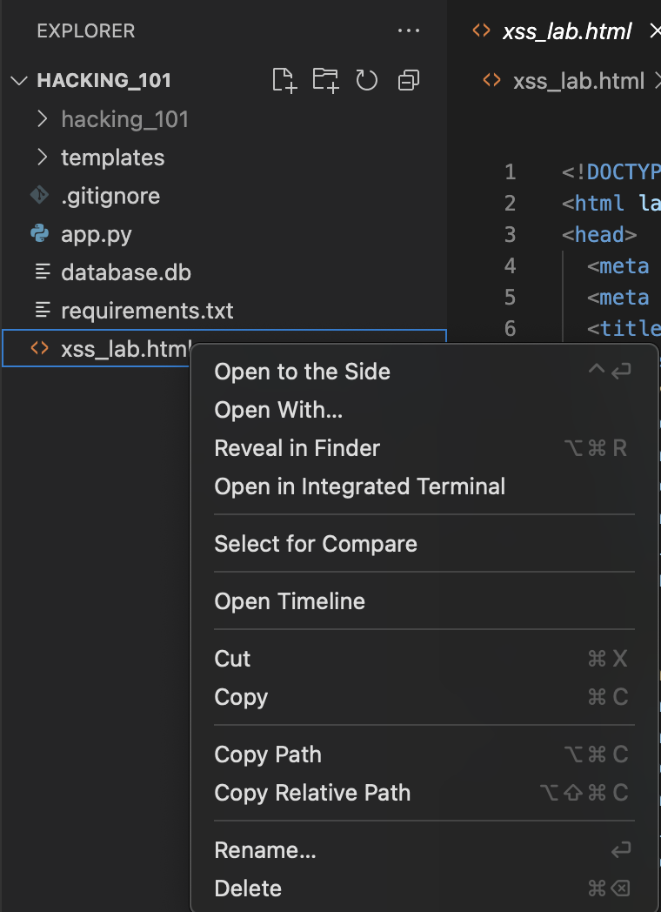{ width="400" }
    

2. In the drop down menu, click `Copy Path`, this will copy the file's location url
    
    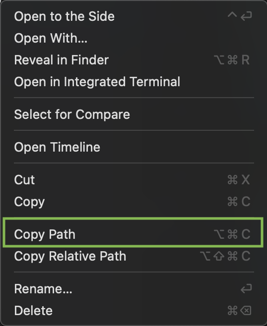{ width="400" }
    

3. Open your web browser of choice and paste the URL in the browser's address bar, then press <kbd>Enter</kbd>
    
    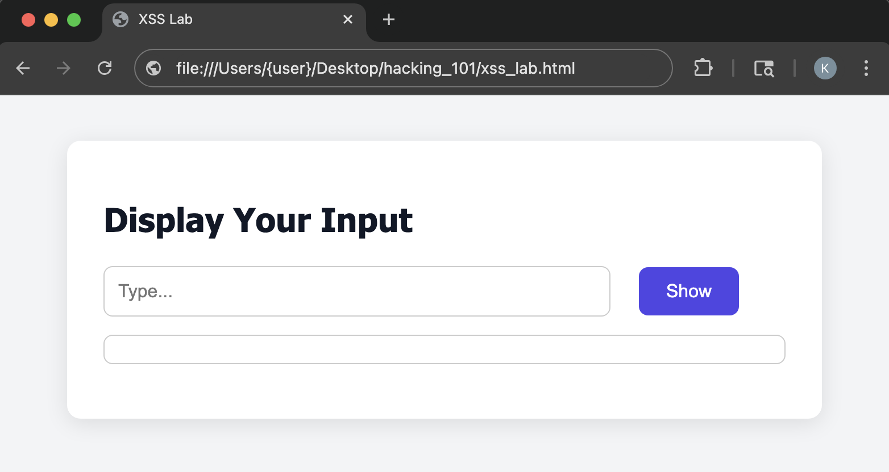{ width="600" }
    

## Step 2: Out-of-the-Box Behavior
Before exploiting the DOM-Based XSS attack, witness how the application should behave by providing an expected input. 

1. In the `Display Your Input` text box, type anything you like

2. Press, the **`Show`** button

3. You should receive a response below stating, `You entered:` followed by your message
    
    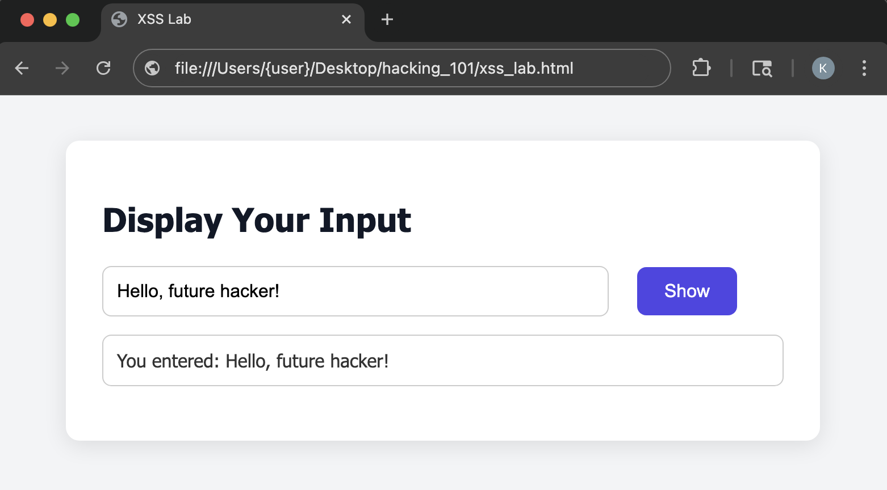{ width="600" }
    

## Step 3: Text Style DOM XSS Attack
Now that you see how the application should behave when entering in a message, attack the application by changing how the response will look.

Enter the following text in the input box, then press **`Show`**,
```
<h1 style="color: red;">Your Message</h1>
```

- This attack will give you a response with much larger text and the color will be red
    
    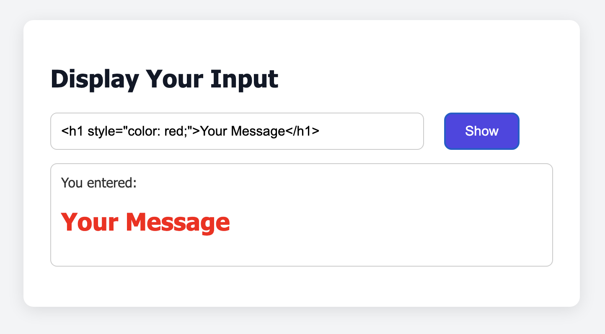{ width="600" }
    

## Step 4: Change Title DOM XSS Attack
As mentioned above, DOM-Based attacks can alter parts of the page that are already presented. Perform a XSS Attack that will change the title `Display Your Input` to something else

1. Before you can change the title, you need to retrieve the reference id for the title. Most DOM objects will have an `id` associated for styling and other uses. First, open the `Inspect` window for the browser

    | Browser              | Task              |
    | ----------------- | ----------------- |
    | Google Chrome     | Right-click anywhere on the page, then click `Inspect`        |
    | Mozilla Firefox   | Right-click anywhere on the page, then click `Inspect`        |
    | Microsoft Edge    | Right-click anywhere on the page, then click `Inspect`        |
    | Safari            | Right-click anywhere on the page, the click `Inspect Element` _(Developer Tools must be enabled)_ |

    
    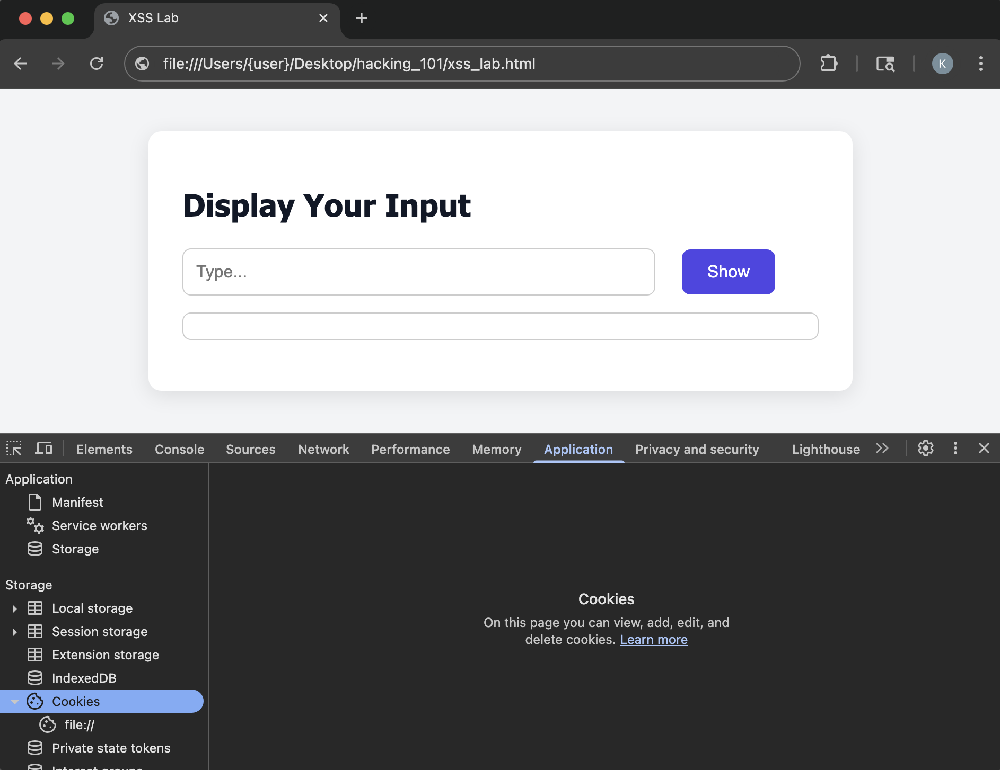{ width="600" }
    

2. Click the `Elements` tab
    
    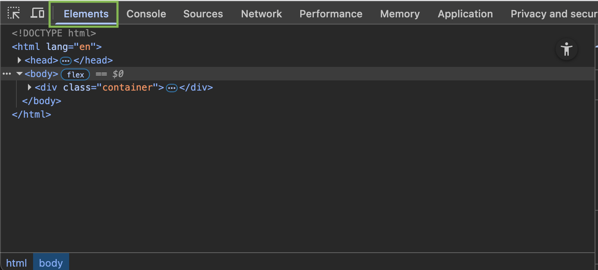{ width="600" }
    

3. In the code shown, unfold the `<body>` and `<div class="container">` tags by clicking the arrow to the left side of the tag
    
    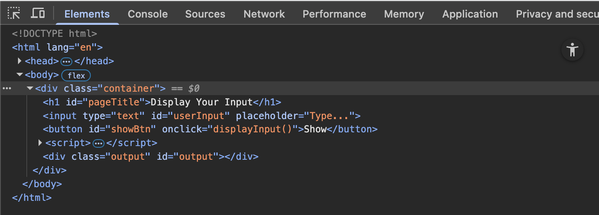{ width="600" }
    

4. Notice the `<h1>` HTML element for the `Display Your Input` title. Next to the `h1` there is an `id` attribute specified. The `id` value specifies the reference id for the title. 
    ```{.text .no-copy}
    <h1 id="pageTitle">Display Your Input</h1>
    ```

5. Using this id, type the following text in the input box on the web page, then press **`Show`**.
    ```
    <script>document.getElementById('pageTitle').textContent='New Input Title'</script>
    ```
    
    |              |              |
    | -------------| ------------ |
    | `<script>...</script>`     | Tells HTML to that there is some JavaScript code that will either add some form of interactivity or manipulate the web page       |
    | `document`   | Refers to the DOM which allows you to access and manipulate HTML elements      |
    | `getElementById('pageTitle')` | Is a built-in function of the `document` that searches for the first HTML element that has an `id` attribute with the specified name for its value  |
    | `.textContent` | Sets the text value to the provided text specified after the `=` sign |

    
    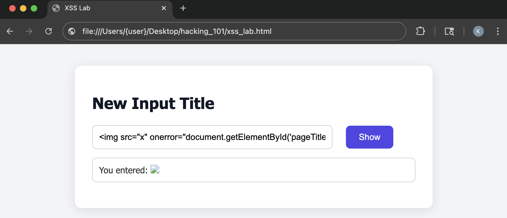{ width="600" }
    

    > **IMPORTANT!** If the `<script>` input did not work for you that is because modern browsers have built-in protections that prevents basic `<script>` injections when inserted into the DOM in certain ways. Especially when inserted dynamically like you are doing for this XSS attack. 

    No worries! You can still perform this attack. To perform this DOM-Based XSS attack insert the following text in the input box 

    ```
    
    ```

    |              |              |
    | -------------| ------------ |
    | ``     | This is an HTML tag used to display images    |
    | `src="x"`   | `src` is a require attribute for this tag that tells the browser where to load the image from. The "x" in this example is not a valid image path so this will generate an error      |
    | `onerror` | This function gets called when the image fails to load. In this case, because `x` is not a valid image path the error function will get triggered. When the error function gets triggered it will execute the JavaScript code that was passed  |

## Step 5: Manipulate Web Page DOM XSS Attack
In this attack, you will change the way the application behaves when clicking the **`Show`** button. 

Enter the following text in the input box, then press **`Show`**,
```
<script>alert("Web Paged Hacked!")</script>
```

- If the `<script>` tag does not work, like in the previous step, type the following text in the input box, then press **`Show`**

```

```


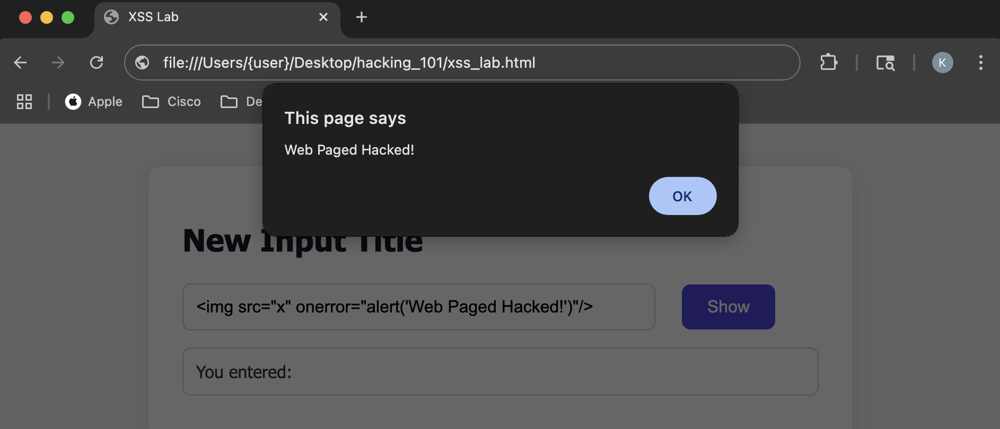{ width="600" }


## Bonus Challenge
Now that you have a few examples on how to exploit a DOM-Based XSS vulnerability try to come up with other attacks.

Example, 
- Change the color of the **Show** button
- Change the text of the **Show** button
- Try combining attacks into one
    - Change the Title text but in a different color

## Step 6: Protect Against DOM-Based XSS Attacks
You have now exploited a DOM-Based XSS attack and its time to see the root cause of this type of attack and how to better protect against them. 

1. In VS Code, open the `xss_lab.html` file

2. Find the `<body>` HTML tag
    ```{.html .no-copy hl_lines="10"}
    <body>
        <div class="container">
            <h1 id="pageTitle">Display Your Input</h1>
            <input type="text" id="userInput" placeholder="Type..." />
            <button id="showBtn" onclick="displayInput()">Show</button>
            <script>
                function displayInput() {
                    const input = document.getElementById('userInput').value;
                    const output = document.getElementById('output');
                    output.innerHTML = `You entered: ${input}`;
                }
            </script>
            <div class="output" id="output"></div>
        </div>
    </body>
    ```

3. The highlighted line above, ```output.innerHTML = `You entered: ${input}`;``` is the culprit of XSS attacks. `innerHTML` is a property of a DOM element in JavaScript that tells the browser to parse the string value as HTML and insert the result back into the DOM element

4. To resolve this XSS attack, simply change the line to 
    ```html
    output.textContent = `You entered: ${input}`;
    ```
    - `textContent`: is another property of a DOM element in JavaScript that tells the browser to treat its value as plain text and not HTML. This would make HTML tags that are entered as input to be plain text which will not be executed.

5. Save `xss_lab.html` file
    - In the top left corner, click `File`, then `Save` in the drop down menu; <br>or<br>

    - Use the respective shortcuts to save the file 

        - MacOS <br>
        <kbd>Command</kbd> + <kbd>S</kbd>

        - Windows <br>
        <kbd>Ctrl</kbd> + <kbd>S</kbd> 

6. Reload the webpage in the browser, or 
    - Right click on the `xss_lab.html` file
    - In the drop down menu, click `Copy Path`, this will copy the file's
    - Open your web browser of choice and paste the URL in the browser's address bar, then press <kbd>Enter</kbd>

7. Try any of the above attacks. The text will appear as expected and no changes has occurred

    Example, enter the following text in the text box
    ```
    
    ```

    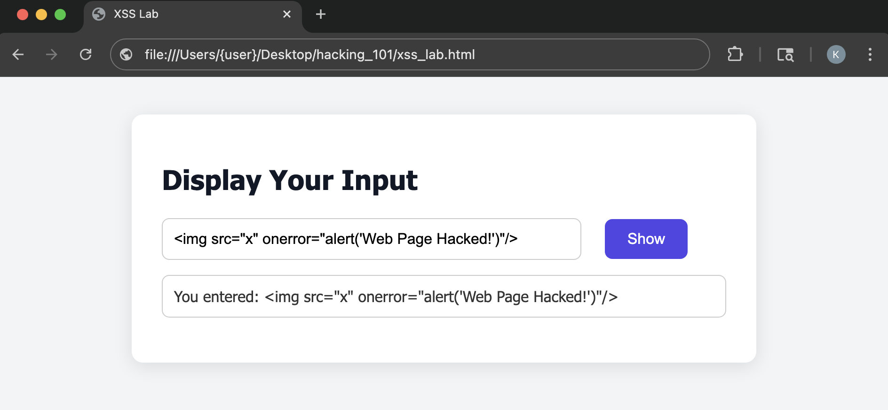{ width="600" }
    

## Congratulations!
You have successfully exploited a vulnerable web page that is susceptible to DOM-Based XSS attacks. Also, you learned how to protect against them as well. 

---

# Task 3 - Reflected Cross-Site Scripting (XSS) Vulnerability

Cross-Site Scripting (XSS) is a web security vulnerability that allows attackers to inject malicious scripts into web pages that are viewed by other users. Since browsers trusts content from the website, it runs the malicious code as if it came for the site itself. 

**Reflected Cross-Site Scripting** vulnerabilities are attacks that the server side reflects from unsanitized inputs from the user. The malicious code is entered in the request and is immediately returned by the server in a HTTP response without proper sanitization where the browser then executes the code affecting DOM elements or controlling how the web page behaves (i.e alerts). However, since this is a server-side issue, attackers can create a malicious link that, when clicked by a user, causes the server to include the harmful script in its HTTP response—allowing the browser to execute it.

## What You'll Learn
In this section, you will:

- Understand what Reflected Cross-Site Scripting is and what impact it can have
- Identify the reflection points in HTTP requests/responses that lead to vulnerabilities
- Craft malicious payloads that exploit the vulnerability to execute arbitrary JavaScript in the browser
- Craft a malicious URL link that reflects back to the browser
- Demonstrate real attack vectors including alert boxes, cookie, theft, and DOM manipulation
- Learn and apply techniques that mitigate these types of XSS attacks 

## Prerequisite 
Before you begin this section, 

- The deliberate vulnerable web application has been downloaded. If not, follow the guide in the [Getting Started](/getting_started) section.

## Step 1: Start the XSS Vulnerability Web Application
For this section of the lab, you will start the `xss_app.py` to exploit XSS vulnerabilities. 

1. In VS Code, click `View` in the top tool bar

2. In the drop down menu, select `Terminal`

3. A Terminal window will appear at the bottom of VS Code, at the project's path.
    - If you already have a Terminal window open and running another application, you can start a new session by clicking the + icon in the Terminal Window toolbar
        
        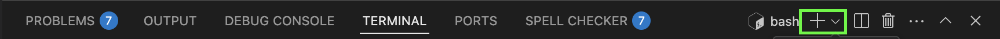{ width="800" }
           

    - You should now see multiple terminal sessions that you can switch between sessions
    
    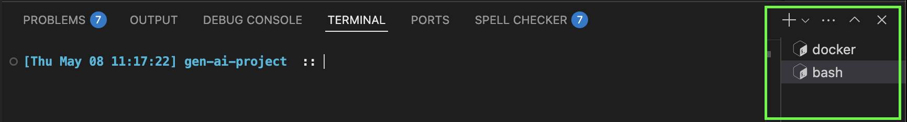{ width="800" }
     

4. Enter the following command to start the Vulnerable XSS web application
    ```bash
    python xss_app.py
    ```

5. Navigate to the Vulnerable XSS web app
    - Click, [http://localhost:8089](http://localhost:8089) <br><br> OR <br><br>
    - Open your web browser of choice and type the following URL in the web address bar
    ```
    http://localhost:8089
    ```

    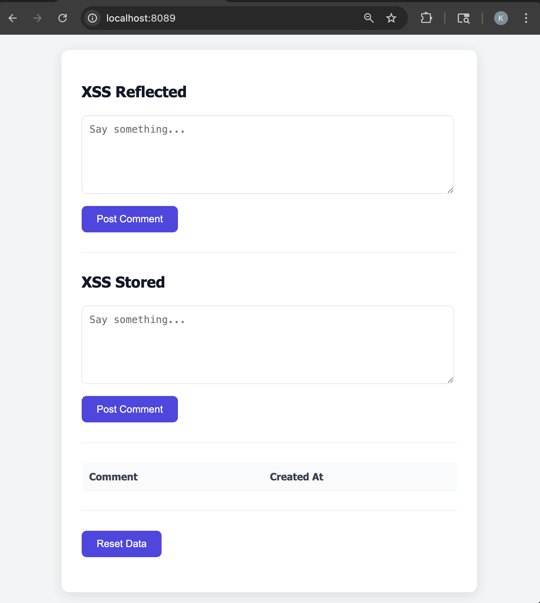{ width="600" }
     

## Step 2: Out-of-the-Box Behavior
Before exploiting the Reflected XSS attack, witness how the application should behave by providing an expected input. 

Under the XSS Reflected section, type any text in the textbox and press **`Post Comment`**

1. In the **XSS Reflected** section, type anything you like in the textbox

2. Press, the **`Post Comment`** button

3. You should receive a response below stating, `You comment:` followed by your message
    
    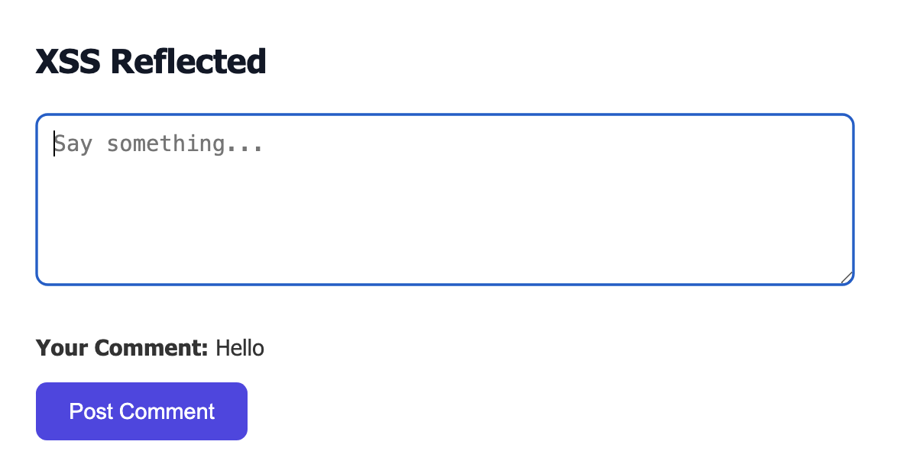{ width="600" }
     

## Step 3: Text Style Reflected XSS Attack
Now that you see how the application should behave when entering in a message, attack the application by changing how the response will look.

Enter the following text in the input box, then press **`Post Comment`**,
```
<h1 style="color: green;">XSS Attack</h1>
```

- This attack will give you a response with much larger text and the color will be green


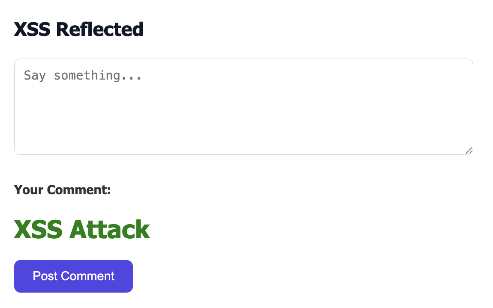{ width="600" }
 

## Step 4: Change Title Reflected XSS Attack
Like other XSS Attacks, Reflected XSS attacks can alter parts of the page that are already present. Perform a XSS Attack that will change the title `XSS Reflected` to something else

1. Before you can change the title, you need to retrieve the reference id for the title. Most DOM objects will have an `id` associated for styling and other uses. First, open the `Inspect` window for the browser

    | Browser              | Task              |
    | ----------------- | ----------------- |
    | Google Chrome     | Right-click anywhere on the page, then click `Inspect`        |
    | Mozilla Firefox   | Right-click anywhere on the page, then click `Inspect`        |
    | Microsoft Edge    | Right-click anywhere on the page, then click `Inspect`        |
    | Safari            | Right-click anywhere on the page, the click `Inspect Element` _(Developer Tools must be enabled)_ |
    
    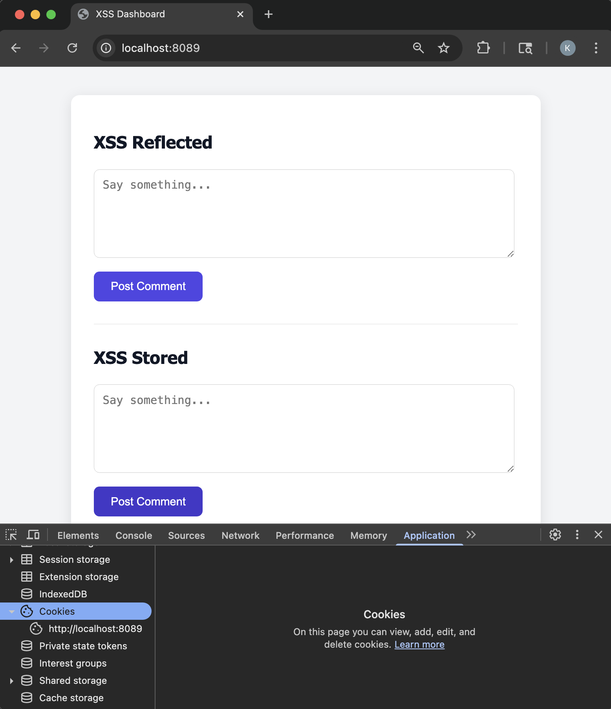{ width="600" }
    

2. Click the `Elements` tab
    
    { width="600" }
    

3. In the code shown, unfold the `<body>` and `<div class="container">` tags by clicking the arrow to the left side of the tag
    
    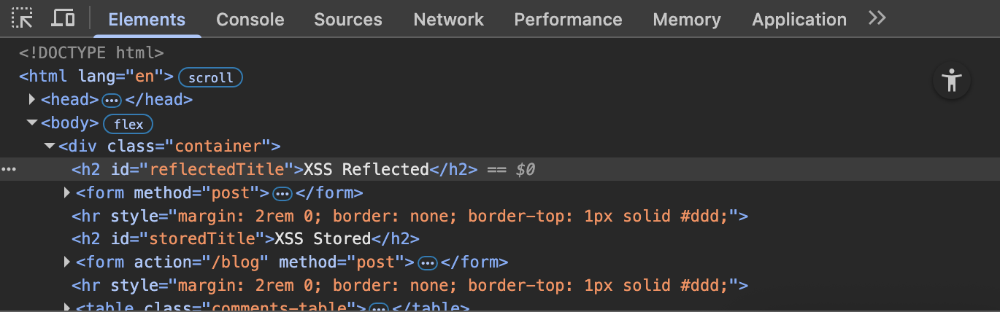{ width="600" }
    

4. Notice the `<h2>` HTML element for the `XSS Reflected` title. Next to the `h2` there is an `id` attribute specified. The `id` value specifies the reference id for the title. 
    ```{.text .no-copy}
    <h2 id="reflectedTitle">XSS Reflected</h2>
    ```

5. Using this id, type the following text in the input box on the web page, then press **`Post Comment`**.
    ```
    <script>document.getElementById('reflectedTitle').textContent='New Input Title';document.getElementById('reflectedTitle').style.color='red'</script>
    ```
    
    |              |              |
    | -------------| ------------ |
    | `<script>...</script>`     | Tells HTML to that there is some JavaScript code that will either add some form of interactivity or manipulate the web page       |
    | `document`   | Refers to the DOM which allows you to access and manipulate HTML elements      |
    | `getElementById('pageTitle')` | Is a built-in function of the `document` that searches for the first HTML element that has an `id` attribute with the specified name for its value  |
    | `.textContent` | Sets the text value to the provided text specified after the `=` sign |
    | `style` | refers to the style attribute on the DOM element |
    | `color` | Sets the text color to the provided value specified after the `=` sign |

    
    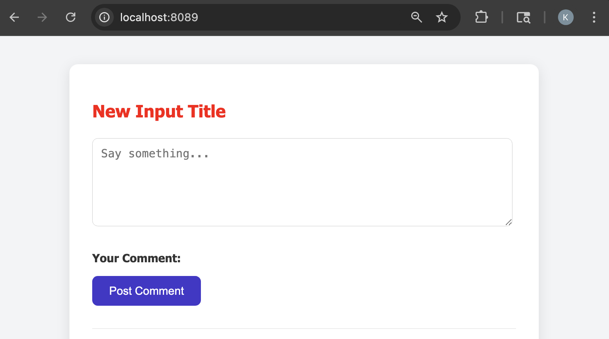{ width="600" }
    

6. Reflected XSS attacks are not persistent attacks so the moment the moment the page reloads all changes revert back to normal.
    - Click in the web browser's address bar and press <kbd>Enter</kbd>

    > **Note**: It's important to note that each post is a form submission. If the page is refreshed by clicking the browser's reload button, the browser tries to reload the last request made which in this case is the form submission. 

## Step 5: Manipulate Web Page Reflected XSS Attack
In this attack, you will change the way the application behaves when posting a comment. 

Enter the following text in the input box, then press **`Post Comment`**,
```
<script>alert("Web Paged Hacked!")</script>
```


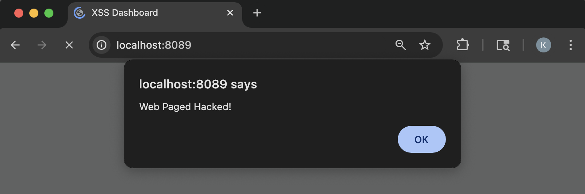{ width="600" }


## Bonus Challenge
Now that you have a few examples on how to exploit a Reflected XSS vulnerability try to come up with other attacks.

Example, 
- Change the color of the **Post Comment** button
- Change the text of the **Post Comment** button
- Try combining attacks into one
    - Change the Title text but in a different color
- Change the width of the textarea
- Change the text color inside the textarea

## Step 6: Protect Against Reflected XSS Attacks
It's time to see the root cause of these attacks and how to protect against these attacks.

1. In VS Code, open the `xss_app.py` file

2. Take a look at the following code block 
    ```{.python .no-copy hl_lines="6"}
    @app.route('/', methods=['GET', 'POST'])
    def dashboard():
        stored_comments = get_comments()
        if request.method == 'POST':
            comment = request.form['comment']
            return render_template('xss_dashboard.html', comment=f"<p><b>Your Comment:</b> {comment}</p>", stored_comments=stored_comments)
        return render_template('xss_dashboard.html', stored_comments=stored_comments)
    ```

3. The highlighted line above is vulnerable to a XSS attack because it injects the user's input into a the variable `comment` that is then returned to the HTML without sanitization or escaping
    ```python
    comment=f"<p><b>Your Comment:</b> {comment}</p>", 
    ```

4. The difference between DOM-Based and XSS Reflect is that a server is involved with returning a HTTP responses. In DOM-Based attacks everything happens on the client side (no server involved). "Reflect" just means that the server immediately sends back the input in the HTTP response without being stored. 

    There are many ways to fix this issue, one being sanitizing the `comment` variable to escape HTML tags. However, you will need to do either heavy logic or use another python package to do this cleanly. In this lab, you will fix this vulnerability in two parts. First, clean up the code to remove the included HTML `<p><b>Your Comment:</b>`. 
    
    Replace the highlighted code with the following: 

    ```python
    return render_template('xss_dashboard.html', comment=comment, stored_comments=stored_comments)
    ```

5. Save `xss_app.py` file
    - In the top left corner, click `File`, then `Save` in the drop down menu; <br>or<br>

    - Use the respective shortcuts to save the file 

        - MacOS <br>
        <kbd>Command</kbd> + <kbd>S</kbd>

        - Windows <br>
        <kbd>Ctrl</kbd> + <kbd>S</kbd>

6. In VS Code, open the `xss_dashboard.html` located under the `templates` folder 

    To render web applications in python, it uses a built-in templating engine called **Jinja2**. Jinja2 is used for generating dynamic HTML pages by combining templates with data received from the python application. To pass data from the python code to the HTML template, Jinja2 replaces it placeholder syntax with the actual values

    | Syntax | Description |
    | ------------ | ------------ |
    | `{{ ... }}`  | Used for expressions or variables (e.g `{{ comment }}`) |
    | ``  | Used for loops and conditionals `{% if comment % }` |

7. Take a look at the following code block 
    ```html
    <h2 id="reflectedTitle">XSS Reflected</h2>

    <form method="post">
      <textarea id="userComment" name="comment" placeholder="Say something..."></textarea>
      
      <div class="server_response">{{ comment | safe }}</div>
      
      <input id="userCommentBtn" type="submit" value="Post Comment" />
    </form>
    ```

    - ``: states that if `comment` is not empty, execute the next code. If the `comment` is empty then skip
    - ``: tells Jinja2 that this is the end of the conditional 
    - `{{ comment }}`: tells Jinja2 to place the value of the `comment` variable here. `comment` is the variable that is passed in the python code `render_template('xss_dashboard.html', comment=comment)` _(the word specified before the equal sign)_ 
    - `| safe`: tells Jinja2 that the value that is being inserted is trusted and to not escape the string.

8. The following code block is the culprit as its using the Jinja keyword `safe`

    Replace 
    ```{.html .no-copy}
    <div class="server_response">{{ comment | safe }}</div>
    ```
    <br>
    with
    ```html
    <div class="server_response"><b>Your Comment:</b> {{ comment }}</div>
    ```
    > **Note:** Why use `safe` since its vulnerable to XSS? Well since the application is rendered using python. You may want to dynamically render HTML. In that case, you would sanitize the input using the `bleach` package in the python code to not allow or allow certain HTML elements in the user input. (e.g `bleach.clean(comment, tags=['b','i','u'], strip=True)`)

9. Save `xss_dashboard.html` file
    - In the top left corner, click `File`, then `Save` in the drop down menu; <br>or<br>

    - Use the respective shortcuts to save the file 

        - MacOS <br>
        <kbd>Command</kbd> + <kbd>S</kbd>

        - Windows <br>
        <kbd>Ctrl</kbd> + <kbd>S</kbd>

10. Reload the XSS Vulnerable Web application in the browser by  
    - Clicking [http://localhost:8089](http://localhost:8089) 
    <br><br> OR <br><br>
    - If the application is already loaded in the web browser, click inside the address bar and press <kbd>Enter</kbd>
    <br><br> OR <br><br>
    - Open your web browser of choice and type the following URL in the web address bar
    ```
    http://localhost:8089
    ```

11. Try any of the above attacks and verify that no malicious changes should occurred

    Example, enter the following text in the text box
    ```
    <script>alert('Web Page Hacked!')</script>
    ```
    
    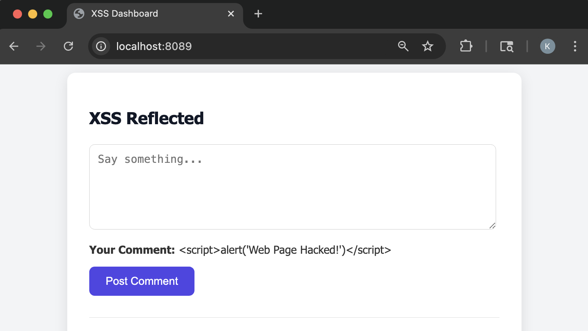{ width="600" }
    

## Congratulations!
You have successfully exploited a vulnerable web page that is susceptible to Reflected XSS attacks. 

Things learned: 

- Understand how Reflected XSS Works
- Crafted payload that with malicious intent
- How to protect against Reflected XSS
- Templating rendering in Python and potential misuse of syntax

---

# Task 4 - Stored Cross-Site Scripting (XSS) Vulnerability

Cross-Site Scripting (XSS) is a web security vulnerability that allows attackers to inject malicious scripts into web pages that are viewed by other users. Since browsers trusts content from the website, it runs the malicious code as if it came for the site itself. 

**Stored Cross-Site Scripting** is an attack that allows attackers to inject malicious scripts into a website's database or other persistent storage. Unlike Stored XSS, which requires a user to click on a specially crafted URL or enter malicious code in a form, stored XSS attacks automatically executes whenever a user loads the content. This makes it particularly dangerous because it requires no user interaction once the malicious script is stored. 

## What You'll Learn
In this section, you will:

- Understand Stored Cross-Site Scripting vulnerabilities and how it is often more dangerous than the other types of XSS
- Craft malicious payloads that persist across sessions
- Experience how malicious input is saved to the backend and automatically rendered to future visitors
- Demonstrate real attack vectors including alert boxes, cookie, theft, and DOM manipulation
- Learn how to fix the vulnerability by escaping user input before rendering it in the HTML context 

## Prerequisite 
Before you begin this section, 

- The deliberate vulnerable web application has been downloaded. If not, follow the guide in the [Getting Started](/getting_started) section.

## Step 1: Start the XSS Vulnerability Web Application
For this section of the lab, you will start the `xss_app.py` to exploit XSS vulnerabilities. 

> **INFO:**If you have done the previous task, Reflected XSS, you may skip this step if you already have the application running in a terminal window

1. In VS Code, click `View` in the top tool bar

2. In the drop down menu, select `Terminal`

3. A Terminal window will appear at the bottom of VS Code, at the project's path.
    - If you already have a Terminal window open and running another application, you can start a new session by clicking the + icon in the Terminal Window toolbar
        
        { width="800" }
           

    - You should now see multiple terminal sessions that you can switch between sessions
    
    { width="800" }
     

4. Enter the following command to start the Vulnerable XSS web application
    ```bash
    python xss_app.py
    ```

5. Navigate to the Vulnerable XSS web app
    - Click, [http://localhost:8089](http://localhost:8089) <br><br> OR <br><br>
    - Open your web browser of choice and type the following URL in the web address bar
    ```
    http://localhost:8089
    ```
    
    { width="600" }
     

## Step 2: Out-of-the-Box Behavior
Before exploiting the Stored XSS attack, witness how the application should behave by providing an expected input. 

1. In the **XSS Stored** section, type anything you like in the textbox

2. Click the **`Post Comment`** button

3. You should be able to see your text in the table below the `Post Comment` button
    
    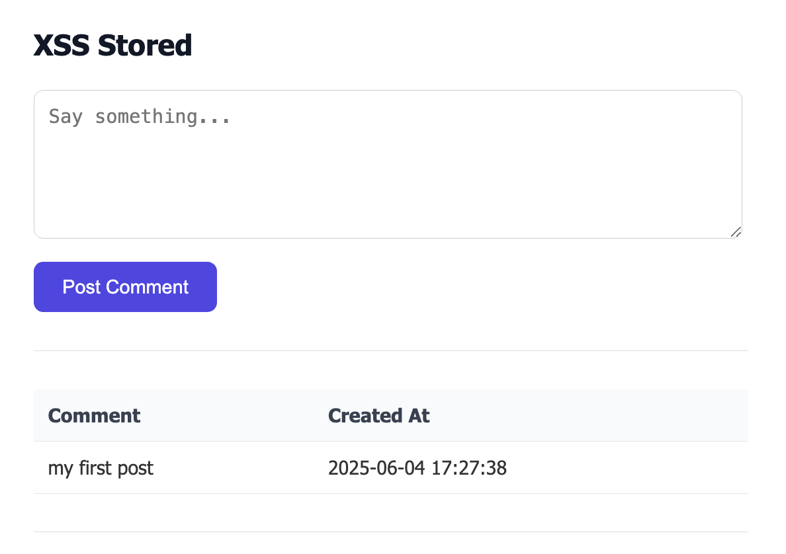{ width="600" }
     

## Step 3: Text Style Stored XSS Attack
Now that you see how the application should behave when entering in a message, attack the application by changing how the response will look.

1. Enter the following text in the input box, then press **`Post Comment`**,
    ```
    <h1 style="color: green;">XSS Stored Attack</h1>
    ```

    
    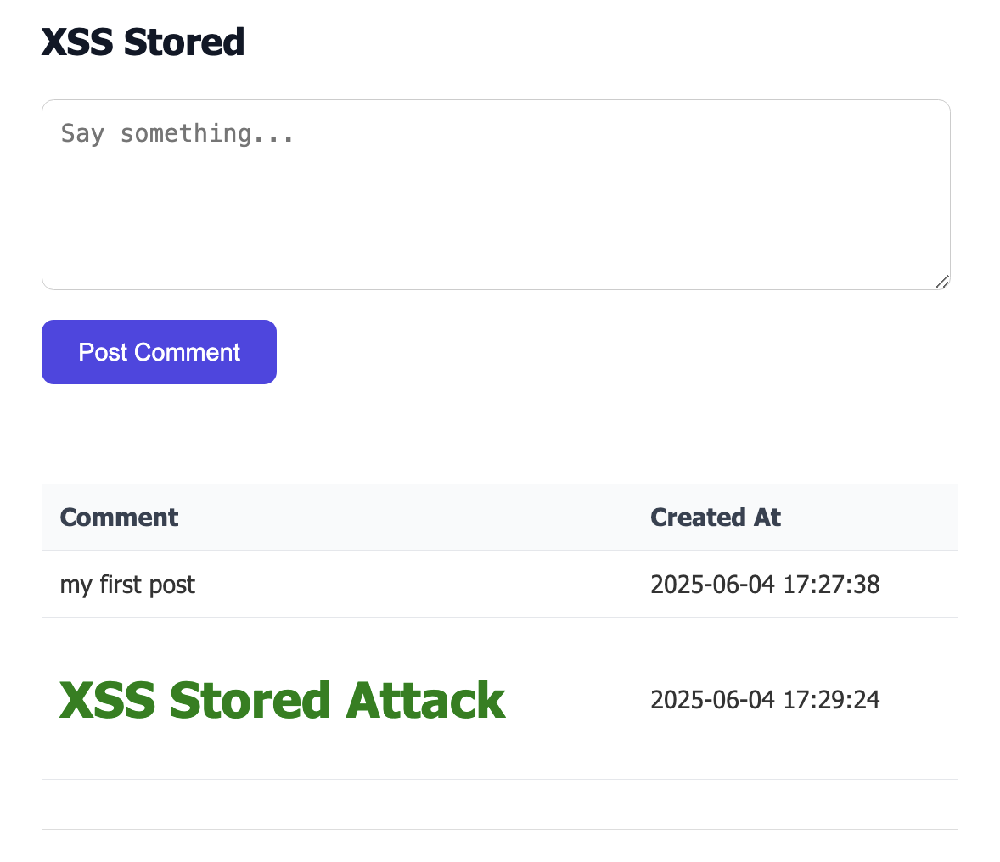{ width="600" }
     

    - This attack will store the text in a much larger font size and the color of it will be green

2. The difference between this attack and the Reflected XSS attack is that all users who visit this page will see the much larger text with a green color

    - Open a new private browser window,

        | Browser           | Instruction       | Keyboard Shortcut |
        | ----------------- | ----------------- | ----------------- |
        | Google Chrome     | Click the three-dot menu (⋮) in the top right → **New Incognito window**  | Windows: <kbd>Ctrl</kbd> + <kbd>Shift</kbd> + <kbd>N</kbd> <br> Mac: <kbd>Command</kbd> + <kbd>Shift</kbd> + <kbd>N</kbd> |
        | Mozilla Firefox   | Click the three-line menu (☰) → **New Private Window** | Windows: <kbd>Ctrl</kbd> + <kbd>Shift</kbd> + <kbd>P</kbd> <br> Mac: <kbd>Command</kbd> + <kbd>Shift</kbd> + <kbd>P</kbd>    |
        | Microsoft Edge    | Click the three-dot menu (⋮) → **New InPrivate window** | Windows: <kbd>Ctrl</kbd> + <kbd>Shift</kbd> + <kbd>N</kbd> <br> Mac: <kbd>Command</kbd> + <kbd>Shift</kbd> + <kbd>N</kbd> |
        | Safari            | Go to the **File** menu → **New Private Window** | <kbd>Command</kbd> + <kbd>Shift</kbd> + <kbd>N</kbd> |

3. In the address bar for the new private browser window, type following then press <kbd>Enter</kbd> 
    ```
    http://localhost:8089
    ```

4. As you will see even in this completely new browser session the XSS attack is still present
    
    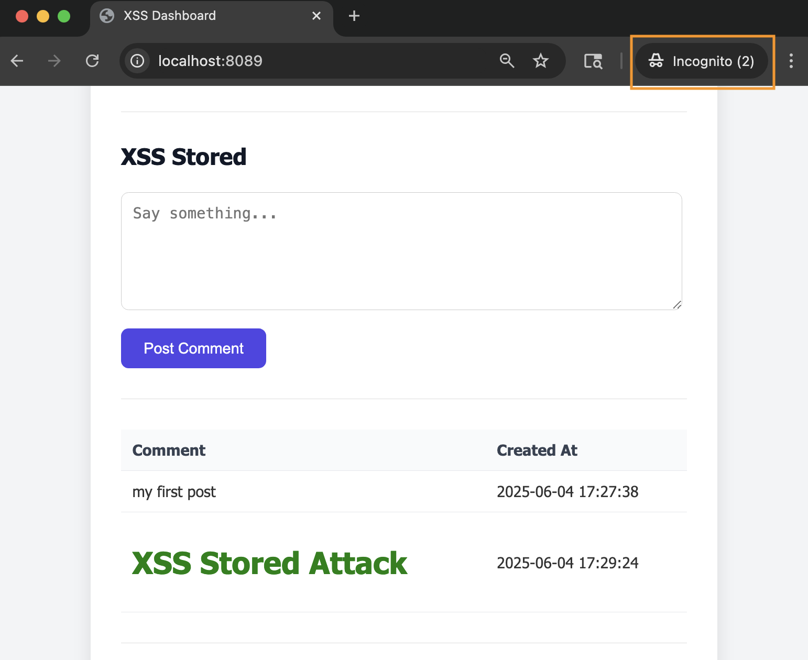{ width="600" }
     

## Step 4: Change Title Stored XSS Attack
Like other XSS Attacks, Stored XSS attacks can alter parts of the page that are already present. Perform a XSS Attack that will change the title `XSS Stored` to something else

1. Before you can change the title, you need to retrieve the reference id for the title. Most DOM objects will have an `id` associated for styling and other uses. First, open the `Inspect` window for the browser

    | Browser              | Instruction              |
    | ----------------- | ----------------- |
    | Google Chrome     | Right-click anywhere on the page, then click `Inspect`        |
    | Mozilla Firefox   | Right-click anywhere on the page, then click `Inspect`        |
    | Microsoft Edge    | Right-click anywhere on the page, then click `Inspect`        |
    | Safari            | Right-click anywhere on the page, the click `Inspect Element` _(Developer Tools must be enabled)_ |

    
    { width="600" }
    

2. Click the `Elements` tab
    
    { width="600" }
    

3. In the code shown, unfold the `<body>` and `<div class="container">` tags by clicking the arrow to the left side of the tag
    
    { width="600" }
    

4. Notice the `<h2>` HTML element for the `XSS Stored` title. Next to the `h2` there is an `id` attribute specified. The `id` value specifies the reference id for the title. 
    ```html
    <h2 id="storedTitle">XSS Stored</h2>
    ```

5. Using this id, type the following text in the input box on the web page, then press **`Post Comment`**.
    ```
    <script>document.getElementById('storedTitle').textContent='New Input Title';document.getElementById('storedTitle').style.color='red'</script>
    ```
    
    |              |              |
    | -------------| ------------ |
    | `<script>...</script>`     | Tells HTML to that there is some JavaScript code that will either add some form of interactivity or manipulate the web page       |
    | `document`   | Refers to the DOM which allows you to access and manipulate HTML elements      |
    | `getElementById('pageTitle')` | Is a built-in function of the `document` that searches for the first HTML element that has an `id` attribute with the specified name for its value  |
    | `.textContent` | Sets the text value to the provided text specified after the `=` sign |
    | `style` | refers to the style attribute on the DOM element |
    | `color` | Sets the text color to the provided value specified after the `=` sign |

    
    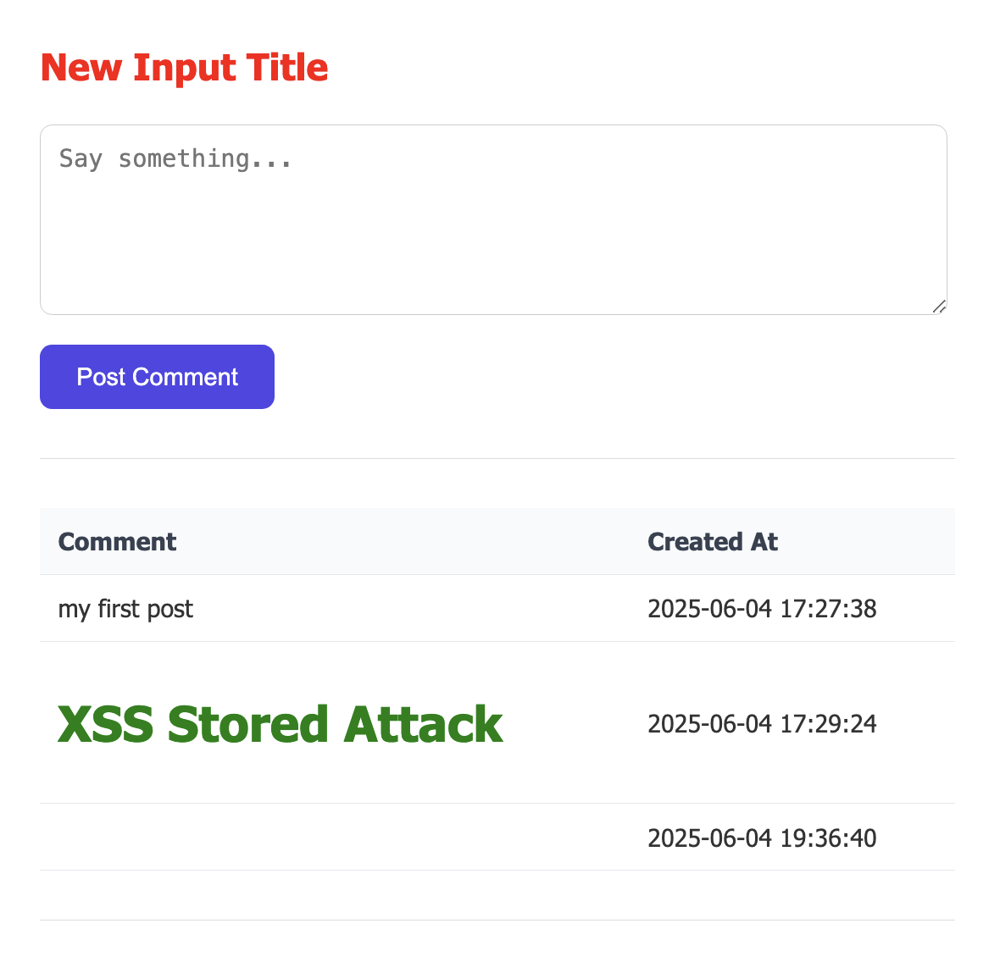{ width="600" }
    

6. Stored XSS attacks are persistent so every user will see the new title when they visit the web page.
    - Open a new private browser window
    - In the address bar for the new private browser window, type following then press <kbd>Enter</kbd> 
    ```
    http://localhost:8089
    ```

    > **Note**: It's important to note that each post is a form submission. If the page is refreshed by clicking the browser's reload button, the browser tries to reload the last request made which in this case is the form submission. 
    
    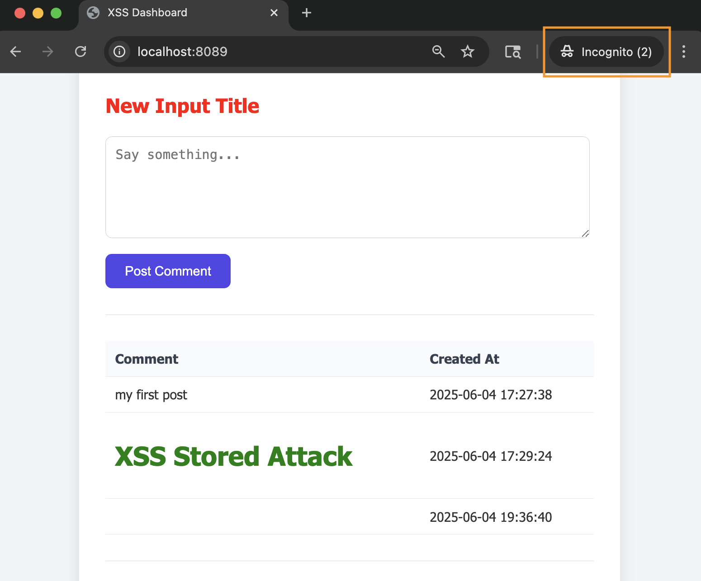{ width="600" }
    


## Step 5: Manipulate Web Page Stored XSS Attack
In this attack, you will change the way the application behaves when posting a comment. 

1. Enter the following text in the input box, then press **`Post Comment`**,
    ```
    <script>alert("Web Paged Hacked!")</script>
    ```
    
    { width="600" }
    

2. Open a new private browser window
    - In the address bar for the new private browser window, type following then press <kbd>Enter</kbd> 
    ```
    http://localhost:8089
    ```

    - The alert will display every time you refresh the page by just clicking in the browser address bar and pressing <kbd>Enter</kbd> or closing the browser and navigating to the XSS Vulnerable web page again

    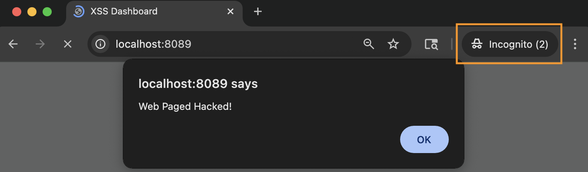{ width="600" }
    

4. To stop the alert from showing, click the **`Reset Data` button to delete all stored comments. These will reset everything back to normal.
    
    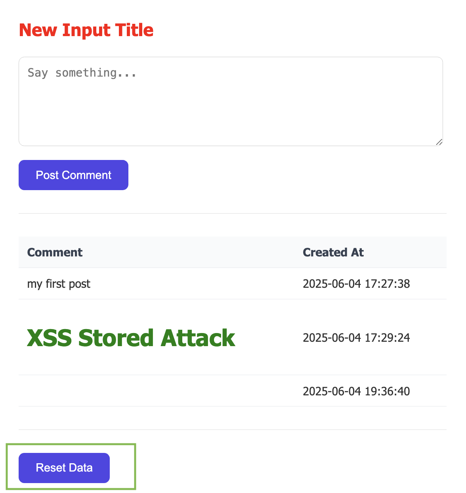{ width="600" }
    
    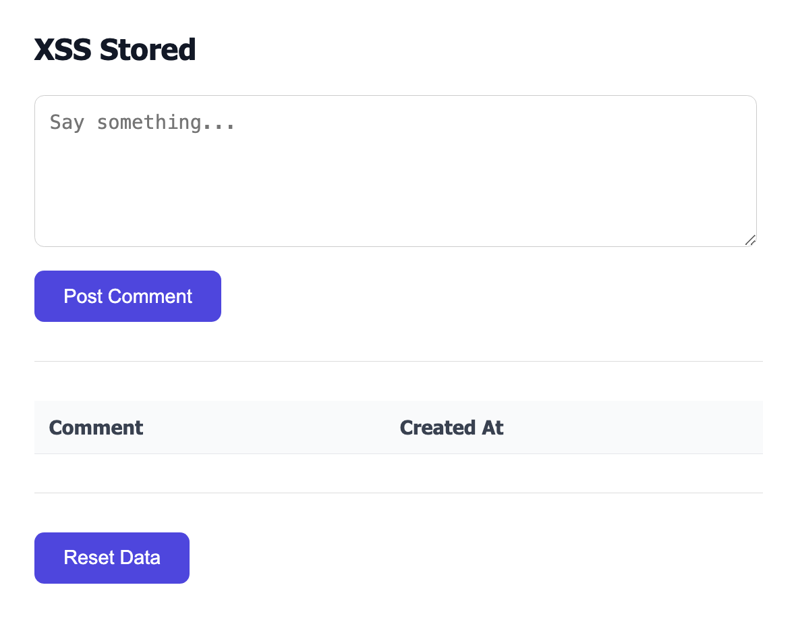{ width="600" }
    

## Bonus Stored XSS Attack Challenge
Now that you have a few examples on how to exploit a Stored XSS vulnerability try to come up with other attacks.

Example, 

- Change the color of the **Post Comment** button
- Change the text of the **Post Comment** button
- Try combining attacks into one
    - Change the Title text but in a different color
- Change the width of the textarea
- Change the text color inside the textarea

## Step 6: Protect Against Stored XSS Attacks
It's time to see the root cause of these attacks and how to protect against these attacks.

1. In VS Code, open the `xss_dashboard.html` located under the `templates` folder 

    To render web applications in python, it uses a built-in templating engine called **Jinja2**. Jinja2 is used for generating dynamic HTML pages by combining templates with data received from the python application. To pass data from the python code to the HTML template, Jinja2 replaces it placeholder syntax with the actual values

    | Syntax | Description |
    | ------------ | ------------ |
    | `{{ ... }}`  | Used for expressions or variables (e.g `{{ comment }}`) |
    | ``  | Used for loops and conditionals `{% if comment % }` |

2. Take a look at the following code block 
    ```html
    <h2 id="storedTitle">XSS Stored</h2>

    <form action="/blog" method="post">
      <textarea id="userInput" name="userInput" placeholder="Say something..."></textarea>
      <input id="userInputBtn" type="submit" value="Post Comment" />
    </form>

    <hr style="margin: 2rem 0; border: none; border-top: 1px solid #ddd;" />
    <table class="comments-table">
        <thead>
            <tr>
            <th>Comment</th>
            <th>Created At</th>
            </tr>
        </thead>
        <tbody>
            
            <tr>
            <td>{{ row.comment | safe }}</td>
            <td>{{ row.created_at }}</td>
            </tr>
            
        </tbody>
    </table>
    ```

    - ``: starts a loop for every `stored_comments` that has been received from the database. `row` is the reference for each stored comment as it loops
    - `stored_comments`: tells Jinja2 to place the value of the `stored_comments` variable here. `stored_comment` is the variable that is passed in the `xss_app.py` python code `render_template('xss_dashboard.html', comment=comment, stored_comments=stored_comments)` _(the word specified before the equal sign)_ 
    - `{{ row.comment }}`: tells Jinja2 to get the value of the comment column for the `row` reference 
    - `| safe`: tells Jinja2 that the value that is being inserted is trusted and to not escape the string.
    - `{{ row.created_at }}`: tells Jinja2 to get the value of the created_at column for the `row` reference 
    - ``: tells Jinja2 that this is the end of the loop

3. The following code block is the culprit as its using the Jinja keyword `safe`

    Replace 
    ```html
    <td>{{ row.comment | safe }}</td>
    ```
    <br>
    with
    ```python
    <td>{{ row.comment }}</td>
    ```
    > **Note:** Why use `safe` since its vulnerable to XSS? Well since the application is rendered using python. You may want to dynamically render HTML. In that case, you would sanitize the input using the `bleach` package in the python code to not allow or allow certain HTML elements in the user input. (e.g `bleach.clean(comment, tags=['b','i','u'], strip=True)`)

4. Save `xss_dashboard.html` file
    - In the top left corner, click `File`, then `Save` in the drop down menu; <br>or<br>

    - Use the respective shortcuts to save the file 

        - MacOS <br>
        <kbd>Command</kbd> + <kbd>S</kbd>

        - Windows <br>
        <kbd>Ctrl</kbd> + <kbd>S</kbd>

5. Reload the XSS Vulnerable Web application in the browser by  
    - Clicking [http://localhost:8089](http://localhost:8089) 
    <br><br> OR <br><br>
    - If the application is already loaded in the web browser, click inside the address bar and press <kbd>Enter</kbd>
    <br><br> OR <br><br>
    - Open your web browser of choice and type the following URL in the web address bar
    ```
    http://localhost:8089
    ```

6. Try any of the above attacks and verify that no malicious changes should occurred

    Example, enter the following text in the text box
    ```
    <script>document.getElementById('storedTitle').textContent='New XSS Title';document.getElementById('storedTitle').style.color='red'</script>
    ```

    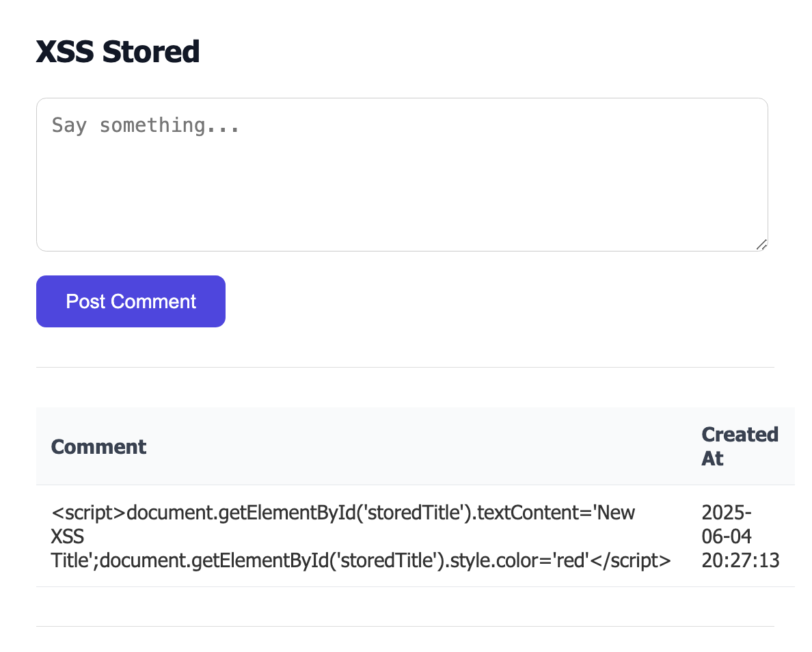{ width="600" }
    

## Bonus Protection Challenge
You now have a web application that protects against a stored XSS attack but in the comments table you can still see the HTML tags. Update the `xss_app.py` file to remove html tags before storing to the database

- Use the bleach package
- Use `pip` to install `bleach`
- Modify the code to use `bleach` to sanitize user input
- Stop & Restart the application to test

## Congratulations!
You have successfully exploited a vulnerable web page that is susceptible to Stored XSS attacks. 

Things learned: 

- Understand how Stored XSS Works
- Crafted payload that with malicious intent
- How to protect against Stored XSS
- Templating rendering in Python and potential misuse of syntax

---

# Task 5 - Cross Site Request Forgery (CSRF)

Cross-Site Request Forgery (CSRF) is list among the OWASP Top vulnerabilities because it exploits a fundamental flaw in how web applications handle user authentication and session management. This vulnerability allows an attacker to trick a victim into performing unintended actions on a web application in whey they are already authenticated. Since the request appears legitimate and comes from the authenticated user, the web application oft processes it without verifying the origin. 

While XSS attacks run code in your browser whether you are logged in or not, CSRF attacks tricks you browser into sending request that relies on a logged-in session.

## What You'll Learn
In this section, you will:

- Understand how CSRF works and how dangerous it is
- Learn how to construct a CSRF attack vector
- See firsthand how authentication is abused
- Discover how to defend against a CSRF attack

## Prerequisite 
Before you begin this section, 

- The deliberate vulnerable web application has been downloaded. If not, follow the guide in the [Getting Started](/getting_started) section.

## Step 1: Login Vulnerable Web Application
First, login to the Vulnerable Web Application. This vulnerability relies on an authenticated session

1. Navigate to the Vulnerable Web Application by clicking this hyperlink [http://localhost:8088](http://localhost:8088) or by typing this url in your Web Browser of choice
    
    { width="400" }
    

2. Provide one of the following credentials to login to the application
    - Admin
        - **Username**: `admin`
        - **Password**: `admin`
    - User
        - **Username**: `user`
        - **Password**: `pass`
    
    { width="400" }
    

## Step 2: Out-of-the-Box Behavior
To ensure the application does what you would like it to do, change the password for the user you are logged in as. 

1. On the dashboard page of the application, type a new password in the `New Password` text box

2. Click **`Change Password`**
    
    { width="400" }
    
3. Verify the password has been changed for the logged in user
    - Click the `<- Back` button
    - Click `Logout`
    - Login as the previous user, with the new password

## Step 3: Create the CSRF Attack Page
CSRF attacks usually will begin with some sort of phishing attempt like an email posed as the site with a message enticing you to click a link. The attack occurs when you click on the link and the moment the page loads a malicious script is executed. However, it assumes you are already logged in as an authenticated user. 

1. In VS Code, Click any where in an open area of the Explorer pane, then click the new file icon, name the file `csrf_attack.html`.
    
    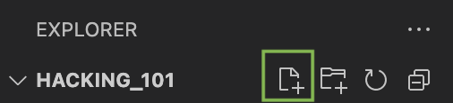{ width="300" }
    
2. Create the foundational elements of an HTML file
    ```html 
    <!DOCTYPE html>
    <html>
        <body>
        
        </body>
    </html>
    ```

3. Inside the `body` HTML element, add a `h2` tag with the value `You have a New Message`
    ```html
    <!DOCTYPE html>
    <html>
        <body>
            <h2> You have a New Message</h2>
        </body>
    </html>
    ```
4. Next, create a HTML image element that will execute an `onerror` function for a bad image source
    ```html
    <!DOCTYPE html>
    <html>
        <body>
            <h2> You have a New Message</h2>
            
        </body>
    </html>
    ```

5. Update the `img` `onerror` attribute with a JavaScript function to create a form
    ```html
    
    ```

6. Continue refining the JavaScript to add a form action that will execute a HTTP `POST` request to `http://localhost:8088/change_password`
    ```html
    
    ```

7. Before you continuing refining the `onerror` JavaScript, you need to get the text box's reference that takes the new password. 
    - Open the Vulnerable Web Application, [http://localhost:8088](http://localhost:8088), and proceed to login if not logged in already.

    - Open the `Inspect` window for the browser

        | Browser           | Instructions       |
        | ----------------- | ----------------- |
        | Google Chrome     | Right-click anywhere on the page, then click `Inspect`        |
        | Mozilla Firefox   | Right-click anywhere on the page, then click `Inspect`        |
        | Microsoft Edge    | Right-click anywhere on the page, then click `Inspect`        |
        | Safari            | Right-click anywhere on the page, the click `Inspect Element` _(Developer Tools must be enabled)_ |

    - Click the `Elements` tab
        
        { width="600" }
        

    - In the code shown, unfold the `<body>`, `<div class="container">`, then `<form action="/change_password" method="post">` tags by clicking the arrow to the left side of the tag
        
        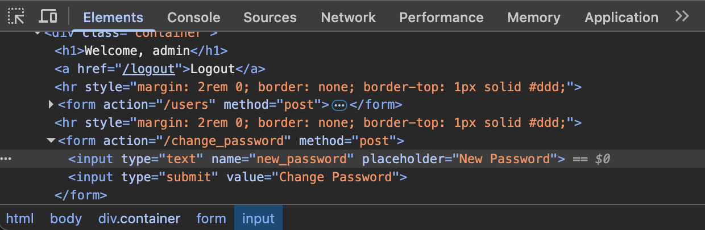{ width="600" }
        

    - Notice the `<input type="text" name="new_password" placeholder="New Password">`. The `name` is what binds the text you put in the textbox to the HTTP request to change the password. You will use the `name` value `new_password` in your `csrf_attack.html`

8. Back in VS Code inside the `csrf_attack.html` file, define an input element in the JavaScript code
    ```html
    
    ```

9. Set the type of input to `hidden` so that its not visible to the user
    ```html
    
    ```

10. Set a name reference of the input that will be used to send to the HTTP request. The name reference will be the value you saw in the inspect window of the `Change Password` form
    ```html
    
    ```

11. Set the value of the input field. This value will be the new password when the malicious script is executed
    ```html
    
    ```

12. Now that you have created both a form and the input elements, you need to associate the input element as a child of the form. 
    ```html
    
    ```

13. Next, associate the form to the DOM body
    ```html
    
    ```

14. Lastly, you want the form to be submitted once image fails to load
    ```html
    
    ```

15. Save `csrf_attack.html` file
    - In the top left corner, click `File`, then `Save` in the drop down menu; <br>or<br>

    - Use the respective shortcuts to save the file 

        - MacOS <br>
        <kbd>Command</kbd> + <kbd>S</kbd>

        - Windows <br>
        <kbd>Ctrl</kbd> + <kbd>S</kbd>

## Step 4: Execute the CSRF Attack

1. In VS Code, right click on the `csrf_attack.html`
    
    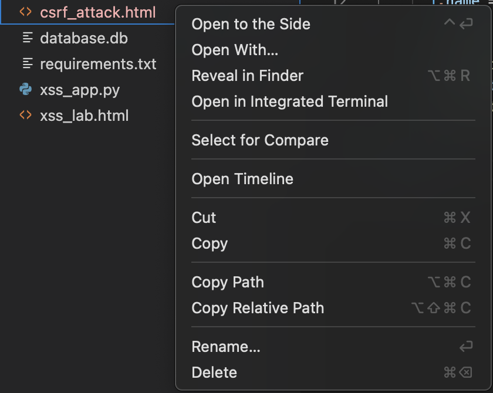{ width="400" }
    

2. In the drop down menu, click `Copy Path`, this will copy the file's location url
    
    { width="400" }
    

3. Ensure you are logged into [http://localhost:8088](http://localhost:8088)
    - Admin
        - **Username**: `admin`
        - **Password**: `admin`
    - User
        - **Username**: `user`
        - **Password**: `pass`

4. Open a new browser tab in the same browser window
    - **Windows:** <kbd>Ctrl</kbd> + <kbd>T</kbd>
    - **Mac:** <kbd>Command</kbd> + <kbd>T</kbd>

5. Paste in the URL/Path that was copied from VS Code, then press <kbd>Enter</kbd>. The page should be redirected to the expected `Password Changed` webpage
    
    { width="400" }
    

6. Verify that the password has indeed changed for the user that was logged in
    - Click on the `User Dashboard` browser tab, then `Logout`
    - Try logging into the application with the expected password
        
        { width="400" }
        
    - Now try logging in with the password you set in the `csrf_attack.html`
        
        { width="400" }
        

## Step 5: Protect Against CSRF Vulnerabilities 
There are many ways to protect against CSRF attacks. The most common and widely recommended approach is the use of CSRF tokens in combination with SameSite cookies. 

In this lab to protect against CSRF, the following steps will guide you through the most common and widely used approach: 
    
- Set the session to use SameSite=Strict, HTTP-Only
- Generate a CSRF Token
- Store it in the user's session
- Inject the CSRF token into the HTML form 
- Validate the CSRF Token from form request against user session

### Configure Session Cookie Settings

1. In VS Code, open the `app.py` file

2. Take a look at the following code block
    ```python
    from flask import Flask, request, render_template, redirect, url_for, session
    import sqlite3

    app = Flask(__name__)
    app.secret_key = 'secret'  # Weak session secret
    ```

3. After the `app.secret_key`, use the Flask instance to set the session cookie settings to be more secured
    ```python
    from flask import Flask, request, render_template, redirect, url_for, session
    import sqlite3

    app = Flask(__name__)
    app.secret_key = 'secret'  # Weak session secret
    app.config.update(
        SESSION_COOKIE_HTTPONLY=True, 
        SESSION_COOKIE_SAMESITE='Strict'
    )
    ```

    | Key               | Description       |
    | ----------------- | ----------------- |
    | `SESSION_COOKIE_HTTPONLY`   | Restricts the session cookie to be accessible only through HTTP, preventing JavaScript from accessing it and thereby protecting against session theft via XSS attacks.    |
    | `SESSION_COOKIE_SAMESITE`   | Helps reduce the risk of cross-origin requests (CSRF) by ensuring the cookie is only sent when the request originates from your own site, preventing it from being transmitted from external origins.    |
    | `SESSION_COOKIE_SECURE`     | The cookie is only sent over encrypted HTTP connections (HTTPS). ***Not used in this lab as everything is done on the local machine.***  |

### Generate CSRF Token & Store in User Session

1. At the top of the `app.py` file, import the `secrets` built-in library
    ```python
    from flask import Flask, request, render_template, redirect, url_for, session
    import sqlite3
    import secrets
    ```

1. Next, take a look at the following code in `app.py`
    ```python
    @app.route('/dashboard', methods=['GET', 'POST'])
    def dashboard():
        if 'username' not in session:
            return redirect('/')
        if request.method == 'POST':
            # XSS vulnerability
            comment = request.form['comment']
            return f"<h2>Your Comment:</h2><p>{comment}</p>"
        return render_template('dashboard.html', username=session['username'])
    ```

2. In between the two `return` statements insert the following code to generate a CSRF token and set it in the user's session
    ```python
    @app.route('/dashboard', methods=['GET', 'POST'])
    def dashboard():
        if 'username' not in session:
            return redirect('/')
        if request.method == 'POST':
            comment = request.form['comment']
            return f"<h2>Your Comment:</h2><p>{comment}</p>"

        session['csrf_token'] = secrets.token_hex(16)
        return render_template('dashboard.html', username=session['username'])
    ```

    This will create a CSRF Token every time the dashboard page loads. For heighten security, you do not want the CSRF Token to be long standing to avoid reuse. 

3. Update the last `return` statement to include a new parameter with the `csrf_token` that will be passed to the `dashboard.html` template
    ```python
    return render_template('dashboard.html', username=session['username'], csrf_token=session['csrf_token'])
    ```

4. Save `app.py` file
    - In the top left corner, click `File`, then `Save` in the drop down menu; <br>or<br>

    - Use the respective shortcuts to save the file 

        - MacOS <br>
        <kbd>Command</kbd> + <kbd>S</kbd>

        - Windows <br>
        <kbd>Ctrl</kbd> + <kbd>S</kbd>

### Inject CSRF Token in HTML Form

1. Open the `dashboard.html` template that's located under the `templates` folder in VS Code

2. Take a look at the following code

    ```html
    <form action="/change_password" method="post">
        <input type="text" name="new_password" placeholder="New Password" />
        <input type="submit" value="Change Password" />
    </form>
    ```

3. Update the form using the Jinja2 template syntax to include the `csrf_token` in a hidden input field. The hidden input field will still be visible in the page source but it will be validated against the session on submission 

    ```html
    <form action="/change_password" method="post">
        <input type="hidden" name="csrf_token" value="{{ csrf_token }}" />
        <input type="text" name="new_password" placeholder="New Password" />
        <input type="submit" value="Change Password" />
    </form>
    ```

4. Save `dashboard.html` file
    - In the top left corner, click `File`, then `Save` in the drop down menu; <br>or<br>

    - Use the respective shortcuts to save the file 

        - MacOS <br>
        <kbd>Command</kbd> + <kbd>S</kbd>

        - Windows <br>
        <kbd>Ctrl</kbd> + <kbd>S</kbd>

### Validate CSRF Token 

1. In VS Code, open the `app.py` file

2. Take a look at the following code 
    ```python
    @app.route('/change_password', methods=['POST'])
    def change_password():
        # CSRF Vulnerability
        new_pass = request.form['new_password']
        conn = sqlite3.connect('database.db')
        cursor = conn.cursor()
        cursor.executescript(f"UPDATE users SET password = '{new_pass}' WHERE username = '{session['username']}'")
        conn.commit()
        conn.close()
        return render_template('response.html', response="Password Changed!")
    ```

3. Update the `change_password()` method to get the CSRF Token from the form
    ```python
    @app.route('/change_password', methods=['POST'])
    def change_password():
        token = request.form['csrf_token']
        
        new_pass = request.form['new_password']
        conn = sqlite3.connect('database.db')
        cursor = conn.cursor()
        cursor.executescript(f"UPDATE users SET password = '{new_pass}' WHERE username = '{session['username']}'")
        conn.commit()
        conn.close()
        return render_template('response.html', response="Password Changed!")
    ```

4. On the next line, get the expected CSRF Token from the user's session
    ```python
    @app.route('/change_password', methods=['POST'])
    def change_password():
        token = request.form['csrf_token']
        expected_token = session['csrf_token']
        
        new_pass = request.form['new_password']
        conn = sqlite3.connect('database.db')
        cursor = conn.cursor()
        cursor.executescript(f"UPDATE users SET password = '{new_pass}' WHERE username = '{session['username']}'")
        conn.commit()
        conn.close()
        return render_template('response.html', response="Password Changed!")
    ```

5. Next, check if the `token` exist and that it matches the expected token. If it does not match then return an invalid response
    ```python
    @app.route('/change_password', methods=['POST'])
    def change_password():
        token = request.form['csrf_token']
        expected_token = session['csrf_token']

        if not token or token != expected_token:
            return render_template('response.html', response="Invalid CSRF Token"), 403
        
        new_pass = request.form['new_password']
        conn = sqlite3.connect('database.db')
        cursor = conn.cursor()
        cursor.executescript(f"UPDATE users SET password = '{new_pass}' WHERE username = '{session['username']}'")
        conn.commit()
        conn.close()
        return render_template('response.html', response="Password Changed!")
    ```

6. Save `app.py` file
    - In the top left corner, click `File`, then `Save` in the drop down menu; <br>or<br>

    - Use the respective shortcuts to save the file 

        - MacOS <br>
        <kbd>Command</kbd> + <kbd>S</kbd>

        - Windows <br>
        <kbd>Ctrl</kbd> + <kbd>S</kbd>

### Test CSRF Attack Protection

1. Navigate to the Vulnerable Web Application by clicking this hyperlink [http://localhost:8088](http://localhost:8088) or by typing this url in your Web Browser of choice
    - If you are already logged in, click `Logout`

2. Provide a different user credential to login into the application. The one you used before password has been changed. So for simplicity, test against another user to make sure their password doesn't change. 
    - Anakin
        - **Username**: `anakin`
        - **Password**: `skywalker123`
    - Vader
        - **Username**: `vader`
        - **Password**: `darth246`

3. In VS Code, right click on the `csrf_attack.html`
    
    { width="400" }
    

4. In the drop down menu, click `Copy Path`, this will copy the file's location url
    
    { width="400" }
    

5. Open a new browser tab in the same browser window
    - **Windows:** <kbd>Ctrl</kbd> + <kbd>T</kbd>
    - **Mac:** <kbd>Command</kbd> + <kbd>T</kbd>

5. Paste in the URL/Path that was copied from VS Code, then press <kbd>Enter</kbd>. You should receive `Invalid CSRF token!`
    
    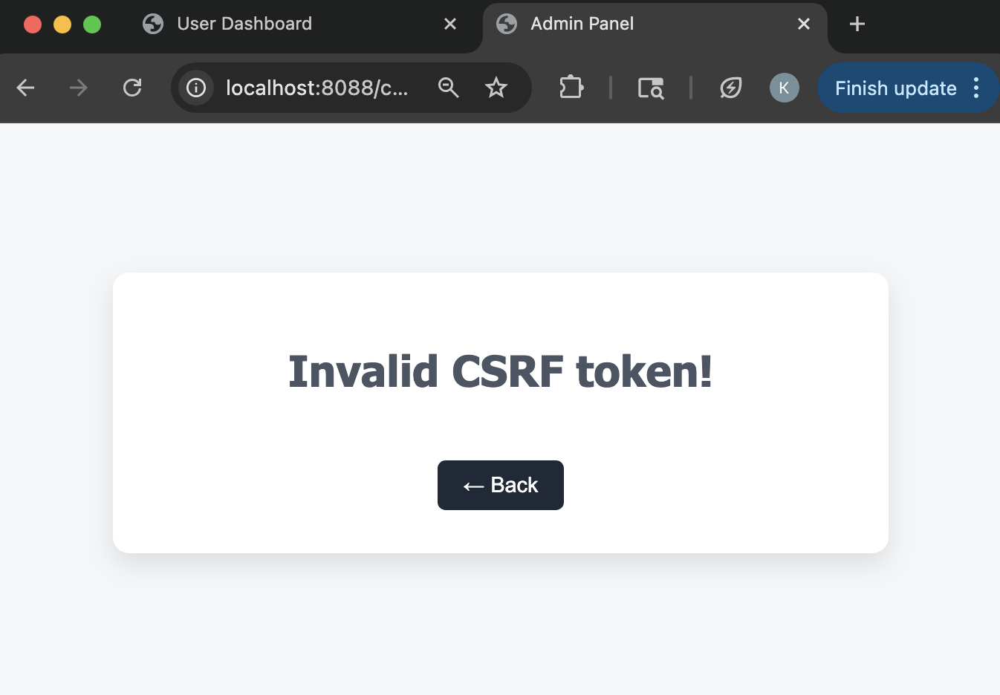{ width="400" }
    

6. Verify that the password has **not** changed for the user that was logged in
    - Click on the `User Dashboard` browser tab, then `Logout`
    - Try logging into the application with the password you set in the `csrf_attack.html`
        
        { width="400" }
        
    - Now try logging in with the original password
        
        { width="400" }
        

### Bonus Challenge
In the changed made to protect against a CSRF vulnerability, you have injected the CSRF Token into the HTML form which is now visible in the DOM when viewing the page source. 

- Investigate the DOM of the `User Dashboard` to retrieve the reference and the value for the CSRF Token
- Update the `csrf_attack.html` to include a new `input` element in the JavaScript created form and insert the CSRF Token as the value
- Test that you are not able to update the logged in user's password.

## Congratulations!
In this section of the lab, you have learned and experienced:

- How to identify Cross-Site Request Forgery and the impact it may have
- How to exploit CSRF vulnerabilities
- How to validate request authenticity using CSRF tokens
- How SameSite Cookie controls cross-site cooke behavior by protecting the session from external origins

--- 

# Summary 
In this lab, you explored the foundational concepts and practical techniques behind common web application vulnerabilities. Using a Python-based vulnerable web application with a backend database, you gained hands-on experience in identifying, exploiting, and mitigating 3 of the Top 10 OWASP vulnerabilities in SQL Injection, DOM-Based XSS, Stored XSS, Reflected XSS, and CSRF. 

Through guided steps, you discovered:

- How SQL Injections can be used to manipulate database queries to bypass logins and extract sensitive information. You also learned how parameterized queries serve as effective defenses. 
- The dangers of Cross-Site Scripting (XSS) in its various forms (Reflected, Stored, and DOM-Based). You gained insight how malicious scripts can be used to hijack user sessions and manipulate the webpage.
- How attackers can exploit user trust to perform unauthorized actions and how CSRF tokens can neutralize such threats.

This lab emphasized a defensive mindset, reinforcing the understanding how attacks works first. This experience lays a strong foundation for aspiring ethical hackers, developers, and security professionals. 

Security practices and mitigation strategies are continually evolving, as new attack vectors emerge daily. Continue building on these foundational techniques to contribute to a safer and more secure digital world

**Thank you for attending the lab!**