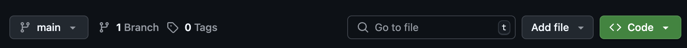
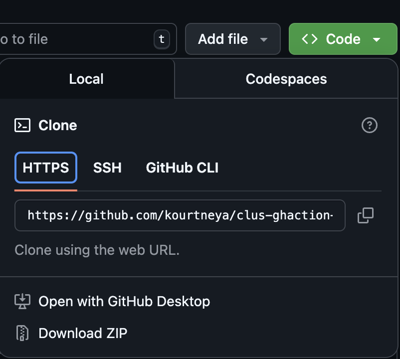

# Getting Started

In this lab, you'll simulate real-world attack scenarios on a deliberate insecure web application. After exploiting each vulnerability, you'll explore how to mitigate them. To begin the lab, you'll download the vulnerable application on to your local machine. Starting the application locally will be the controlled environment to perform the attacks. 

## Step 1: Download Vulnerable Web Application 
1. Navigate to the Vulnerable Web Application repository in GitHub by visiting https://github.com/kourtneya/hacking-101-lab

2. On the homepage of the repository, click the green button that's labeled **Code**
    <figure markdown>
        { width="880" }
    </figure>

3. Download the codebase using one of the following options from the drop down menu
    <figure markdown>
        { width="400" }
    </figure>

    - **Zip File**
        - Click **`Download Zip`** and save on the Desktop
        - Double Click, the zip file located on the Desktop to begin extraction 
    - **Git Clone**
        - Open Local Terminal 
            - **MacOS**: Press the <kbd>Command</kbd> + <kbd>Space</kbd> buttons on the keyboard, type `Terminal` and press enter
            - **Windows**: Click the `Start` button (usually Windows icon) at the bottom left corner of the screen. Type `cmd` and press enter
        - Navigate to Desktop Directory in Terminal
            - MacOS
                ```bash
                cd ~/Desktop
                ```
            - Windows
                ```bash
                cd $HOME\Desktop
                ```
        - Clone Repository 
            ```bash
            git clone https://github.com/kourtneya/hacking-101-lab.git
            ```

4. Open Visual Studio Code from Applications Menu or icon on Desktop

5. Open Project Directory
    - Click `File`, in the top tool bar
    - In the dropdown menu, click `Open Folder`
    - Select the `hacking-101-lab`, from the Desktop location

## Step 2: Create a Local Python Virtual Environment 
In Python, it is best practice to create a virtual environment. A virtual environment in python is a self-contained directory that contains a the python interpreter and its installed dependencies. Having this virtual environment scopes the dependencies to this project, avoid conflicts with other projects, and keeps your global python installation clean.

1. In VS Code, open a `Terminal` window
    - Click `View` in the top tool bar
    - Then click, `Terminal`

2. A Terminal window will appear at the bottom of VS Code, at the project's path
    - To test that the terminal is at the projects path, type `pwd` and press enter in the terminal window
    <figure markdown>
    { width="800" }
    </figure>

3. Enter the following command to create the virtual environment 
    ```bash
    python -m venv hacking_101
    ```

4. Next, enter in the following command to activate the virtual environment
    - MacOS
    ```bash
    source hacking_101/bin/activate
    ```
    
    - Windows
    ```bash
    hacking_101\Scripts\activate.bat
    ```

## Step 3: Install Python Dependencies
In the project directory is a file named `requirements.txt`. This file list all the dependencies required to run the python application. You need to install these dependencies in the virutal environment so that you can properly run the python application

Install the projects dependencies by entering the following command in the terminal session. 

```bash 
pip install -r requirements.txt
```

## Step 4: Start the Vulnerable Web Application
In the terminal session, enter the following command to start the python application

```bash
python app.py
```
You should see a similar result like the following to ensure your application is running 

```{.bash .no-copy}
* Serving Flask app 'app'
* Debug mode: on
WARNING: This is a development server. Do not use it in a production deployment. Use a production WSGI server instead.
* Running on all addresses (0.0.0.0)
* Running on http://127.0.0.1:8088
* Running on http://10.26.165.233:8088
Press CTRL+C to quit
* Restarting with stat
* Debugger is active!
* Debugger PIN: 113-761-129
```

## Step 5: Visit the Vulnerable Web Application in Web Browser
Now that the application is running you can now visit the application in your web browser of choice by clicking [http://localhost:8088](http://localhost:8088) or typing the url in the web browser. 

<figure markdown>
{ width="600" }
</figure>


## Optional: Scan for Vulnerabilities 
!!! danger "Important!"
    If using the provided workstations at Cisco Live, please skip this step as the workstations do not have the tools installed to perform vulnerability scanning.

While its not required for this lab, you're encouraged to explore how automated tools detect vulnerabilities. It is recommended to use one of the following tools to scan for vulnerabilities within your application

| Tool              | Description                      |
| ----------------- | -------------------------------- |
| [OWASP ZAP](https://www.zaproxy.org/) | Great for intercepting traffic and scanning for common issues |
| [Nikto](https://cirt.net/Nikto2) | Command-line scanner for common web server vulnerabilities |
| [sqlmap](https://sqlmap.org/) | Useful for identifying SQL Injection |
| [Burp Suite](https://portswigger.net/burp/dast) | Great for intercepts and analyzes web traffic to find and exploit vulnerabilities |
| [Wapiti](https://wapiti-scanner.github.io/) | Open-source scanner that detects security flaws like XSS and SQL injection by performing automated black-box testing |

## How to Approach This Lab
This lab is modular and self-paced. Each vulnerability is presented in its own section. You'll follow a consistent pattern in each section: 
- Understand the vulnerability
- Exploit the vulnerability
- Mitigate the issue using secure coding practices

You can complete the modules in order or jump around. However, it is recommended to start with SQL Injection.

## Troubleshooting & Help
- Check for port conflicts (port 8088 is used by default)
- If `app.py` fails to start, ensure dependencies were install correctly
- For Python errors, verify your version is 3.8 or higher
- To rest database, stop the Python application, delete the `database.db` file, recreate the file, and then restart the Python application
- For additional assistance, click the `help` icon in the WIL Assistant so that a team member can be notified ***(Cisco Live Only)***


## You're Ready! 
Jump into [Task 1 - SQL Injection](/task_1) when you are ready to begin! Really dive into the concept and learn deeply by breaking things and attempting to fix them.