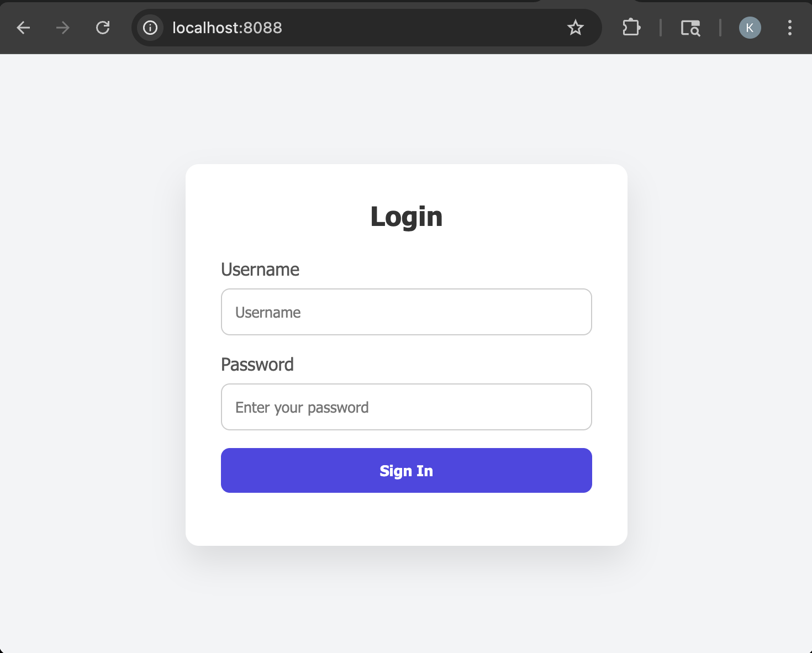
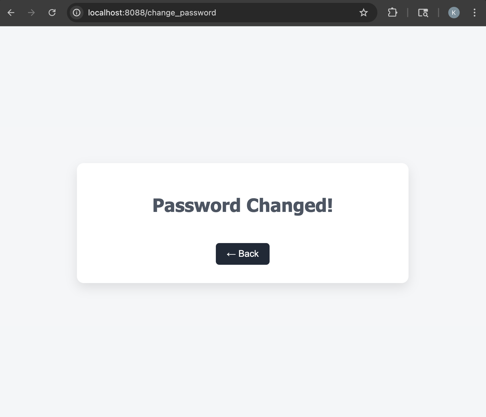
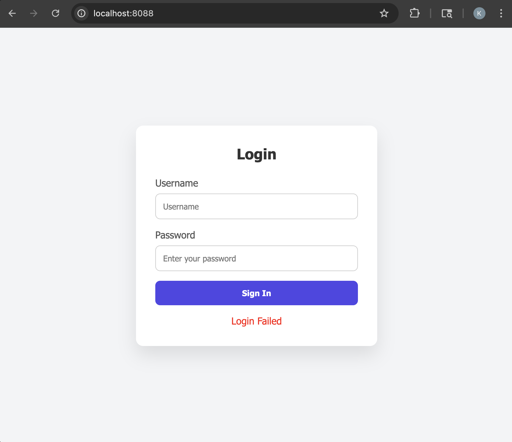

# Task 1 - SQL Injection

SQL Injection is one of the oldest and most dangerous web application vulnerabilities and it's still prevalent today. It's listed as one of the OWASP Top 10 security risks for good reason. SQL Injection manipulates unsanitized user input which allow attackers to craft SQL queries that trick the database into revealing data, bypassing authorization, or even executing destructive commands. Data breaches caused by SQL Injections have compromised millions of records.

## What You'll Learn
In this section, you'll:

- Understand how SQL Injection works and why it's dangerous through examples
- Manually exploit a login form to bypass authentication
- Try to extract all users from the database
- Techniques to protect against SQL Injection

## Prerequisite 
Before you begin this section, 

- The deliberate vulnerable web application has been downloaded and started. If not, follow the guide in the [Getting Started](/getting_started) section.

## Bypass Login Authentication 
Almost every web application contain a login process to retrieve access to the application or additional features. Bypassing authentication is one of the simplest and most classic examples of how attackers can manipulate SQL queries to perform SQL Injection. 

### Step 1: Login Vulnerable Web Application
Before you begin exploiting the login page, login to the Vulnerable Web application with one of the follow default users. 

1. Navigate to the Vulnerable Web Application by clicking this hyperlink [http://localhost:8088](http://localhost:8088) or by typing this url in your Web Browser of choice
    <figure markdown>
    { width="400" }
    </figure>

2. Provide one of the following credentials to login to the application
    - Admin
        - **Username**: `admin`
        - **Password**: `admin`
    - User
        - **Username**: `user`
        - **Password**: `pass`

    <figure markdown>
    { width="400" }
    </figure>

### Step 2: Bypass Login 
Now that you have successfully logged in with a known user and password. Try exploiting the login

1. If you are currently logged in, click the `Logout` button

2. On the Login page, provide the following credentials
    - **Username**: `' OR 1=1--`
    - **Password**: Type, anything as it's irrelevant

    <figure markdown>
    { width="400" }
    </figure>

### Step 3: Login Attack Root Cause
More often than not, you will not have access to view an applications source code. In order to education how these attacks occur, take a look at the following source code to see the root cause of this attack. 

1. In VS Code, open the `app.py` file. 

2. Take a look at the following code block 
    ```{.python .no-copy hl_lines="7"}
    @app.route('/', methods=['GET', 'POST'])
    def login():
        if request.method == 'POST':
            username = request.form['username']
            password = request.form['password']
            # Vulnerable to SQL Injection
            query = f"SELECT * FROM users WHERE username = '{username}' AND password = '{password}'"
            conn = sqlite3.connect('database.db')
            cursor = conn.cursor()
            cursor.execute(query)
            user = cursor.fetchone()
            conn.close()
            if user:
                session['username'] = username
                session['is_admin'] = user[3]
                return redirect('/dashboard')
            else:
                return render_template('login.html', response="Login Failed")
        return render_template('login.html')
    ```

3. The highlighted `query` is vulnerable to SQL Injection due to string concatenation
    ```{.python .no-copy}
    query = f"SELECT * FROM users WHERE username = '{username}' AND password = '{password}'"
    ```
4. Passing `' OR 1=1--` as the username will turn the `query` string to 
    ```sql
    SELECT * FROM users WHERE username = '' OR 1=1 --' AND password = '';
    ```

    - `'` will end the original string that started right after the equal sign for the username. Causing the username to be `username = ''`

    - `OR 1=1` first states find the user by `username = ''` OR where `1=1`. The statement `1=1` is always true and will return all rows from the requested table

    - `--` starts a comment in SQL, so the request of the query `' AND password = ''` will be ignored. The leading `'` was the ending of the original username string. Nevertheless, this is why entering a password in the login is irrelevant

5. The `query` will return all rows in the `users` table, letting the attacker bypass the login as the first valid user.

## Extract Data from Database
Before you being protecting SQL Injection attacks, exploit the `Find User` input after logging into the application. 

### Step 1: Find User By Name
First find the `admin` or `user` user to ensure you are receiving the expected response

In the dashboard page, enter `admin` or `user` then press the `Find User` button

<figure markdown>
{ width="400" }
</figure>

### Step 2: Find All Users
Perform a SQL Injection attack to find all users in the database.

1. In the dashboard page, enter `' OR 1=1--`, to retrieve a list of all users

<figure markdown>
{ width="400" }
</figure>

2. Entering `' OR 1=1--` has the same affect as it did for bypassing the login.

3. In `app.py`, the following code is executed to find the user. The highlighted line is vulnerable to SQL Injection
    ```{.python .no-copy hl_lines="6"}
    @app.route('/users', methods=['POST'])
    def find_users():
        username = request.form['username']
        conn = sqlite3.connect('database.db')
        cursor = conn.cursor()
        cursor.execute(f"SELECT * FROM users where username='{username}'")
        users = cursor.fetchall()
        conn.close()

        if not users:
            return render_template('users.html')

        return render_template('users.html', users=users)
    ```

4. The highlighted line was modified to the following query when entering `' OR 1=1--`
    ```{.sql .no-copy}
    SELECT * FROM users where username='' OR 1=1--'
    ```

### Step 3: Delete Users
So far you have perform SQL Injections that bypass authentication and view data that were not expected to be viewed. While those are damaging and can give an attacker access to the application, some attackers perform SQL Injections to corrupt or remove data. Perform the next few steps to remove all users from the database.

1. In the dashboard view after logging into the application, type the following in the `New Password` text box, then click `Change Password`
    ```
    '; DELETE FROM USERS;--
    ```

2. You will see a misleading message like the following
    <figure markdown>
    { width="400" }
    </figure>

3. Click, the `Back` button

4. In the `Find Users` input field, enter `admin`, then click `Find User` button 
    <figure markdown>
    { width="400" }
    </figure>

5. You have made a SQL Injection attack to delete all users from the database. Thus if you `Logout` and try to login, you will receive the "Login Failed" message. 
    <figure markdown>
    { width="400" }
    </figure>

6. In `app.py`, the following code is executed to update the password. The highlighted line is vulnerable to SQL Injection
    ```{.python .no-copy hl_lines="7"}
    @app.route('/change_password', methods=['POST'])
    def change_password():
        # CSRF Vulnerability
        new_pass = request.form['new_password']
        conn = sqlite3.connect('database.db')
        cursor = conn.cursor()
        cursor.executescript(f"UPDATE users SET password = '{new_pass}' WHERE username = '{session['username']}'")
        conn.commit()
        conn.close()
        return render_template('response.html', response="Password Changed!")
    ```

7. Passing `'; DELETE FROM USERS;--` as the new password will turn the `query` string to 
    ```sql
    UPDATE users SET password = ''; DELETE FROM USERS;--' WHERE username = '{session['username']}'
    ```

    - `'` will end the original string that started right after the equal sign for the password. Causing the string to be `password = ''`

    - `;` will terminate the SQL statement for the `UPDATE` query

    - `DELETE FROM USERS;` will execute a new SQL statement to delete all data in the users table.

    - `--` starts a comment in SQL, so the request of the query `' WHERE username = '{session['username']}'` will be ignored. 

## Step 4: Reset Database
The Python application is setup to seed the database everytime it is started if the data isn't already populated. 

1. In VS Code Terminal window, the Python code is running. Simply press <kbd>Ctrl</kbd> + <kbd>C</kbd> to stop the application 

2. Then type `python app.py` to restart the application

3. Navigate to the Vulnerable Web Application by clicking this hyperlink [http://localhost:8088](http://localhost:8088) or by typing this url in the existing web browser tab

4. Try logging into the application again by providing one of the following credentials
    - Admin
        - **Username**: `admin`
        - **Password**: `admin`
    - User
        - **Username**: `user`
        - **Password**: `pass`

## Protect Against SQL Injection
Now that you have exploited an SQL Injection vulnerability, the next few steps will walk you through protecting these types of attacks

### Step 1: Protect From SQL Injections
SQL Injections occur from manipulating a string into a statement in which the input will be treated as code instead of plain text or data. To resolve these type of attacks, use prepared statements which will treat input as data and not executable SQL statements. 

Instead of building SQL queries by concatenating strings, use parameterized queries that uses placeholders for user inputs which the database will safely bind to the query without executing it as part of the SQL statement. 

1. In VS Code, open the `app.py` file

2. Locate the code block for login, 
    ```{.python .no-copy hl_lines="7 10"}
    @app.route('/', methods=['GET', 'POST'])
    def login():
        if request.method == 'POST':
            username = request.form['username']
            password = request.form['password']
            # Vulnerable to SQL Injection
            query = f"SELECT * FROM users WHERE username = '{username}' AND password = '{password}'"
            conn = sqlite3.connect('database.db')
            cursor = conn.cursor()
            cursor.execute(query)
            user = cursor.fetchone()
            conn.close()
            if user:
                session['username'] = username
                session['is_admin'] = user[3]
                return redirect('/dashboard')
            else:
                return render_template('login.html', response="Login Failed")
        return render_template('login.html')
    ```

3. Replace the highlighted lines above with the following, 
    ```python
    query = f"SELECT * FROM users WHERE username = ? AND password = ?"
    ```
    ```python
    cursor.execute(query, (username, password))
    ```

    - `?` is a placeholder for the user-provided value. SQLite automatically escapes the input into its respective data type
    - The `cursor.execute` function now accepts a second argument that supplies values for the `?` placeholders in the SQL query. Each placeholder is replaced in order by the corresponding value provided—for example, the first `?` is replaced by the first value in `(username, password)`

4. Save `app.py` File
    - In the top left corner, click `File`, then `Save` in the drop down menu; <br>or<br>

    - Use the respective shortcuts to save the file 

        - MacOS <br>
        <kbd>Command</kbd> + <kbd>S</kbd>

        - Windows <br>
        <kbd>Ctrl</kbd> + <kbd>S</kbd>

    The running application will automatically be updated and will quietly reload

6. Navigate to the Vulnerable Web Application by clicking this hyperlink [http://localhost:8088](http://localhost:8088) or by typing this url in the existing web browser tab

7. Try logging into the application again by providing one of the following credentials
    - Admin
        - **Username**: `admin`
        - **Password**: `admin`
    - User
        - **Username**: `user`
        - **Password**: `pass`

    All works as expected!

8. Now logout and try performing a SQL Injection attack. 
    - On the Login page, provide the following credentials
        - **Username**: `' OR 1=1--`
        - **Password**: Type, anything as it's irrelevant

    You will receive the "Login Failed" message and now your login is protected from SQL Injection attacks
    <figure markdown>
    { width="400" }
    </figure>


### Step 2: Protect Find User Input
Let's do the same for the `Find User` logic. 

1. In VS Code, open the `app.py` file

2. Locate the code block for login, 
    ```{.python .no-copy hl_lines="6"}
    @app.route('/users', methods=['POST'])
    def find_users():
        username = request.form['username']
        conn = sqlite3.connect('database.db')
        cursor = conn.cursor()
        cursor.execute(f"SELECT * FROM users where username='{username}'")
        users = cursor.fetchall()
        conn.close()

        if not users:
            return render_template('users.html')

        return render_template('users.html', users=users)
    ```

3. Replace the highlighted line above with the following, 
    ```python
    cursor.execute("SELECT * FROM users where username = ?", (username,))
    ```

4. Save `app.py` File
    - In the top left corner, click `File`, then `Save` in the drop down menu; <br>or<br>

    - Use the respective shortcuts to save the file 

        - MacOS <br>
        <kbd>Command</kbd> + <kbd>S</kbd>

        - Windows <br>
        <kbd>Ctrl</kbd> + <kbd>S</kbd>

    The running application will automatically be updated and will quietly reload

5. On the dashboard page of the Vulnerable application, find the `admin` user. The expected user should be returned.

6. Click Back 

7. Attempt a SQL Injection attack by typing `' OR 1=1--`, then click `Find User`. The expect `No users found` message should appear
    <figure markdown>
    { width="400" }
    </figure>

## Congratulations! 
You have learned how to exploit and protect SQL Injections one of the most popular vulnerabilities exploited. 
