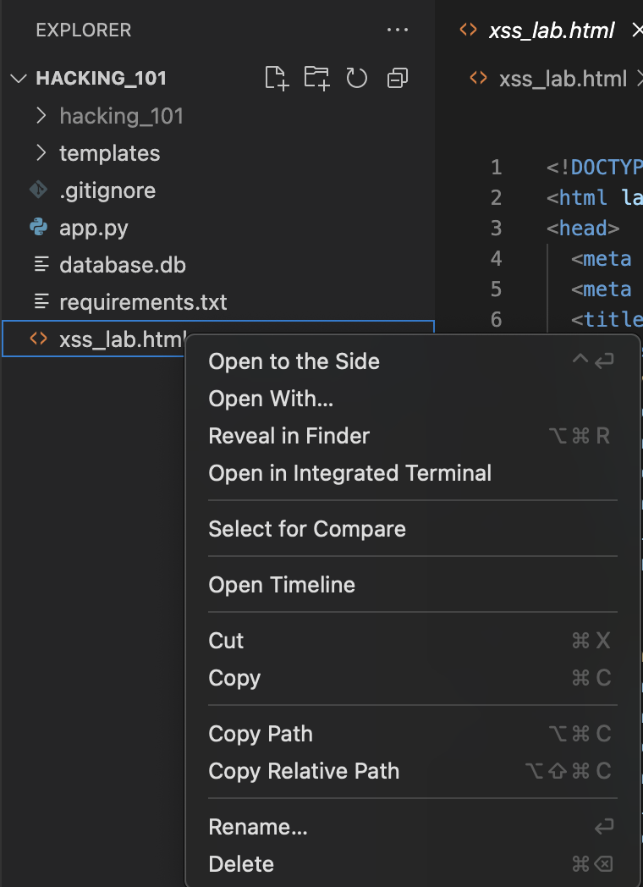
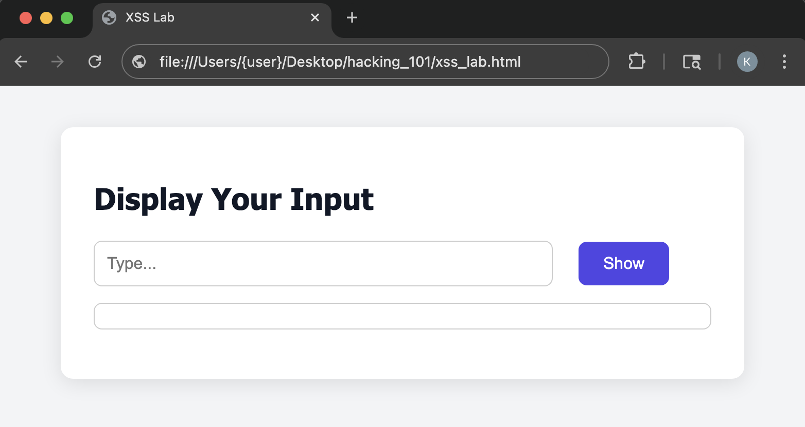
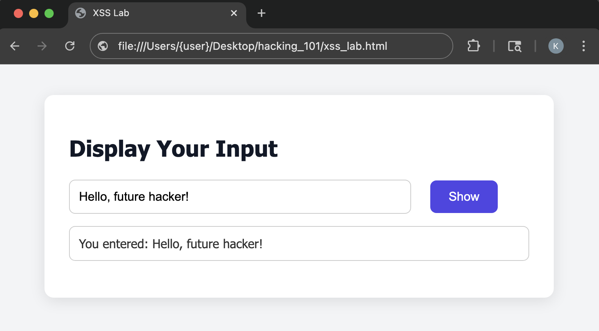
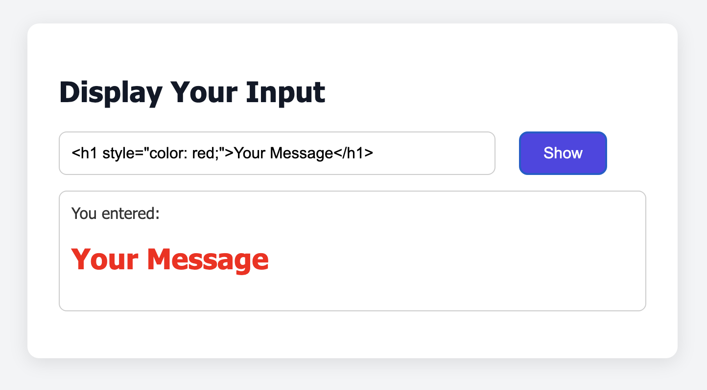
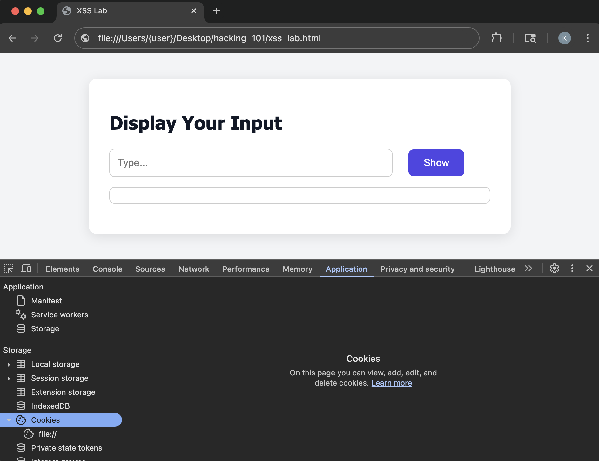
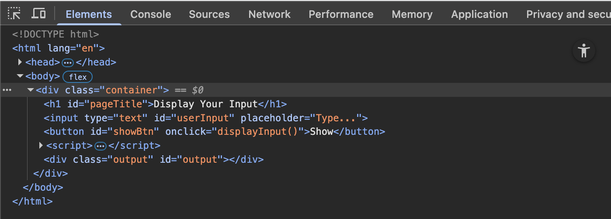
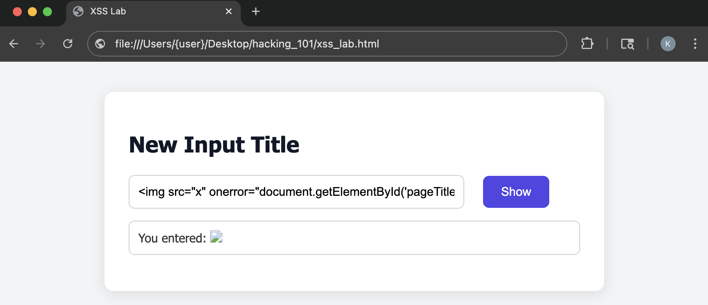
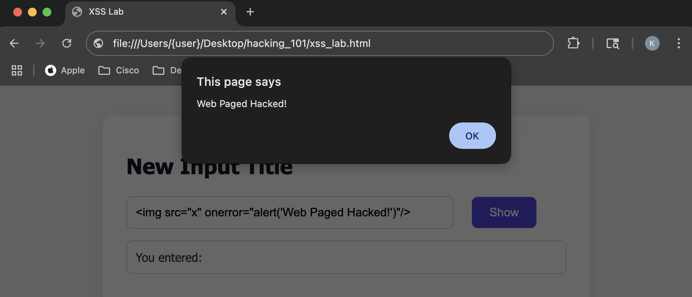
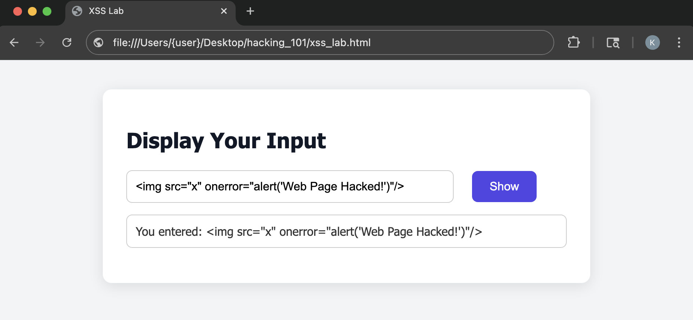

# Task 2 - DOM-Based Cross Site Scripting (XSS) Vulnerability

Cross-Site Scripting (XSS) is a web security vulnerability that allows attackers to inject malicious scripts into web pages that are viewed by other users. Since browsers trusts content from the website, it runs the malicious code as if it came for the site itself. 

**DOM-Based Cross-Site Scripting** attacks are client-side attacks that that affects the DOM. DOM (Document Object Model) is the the blueprint of a web page. It shows all the parts of the page like text, images, buttons, and links. With DOM-Based XSS attacks, scripts executed in JavaScript can interact with those parts and can control how a web page may behave. These attacks are executed entirely in the user's web browser without involving the server that generates HTTP request and responses.

## What You'll Learn
In this section, you will:

- Understand the Core of DOM-Based XSS
- Experience how untrusted user input can be misused when improperly handled in the browser's DOM
- Learn how JavaScript on the client side can interact and manipulate DOM elements
- Apply mitigation techniques to protect against XSS attacks

## Prerequisite 
Before you begin this section, 

- The deliberate vulnerable web application has been downloaded. If not, follow the guide in the [Getting Started](/getting_started) section.

## Step 1: Launch the XSS Lab HTML
1. In VS Code, right click on the `xss_lab.html`
    <figure markdown>
    { width="400" }
    </figure>

2. In the drop down menu, click `Copy Path`, this will copy the file's location url
    <figure markdown>
    { width="400" }
    </figure>

3. Open your web browser of choice and paste the URL in the browser's address bar, then press <kbd>Enter</kbd>
    <figure markdown>
    { width="600" }
    </figure>

## Step 2: Out-of-the-Box Behavior
Before exploiting the DOM-Based XSS attack, witness how the application should behave by providing an expected input. 

1. In the `Display Your Input` text box, type anything you like

2. Press, the **`Show`** button

3. You should receive a response below stating, `You entered:` followed by your message
    <figure markdown>
    { width="600" }
    </figure>

## Step 3: Text Style DOM XSS Attack
Now that you see how the application should behave when entering in a message, attack the application by changing how the response will look.

Enter the following text in the input box, then press **`Show`**,
```
<h1 style="color: red;">Your Message</h1>
```

- This attack will give you a response with much larger text and the color will be red
    <figure markdown>
    { width="600" }
    </figure>

## Step 4: Change Title DOM XSS Attack
As mentioned above, DOM-Based attacks can alter parts of the page that are already presented. Perform a XSS Attack that will change the title `Display Your Input` to something else

1. Before you can change the title, you need to retrieve the reference id for the title. Most DOM objects will have an `id` associated for styling and other uses. First, open the `Inspect` window for the browser

    | Browser              | Task              |
    | ----------------- | ----------------- |
    | Google Chrome     | Right-click anywhere on the page, then click `Inspect`        |
    | Mozilla Firefox   | Right-click anywhere on the page, then click `Inspect`        |
    | Microsoft Edge    | Right-click anywhere on the page, then click `Inspect`        |
    | Safari            | Right-click anywhere on the page, the click `Inspect Element` _(Developer Tools must be enabled)_ |

    <figure markdown>
    { width="600" }
    </figure>

2. Click the `Elements` tab
    <figure markdown>
    { width="600" }
    </figure>

3. In the code shown, unfold the `<body>` and `<div class="container">` tags by clicking the arrow to the left side of the tag
    <figure markdown>
    { width="600" }
    </figure>

4. Notice the `<h1>` HTML element for the `Display Your Input` title. Next to the `h1` there is an `id` attribute specified. The `id` value specifies the reference id for the title. 
    ```{.text .no-copy}
    <h1 id="pageTitle">Display Your Input</h1>
    ```

5. Using this id, type the following text in the input box on the web page, then press **`Show`**.
    ```
    <script>document.getElementById('pageTitle').textContent='New Input Title'</script>
    ```
    
    |              |              |
    | -------------| ------------ |
    | `<script>...</script>`     | Tells HTML to that there is some JavaScript code that will either add some form of interactivity or manipulate the web page       |
    | `document`   | Refers to the DOM which allows you to access and manipulate HTML elements      |
    | `getElementById('pageTitle')` | Is a built-in function of the `document` that searches for the first HTML element that has an `id` attribute with the specified name for its value  |
    | `.textContent` | Sets the text value to the provided text specified after the `=` sign |

    <figure markdown>
    { width="600" }
    </figure>

!!! danger "Important!"
    If the `<script>` input did not work for you that is because modern browsers have built-in protections that prevents basic `<script>` injections when inserted into the DOM in certain ways. Especially when inserted dynamically like you are doing for this XSS attack. 

    No worries! You can still perform this attack. To perform this DOM-Based XSS attack insert the following text in the input box 

    ```
    
    ```

    |              |              |
    | -------------| ------------ |
    | ``     | This is an HTML tag used to display images    |
    | `src="x"`   | `src` is a require attribute for this tag that tells the browser where to load the image from. The "x" in this example is not a valid image path so this will generate an error      |
    | `onerror` | This function gets called when the image fails to load. In this case, because `x` is not a valid image path the error function will get triggered. When the error function gets triggered it will execute the JavaScript code that was passed  |

## Step 5: Manipulate Web Page DOM XSS Attack
In this attack, you will change the way the application behaves when clicking the **`Show`** button. 

Enter the following text in the input box, then press **`Show`**,
```
<script>alert("Web Paged Hacked!")</script>
```

- If the `<script>` tag does not work, like in the previous step, type the following text in the input box, then press **`Show`**

```

```

<figure markdown>
{ width="600" }
</figure>

## Bonus Challenge
Now that you have a few examples on how to exploit a DOM-Based XSS vulnerability try to come up with other attacks.

Example, 
- Change the color of the **Show** button
- Change the text of the **Show** button
- Try combining attacks into one
    - Change the Title text but in a different color

## Step 6: Protect Against DOM-Based XSS Attacks
You have now exploited a DOM-Based XSS attack and its time to see the root cause of this type of attack and how to better protect against them. 

1. In VS Code, open the `xss_lab.html` file

2. Find the `<body>` HTML tag
    ```{.html .no-copy hl_lines="10"}
    <body>
        <div class="container">
            <h1 id="pageTitle">Display Your Input</h1>
            <input type="text" id="userInput" placeholder="Type..." />
            <button id="showBtn" onclick="displayInput()">Show</button>
            <script>
                function displayInput() {
                    const input = document.getElementById('userInput').value;
                    const output = document.getElementById('output');
                    output.innerHTML = `You entered: ${input}`;
                }
            </script>
            <div class="output" id="output"></div>
        </div>
    </body>
    ```

3. The highlighted line above, ```output.innerHTML = `You entered: ${input}`;``` is the culprit of XSS attacks. `innerHTML` is a property of a DOM element in JavaScript that tells the browser to parse the string value as HTML and insert the result back into the DOM element

4. To resolve this XSS attack, simply change the line to 
    ```html
    output.textContent = `You entered: ${input}`;
    ```
    - `textContent`: is another property of a DOM element in JavaScript that tells the browser to treat its value as plain text and not HTML. This would make HTML tags that are entered as input to be plain text which will not be executed.

5. Save `xss_lab.html` file
    - In the top left corner, click `File`, then `Save` in the drop down menu; <br>or<br>

    - Use the respective shortcuts to save the file 

        - MacOS <br>
        <kbd>Command</kbd> + <kbd>S</kbd>

        - Windows <br>
        <kbd>Ctrl</kbd> + <kbd>S</kbd> 

6. Reload the webpage in the browser, or 
    - Right click on the `xss_lab.html` file
    - In the drop down menu, click `Copy Path`, this will copy the file's
    - Open your web browser of choice and paste the URL in the browser's address bar, then press <kbd>Enter</kbd>

7. Try any of the above attacks. The text will appear as expected and no changes has occurred

    Example, enter the following text in the text box
    ```
    
    ```

    <figure markdown>
    { width="600" }
    </figure>


## Congratulations!
You have successfully exploited a vulnerable web page that is susceptible to DOM-Based XSS attacks. Also, you learned how to protect against them as well. 