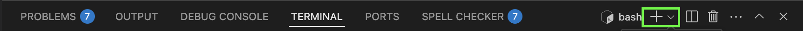
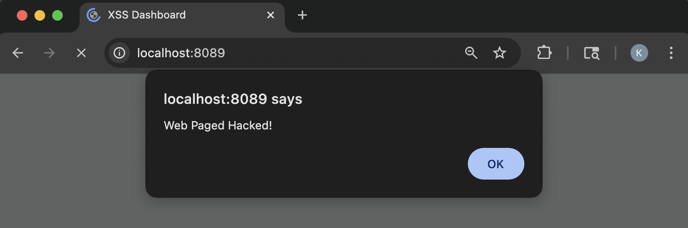

# Task 3 - Reflected Cross-Site Scripting (XSS) Vulnerability

Cross-Site Scripting (XSS) is a web security vulnerability that allows attackers to inject malicious scripts into web pages that are viewed by other users. Since browsers trusts content from the website, it runs the malicious code as if it came for the site itself. 

**Reflected Cross-Site Scripting** vulnerabilities are attacks that the server side reflects from unsanitized inputs from the user. The malicious code is entered in the request and is immediately returned by the server in a HTTP response without proper sanitization where the browser then executes the code affecting DOM elements or controlling how the web page behaves (i.e alerts). However, since this is a server-side issue, attackers can create a malicious link that, when clicked by a user, causes the server to include the harmful script in its HTTP response—allowing the browser to execute it.

## What You'll Learn
In this section, you will:

- Understand what Reflected Cross-Site Scripting is and what impact it can have
- Identify the reflection points in HTTP requests/responses that lead to vulnerabilities
- Craft malicious payloads that exploit the vulnerability to execute arbitrary JavaScript in the browser
- Craft a malicious URL link that reflects back to the browser
- Demonstrate real attack vectors including alert boxes, cookie, theft, and DOM manipulation
- Learn and apply techniques that mitigate these types of XSS attacks 

## Prerequisite 
Before you begin this section, 

- The deliberate vulnerable web application has been downloaded. If not, follow the guide in the [Getting Started](/getting_started) section.

## Step 1: Start the XSS Vulnerability Web Application
For this section of the lab, you will start the `xss_app.py` to exploit XSS vulnerabilities. 

1. In VS Code, click `View` in the top tool bar

2. In the drop down menu, select `Terminal`

3. A Terminal window will appear at the bottom of VS Code, at the project's path.
    - If you already have a Terminal window open and running another application, you can start a new session by clicking the + icon in the Terminal Window toolbar
        <figure markdown>
        { width="800" }
        </figure>   

    - You should now see multiple terminal sessions that you can switch between sessions
    <figure markdown>
    { width="800" }
    </figure> 

4. Enter the following command to start the Vulnerable XSS web application
    ```bash
    python xss_app.py
    ```

5. Navigate to the Vulnerable XSS web app
    - Click, [http://localhost:8089](http://localhost:8089) <br><br> OR <br><br>
    - Open your web browser of choice and type the following URL in the web address bar
    ```
    http://localhost:8089
    ```

    <figure markdown>
    { width="600" }
    </figure> 

## Step 2: Out-of-the-Box Behavior
Before exploiting the Reflected XSS attack, witness how the application should behave by providing an expected input. 

Under the XSS Reflected section, type any text in the textbox and press **`Post Comment`**

1. In the **XSS Reflected** section, type anything you like in the textbox

2. Press, the **`Post Comment`** button

3. You should receive a response below stating, `You comment:` followed by your message
    <figure markdown>
    { width="600" }
    </figure> 

## Step 3: Text Style Reflected XSS Attack
Now that you see how the application should behave when entering in a message, attack the application by changing how the response will look.

Enter the following text in the input box, then press **`Post Comment`**,
```
<h1 style="color: green;">XSS Attack</h1>
```

- This attack will give you a response with much larger text and the color will be green

<figure markdown>
{ width="600" }
</figure> 

## Step 4: Change Title Reflected XSS Attack
Like other XSS Attacks, Reflected XSS attacks can alter parts of the page that are already present. Perform a XSS Attack that will change the title `XSS Reflected` to something else

1. Before you can change the title, you need to retrieve the reference id for the title. Most DOM objects will have an `id` associated for styling and other uses. First, open the `Inspect` window for the browser

    | Browser              | Task              |
    | ----------------- | ----------------- |
    | Google Chrome     | Right-click anywhere on the page, then click `Inspect`        |
    | Mozilla Firefox   | Right-click anywhere on the page, then click `Inspect`        |
    | Microsoft Edge    | Right-click anywhere on the page, then click `Inspect`        |
    | Safari            | Right-click anywhere on the page, the click `Inspect Element` _(Developer Tools must be enabled)_ |

    <figure markdown>
    { width="600" }
    </figure>

2. Click the `Elements` tab
    <figure markdown>
    { width="600" }
    </figure>

3. In the code shown, unfold the `<body>` and `<div class="container">` tags by clicking the arrow to the left side of the tag
    <figure markdown>
    { width="600" }
    </figure>

4. Notice the `<h2>` HTML element for the `XSS Reflected` title. Next to the `h2` there is an `id` attribute specified. The `id` value specifies the reference id for the title. 
    ```{.text .no-copy}
    <h2 id="reflectedTitle">XSS Reflected</h2>
    ```

5. Using this id, type the following text in the input box on the web page, then press **`Post Comment`**.
    ```
    <script>document.getElementById('reflectedTitle').textContent='New Input Title';document.getElementById('reflectedTitle').style.color='red'</script>
    ```
    
    |              |              |
    | -------------| ------------ |
    | `<script>...</script>`     | Tells HTML to that there is some JavaScript code that will either add some form of interactivity or manipulate the web page       |
    | `document`   | Refers to the DOM which allows you to access and manipulate HTML elements      |
    | `getElementById('pageTitle')` | Is a built-in function of the `document` that searches for the first HTML element that has an `id` attribute with the specified name for its value  |
    | `.textContent` | Sets the text value to the provided text specified after the `=` sign |
    | `style` | refers to the style attribute on the DOM element |
    | `color` | Sets the text color to the provided value specified after the `=` sign |

    <figure markdown>
    { width="600" }
    </figure>

6. Reflected XSS attacks are not persistent attacks so the moment the moment the page reloads all changes revert back to normal.
    - Click in the web browser's address bar and press <kbd>Enter</kbd>

    > **Note**: It's important to note that each post is a form submission. If the page is refreshed by clicking the browser's reload button, the browser tries to reload the last request made which in this case is the form submission. 

## Step 5: Manipulate Web Page Reflected XSS Attack
In this attack, you will change the way the application behaves when posting a comment. 

Enter the following text in the input box, then press **`Post Comment`**,
```
<script>alert("Web Paged Hacked!")</script>
```

<figure markdown>
{ width="600" }
</figure>

## Bonus Challenge
Now that you have a few examples on how to exploit a Reflected XSS vulnerability try to come up with other attacks.

Example, 
- Change the color of the **Post Comment** button
- Change the text of the **Post Comment** button
- Try combining attacks into one
    - Change the Title text but in a different color
- Change the width of the textarea
- Change the text color inside the textarea

## Step 6: Protect Against Reflected XSS Attacks
It's time to see the root cause of these attacks and how to protect against these attacks.

1. In VS Code, open the `xss_app.py` file

2. Take a look at the following code block 
    ```{.python .no-copy hl_lines="6"}
    @app.route('/', methods=['GET', 'POST'])
    def dashboard():
        stored_comments = get_comments()
        if request.method == 'POST':
            comment = request.form['comment']
            return render_template('xss_dashboard.html', comment=f"<p><b>Your Comment:</b> {comment}</p>", stored_comments=stored_comments)
        return render_template('xss_dashboard.html', stored_comments=stored_comments)
    ```

3. The highlighted line above is vulnerable to a XSS attack because it injects the user's input into a the variable `comment` that is then returned to the HTML without sanitization or escaping
    ```{.python .no-copy}
    comment=f"<p><b>Your Comment:</b> {comment}</p>", 
    ```

4. The difference between DOM-Based and XSS Reflect is that a server is involved with returning a HTTP responses. In DOM-Based attacks everything happens on the client side (no server involved). "Reflect" just means that the server immediately sends back the input in the HTTP response without being stored. 

    There are many ways to fix this issue, one being sanitizing the `comment` variable to escape HTML tags. However, you will need to do either heavy logic or use another python package to do this cleanly. In this lab, you will fix this vulnerability in two parts. First, clean up the code to remove the included HTML `<p><b>Your Comment:</b>`. 
    
    Replace the highlighted code with the following: 

    ```python
    return render_template('xss_dashboard.html', comment=comment, stored_comments=stored_comments)
    ```

5. Save `xss_app.py` file
    - In the top left corner, click `File`, then `Save` in the drop down menu; <br>or<br>

    - Use the respective shortcuts to save the file 

        - MacOS <br>
        <kbd>Command</kbd> + <kbd>S</kbd>

        - Windows <br>
        <kbd>Ctrl</kbd> + <kbd>S</kbd>

6. In VS Code, open the `xss_dashboard.html` located under the `templates` folder 

    To render web applications in python, it uses a built-in templating engine called **Jinja2**. Jinja2 is used for generating dynamic HTML pages by combining templates with data received from the python application. To pass data from the python code to the HTML template, Jinja2 replaces it placeholder syntax with the actual values

    | Syntax | Description |
    | ------------ | ------------ |
    | `{{ ... }}`  | Used for expressions or variables (e.g `{{ comment }}`) |
    | ``  | Used for loops and conditionals `{% if comment % }` |

7. Take a look at the following code block 
    ```{.html .no-copy hl_lines="5 6 7"}
    <h2 id="reflectedTitle">XSS Reflected</h2>

    <form method="post">
      <textarea id="userComment" name="comment" placeholder="Say something..."></textarea>
      
      <div class="server_response">{{ comment | safe }}</div>
      
      <input id="userCommentBtn" type="submit" value="Post Comment" />
    </form>
    ```

    - ``: states that if `comment` is not empty, execute the next code. If the `comment` is empty then skip
    - ``: tells Jinja2 that this is the end of the conditional 
    - `{{ comment }}`: tells Jinja2 to place the value of the `comment` variable here. `comment` is the variable that is passed in the python code `render_template('xss_dashboard.html', comment=comment)` _(the word specified before the equal sign)_ 
    - `| safe`: tells Jinja2 that the value that is being inserted is trusted and to not escape the string.

8. The following code block is the culprit as its using the Jinja keyword `safe`

    Replace 
    ```{.html .no-copy}
    <div class="server_response">{{ comment | safe }}</div>
    ```
    <br>
    with
    ```html
    <div class="server_response"><b>Your Comment:</b> {{ comment }}</div>
    ```
    > **Note:** Why use `safe` since its vulnerable to XSS? Well since the application is rendered using python. You may want to dynamically render HTML. In that case, you would sanitize the input using the `bleach` package in the python code to not allow or allow certain HTML elements in the user input. (e.g `bleach.clean(comment, tags=['b','i','u'], strip=True)`)

9. Save `xss_dashboard.html` file
    - In the top left corner, click `File`, then `Save` in the drop down menu; <br>or<br>

    - Use the respective shortcuts to save the file 

        - MacOS <br>
        <kbd>Command</kbd> + <kbd>S</kbd>

        - Windows <br>
        <kbd>Ctrl</kbd> + <kbd>S</kbd>

10. Reload the XSS Vulnerable Web application in the browser by  
    - Clicking [http://localhost:8089](http://localhost:8089) 
    <br><br> OR <br><br>
    - If the application is already loaded in the web browser, click inside the address bar and press <kbd>Enter</kbd>
    <br><br> OR <br><br>
    - Open your web browser of choice and type the following URL in the web address bar
    ```
    http://localhost:8089
    ```

11. Try any of the above attacks and verify that no malicious changes should occurred

    Example, enter the following text in the text box
    ```
    <script>alert('Web Page Hacked!')</script>
    ```

    <figure markdown>
    { width="600" }
    </figure>

## Congratulations!
You have successfully exploited a vulnerable web page that is susceptible to Reflected XSS attacks. 

Things learned: 

- Understand how Reflected XSS Works
- Crafted payload that with malicious intent
- How to protect against Reflected XSS
- Templating rendering in Python and potential misuse of syntax