# Task 4 - Stored Cross-Site Scripting (XSS) Vulnerability

Cross-Site Scripting (XSS) is a web security vulnerability that allows attackers to inject malicious scripts into web pages that are viewed by other users. Since browsers trusts content from the website, it runs the malicious code as if it came for the site itself. 

**Stored Cross-Site Scripting** is an attack that allows attackers to inject malicious scripts into a website's database or other persistent storage. Unlike Stored XSS, which requires a user to click on a specially crafted URL or enter malicious code in a form, stored XSS attacks automatically executes whenever a user loads the content. This makes it particularly dangerous because it requires no user interaction once the malicious script is stored. 

## What You'll Learn
In this section, you will:

- Understand Stored Cross-Site Scripting vulnerabilities and how it is often more dangerous than the other types of XSS
- Craft malicious payloads that persist across sessions
- Experience how malicious input is saved to the backend and automatically rendered to future visitors
- Demonstrate real attack vectors including alert boxes, cookie, theft, and DOM manipulation
- Learn how to fix the vulnerability by escaping user input before rendering it in the HTML context 

## Prerequisite 
Before you begin this section, 

- The deliberate vulnerable web application has been downloaded. If not, follow the guide in the [Getting Started](/getting_started) section.

## Step 1: Start the XSS Vulnerability Web Application
For this section of the lab, you will start the `xss_app.py` to exploit XSS vulnerabilities. 

!!! info
    If you have done the previous task, Reflected XSS, you may skip this step if you already have the application running in a terminal window

1. In VS Code, click `View` in the top tool bar

2. In the drop down menu, select `Terminal`

3. A Terminal window will appear at the bottom of VS Code, at the project's path.
    - If you already have a Terminal window open and running another application, you can start a new session by clicking the + icon in the Terminal Window toolbar
        <figure markdown>
        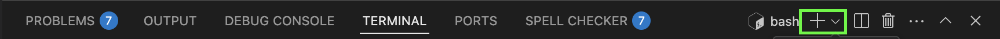{ width="800" }
        </figure>   

    - You should now see multiple terminal sessions that you can switch between sessions
    <figure markdown>
    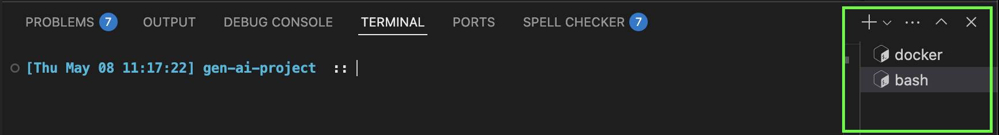{ width="800" }
    </figure> 

4. Enter the following command to start the Vulnerable XSS web application
    ```bash
    python xss_app.py
    ```

5. Navigate to the Vulnerable XSS web app
    - Click, [http://localhost:8089](http://localhost:8089) <br><br> OR <br><br>
    - Open your web browser of choice and type the following URL in the web address bar
    ```
    http://localhost:8089
    ```

    <figure markdown>
    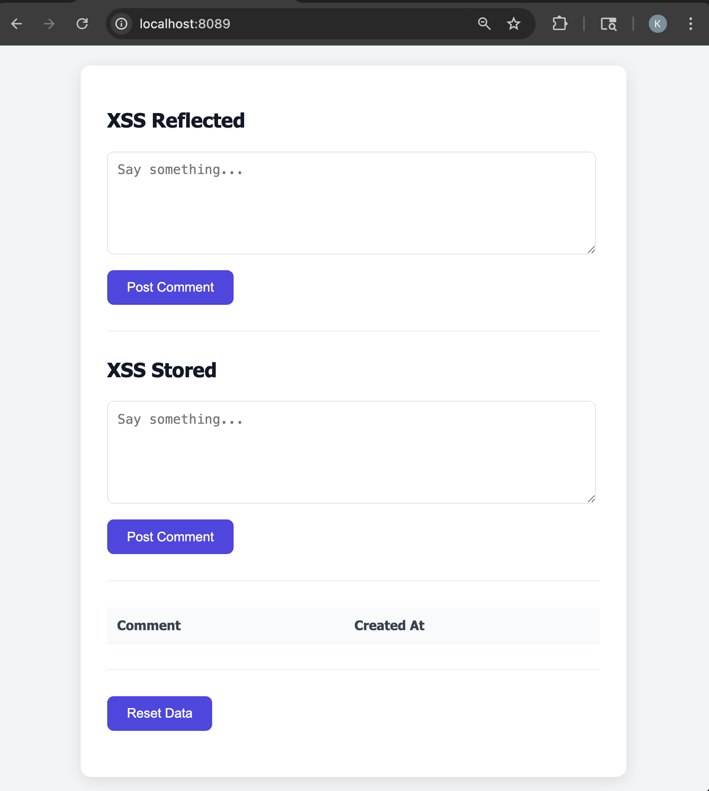{ width="600" }
    </figure> 

## Step 2: Out-of-the-Box Behavior
Before exploiting the Stored XSS attack, witness how the application should behave by providing an expected input. 

1. In the **XSS Stored** section, type anything you like in the textbox

2. Click the **`Post Comment`** button

3. You should be able to see your text in the table below the `Post Comment` button
    <figure markdown>
    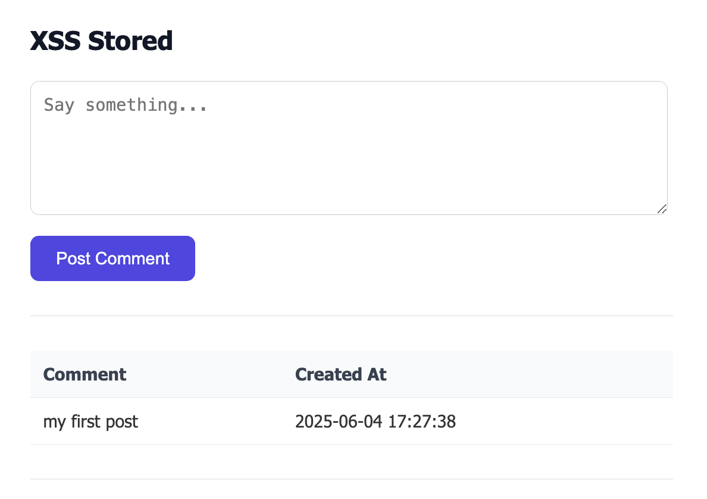{ width="600" }
    </figure> 

## Step 3: Text Style Stored XSS Attack
Now that you see how the application should behave when entering in a message, attack the application by changing how the response will look.

1. Enter the following text in the input box, then press **`Post Comment`**,
    ```
    <h1 style="color: green;">XSS Stored Attack</h1>
    ```

    <figure markdown>
    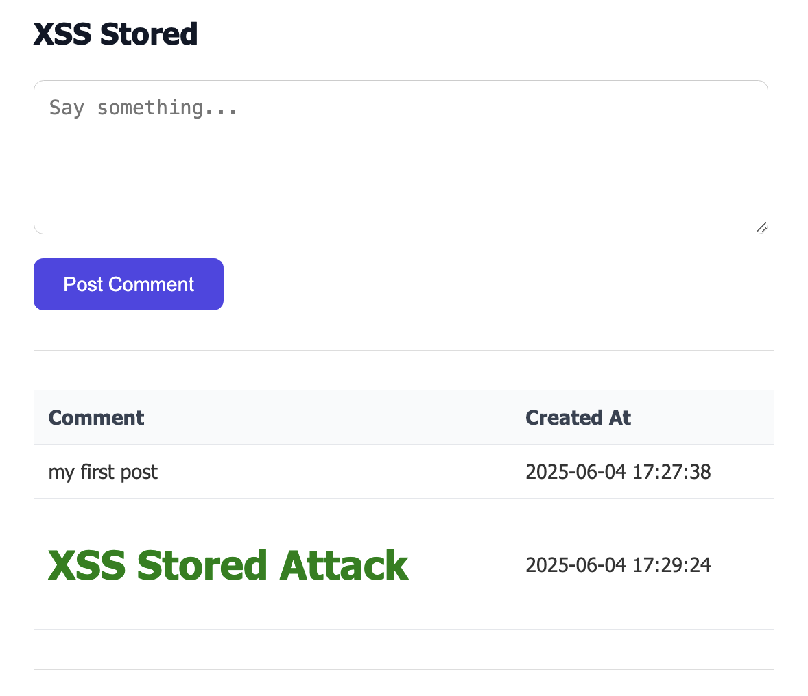{ width="600" }
    </figure> 

    - This attack will store the text in a much larger font size and the color of it will be green

2. The difference between this attack and the Reflected XSS attack is that all users who visit this page will see the much larger text with a green color

    - Open a new private browser window,

        | Browser           | Instruction       | Keyboard Shortcut |
        | ----------------- | ----------------- | ----------------- |
        | Google Chrome     | Click the three-dot menu (⋮) in the top right → **New Incognito window**  | Windows: <kbd>Ctrl</kbd> + <kbd>Shift</kbd> + <kbd>N</kbd> <br> Mac: <kbd>Command</kbd> + <kbd>Shift</kbd> + <kbd>N</kbd> |
        | Mozilla Firefox   | Click the three-line menu (☰) → **New Private Window** | Windows: <kbd>Ctrl</kbd> + <kbd>Shift</kbd> + <kbd>P</kbd> <br> Mac: <kbd>Command</kbd> + <kbd>Shift</kbd> + <kbd>P</kbd>    |
        | Microsoft Edge    | Click the three-dot menu (⋮) → **New InPrivate window** | Windows: <kbd>Ctrl</kbd> + <kbd>Shift</kbd> + <kbd>N</kbd> <br> Mac: <kbd>Command</kbd> + <kbd>Shift</kbd> + <kbd>N</kbd> |
        | Safari            | Go to the **File** menu → **New Private Window** | <kbd>Command</kbd> + <kbd>Shift</kbd> + <kbd>N</kbd> |

3. In the address bar for the new private browser window, type following then press <kbd>Enter</kbd> 
    ```
    http://localhost:8089
    ```

4. As you will see even in this completely new browser session the XSS attack is still present
    <figure markdown>
    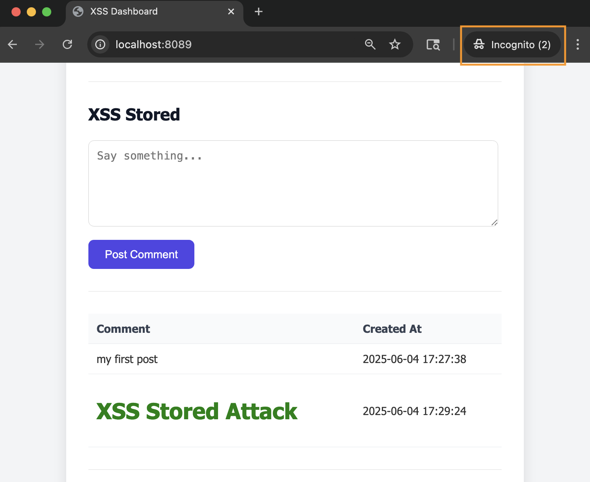{ width="600" }
    </figure> 


## Step 4: Change Title Stored XSS Attack
Like other XSS Attacks, Stored XSS attacks can alter parts of the page that are already present. Perform a XSS Attack that will change the title `XSS Stored` to something else

1. Before you can change the title, you need to retrieve the reference id for the title. Most DOM objects will have an `id` associated for styling and other uses. First, open the `Inspect` window for the browser

    | Browser              | Instruction              |
    | ----------------- | ----------------- |
    | Google Chrome     | Right-click anywhere on the page, then click `Inspect`        |
    | Mozilla Firefox   | Right-click anywhere on the page, then click `Inspect`        |
    | Microsoft Edge    | Right-click anywhere on the page, then click `Inspect`        |
    | Safari            | Right-click anywhere on the page, the click `Inspect Element` _(Developer Tools must be enabled)_ |

    <figure markdown>
    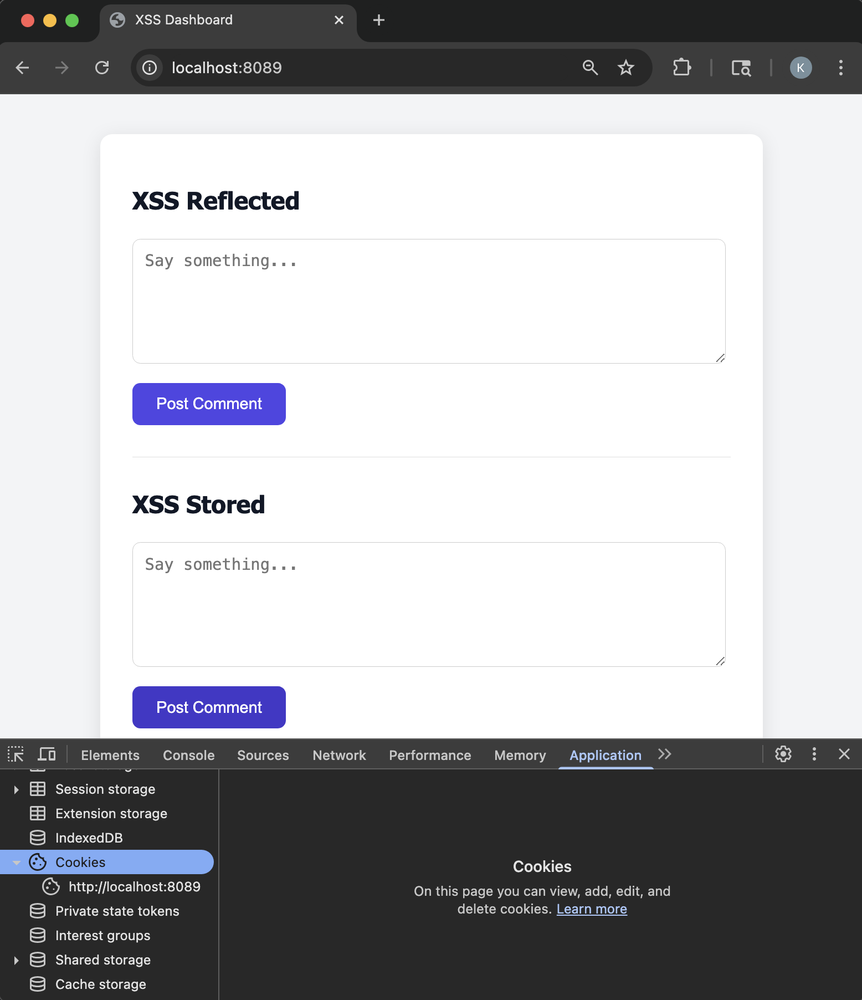{ width="600" }
    </figure>

2. Click the `Elements` tab
    <figure markdown>
    { width="600" }
    </figure>

3. In the code shown, unfold the `<body>` and `<div class="container">` tags by clicking the arrow to the left side of the tag
    <figure markdown>
    { width="600" }
    </figure>

4. Notice the `<h2>` HTML element for the `XSS Stored` title. Next to the `h2` there is an `id` attribute specified. The `id` value specifies the reference id for the title. 
    ```{.text .no-copy}
    <h2 id="storedTitle">XSS Stored</h2>
    ```

5. Using this id, type the following text in the input box on the web page, then press **`Post Comment`**.
    ```
    <script>document.getElementById('storedTitle').textContent='New Input Title';document.getElementById('storedTitle').style.color='red'</script>
    ```
    
    |              |              |
    | -------------| ------------ |
    | `<script>...</script>`     | Tells HTML to that there is some JavaScript code that will either add some form of interactivity or manipulate the web page       |
    | `document`   | Refers to the DOM which allows you to access and manipulate HTML elements      |
    | `getElementById('pageTitle')` | Is a built-in function of the `document` that searches for the first HTML element that has an `id` attribute with the specified name for its value  |
    | `.textContent` | Sets the text value to the provided text specified after the `=` sign |
    | `style` | refers to the style attribute on the DOM element |
    | `color` | Sets the text color to the provided value specified after the `=` sign |

    <figure markdown>
    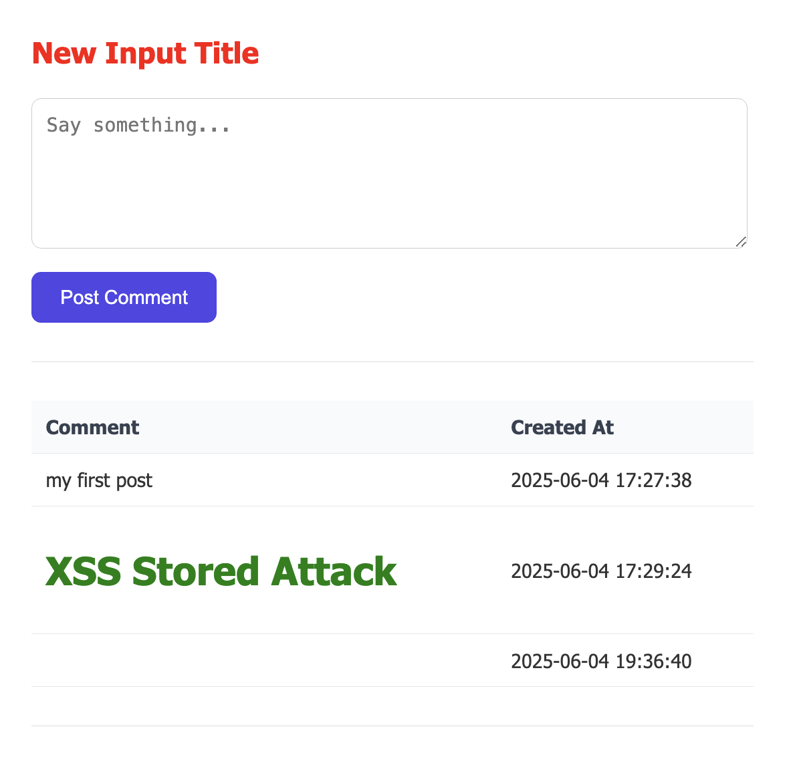{ width="600" }
    </figure>

6. Stored XSS attacks are persistent so every user will see the new title when they visit the web page.
    - Open a new private browser window
    - In the address bar for the new private browser window, type following then press <kbd>Enter</kbd> 
    ```
    http://localhost:8089
    ```

    > **Note**: It's important to note that each post is a form submission. If the page is refreshed by clicking the browser's reload button, the browser tries to reload the last request made which in this case is the form submission. 

    <figure markdown>
    { width="600" }
    </figure>


## Step 5: Manipulate Web Page Stored XSS Attack
In this attack, you will change the way the application behaves when posting a comment. 

1. Enter the following text in the input box, then press **`Post Comment`**,
    ```
    <script>alert("Web Paged Hacked!")</script>
    ```

    <figure markdown>
    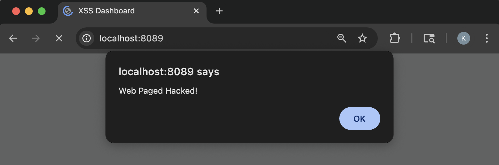{ width="600" }
    </figure>

2. Open a new private browser window
    - In the address bar for the new private browser window, type following then press <kbd>Enter</kbd> 
    ```
    http://localhost:8089
    ```

    - The alert will display every time you refresh the page by just clicking in the browser address bar and pressing <kbd>Enter</kbd> or closing the browser and navigating to the XSS Vulnerable web page again

    <figure markdown>
    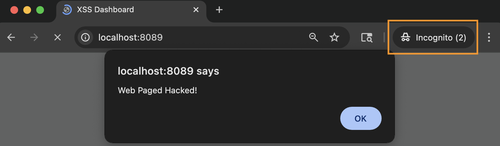{ width="600" }
    </figure>

4. To stop the alert from showing, click the **`Reset Data` button to delete all stored comments. These will reset everything back to normal.

    <figure markdown>
    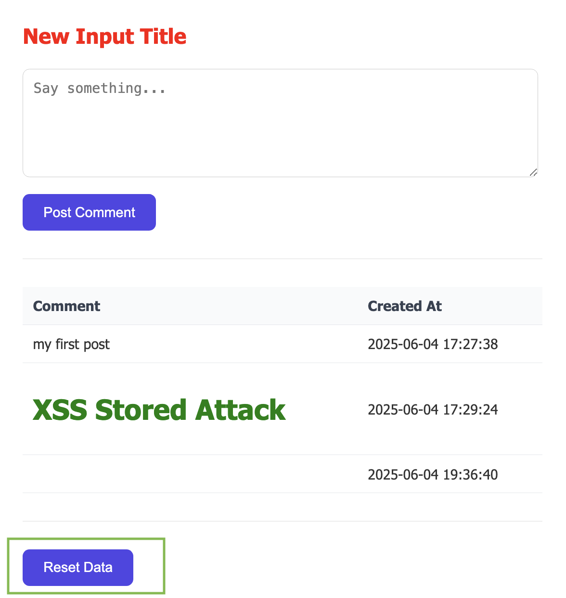{ width="600" }
    </figure>

    <figure markdown>
    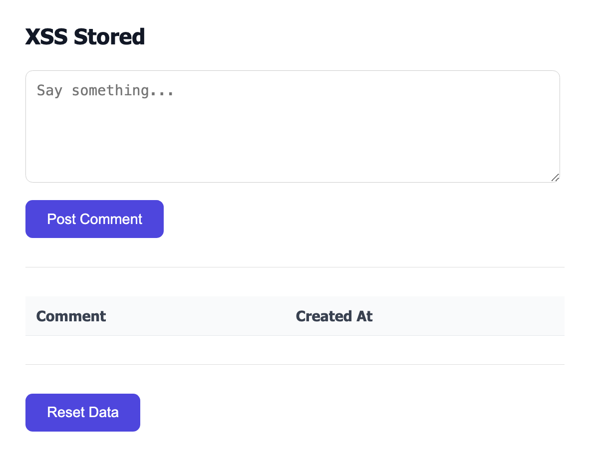{ width="600" }
    </figure>

## Bonus Stored XSS Attack Challenge
Now that you have a few examples on how to exploit a Stored XSS vulnerability try to come up with other attacks.

Example, 

- Change the color of the **Post Comment** button
- Change the text of the **Post Comment** button
- Try combining attacks into one
    - Change the Title text but in a different color
- Change the width of the textarea
- Change the text color inside the textarea

## Step 6: Protect Against Stored XSS Attacks
It's time to see the root cause of these attacks and how to protect against these attacks.

1. In VS Code, open the `xss_dashboard.html` located under the `templates` folder 

    To render web applications in python, it uses a built-in templating engine called **Jinja2**. Jinja2 is used for generating dynamic HTML pages by combining templates with data received from the python application. To pass data from the python code to the HTML template, Jinja2 replaces it placeholder syntax with the actual values

    | Syntax | Description |
    | ------------ | ------------ |
    | `{{ ... }}`  | Used for expressions or variables (e.g `{{ comment }}`) |
    | ``  | Used for loops and conditionals `{% if comment % }` |

2. Take a look at the following code block 
    ```{.html .no-copy hl_lines="17 18 19 20 21 22"}
    <h2 id="storedTitle">XSS Stored</h2>

    <form action="/blog" method="post">
      <textarea id="userInput" name="userInput" placeholder="Say something..."></textarea>
      <input id="userInputBtn" type="submit" value="Post Comment" />
    </form>

    <hr style="margin: 2rem 0; border: none; border-top: 1px solid #ddd;" />
    <table class="comments-table">
        <thead>
            <tr>
            <th>Comment</th>
            <th>Created At</th>
            </tr>
        </thead>
        <tbody>
            
            <tr>
            <td>{{ row.comment | safe }}</td>
            <td>{{ row.created_at }}</td>
            </tr>
            
        </tbody>
    </table>
    ```

    - ``: starts a loop for every `stored_comments` that has been received from the database. `row` is the reference for each stored comment as it loops
    - `stored_comments`: tells Jinja2 to place the value of the `stored_comments` variable here. `stored_comment` is the variable that is passed in the `xss_app.py` python code `render_template('xss_dashboard.html', comment=comment, stored_comments=stored_comments)` _(the word specified before the equal sign)_ 
    - `{{ row.comment }}`: tells Jinja2 to get the value of the comment column for the `row` reference 
    - `| safe`: tells Jinja2 that the value that is being inserted is trusted and to not escape the string.
    - `{{ row.created_at }}`: tells Jinja2 to get the value of the created_at column for the `row` reference 
    - ``: tells Jinja2 that this is the end of the loop

3. The following code block is the culprit as its using the Jinja keyword `safe`

    Replace 
    ```{.html .no-copy}
    <td>{{ row.comment | safe }}</td>
    ```
    <br>
    with
    ```python
    <td>{{ row.comment }}</td>
    ```
    > **Note:** Why use `safe` since its vulnerable to XSS? Well since the application is rendered using python. You may want to dynamically render HTML. In that case, you would sanitize the input using the `bleach` package in the python code to not allow or allow certain HTML elements in the user input. (e.g `bleach.clean(comment, tags=['b','i','u'], strip=True)`)

4. Save `xss_dashboard.html` file
    - In the top left corner, click `File`, then `Save` in the drop down menu; <br>or<br>

    - Use the respective shortcuts to save the file 

        - MacOS <br>
        <kbd>Command</kbd> + <kbd>S</kbd>

        - Windows <br>
        <kbd>Ctrl</kbd> + <kbd>S</kbd>

5. Reload the XSS Vulnerable Web application in the browser by  
    - Clicking [http://localhost:8089](http://localhost:8089) 
    <br><br> OR <br><br>
    - If the application is already loaded in the web browser, click inside the address bar and press <kbd>Enter</kbd>
    <br><br> OR <br><br>
    - Open your web browser of choice and type the following URL in the web address bar
    ```
    http://localhost:8089
    ```

6. Try any of the above attacks and verify that no malicious changes should occurred

    Example, enter the following text in the text box
    ```
    <script>document.getElementById('storedTitle').textContent='New XSS Title';document.getElementById('storedTitle').style.color='red'</script>
    ```

    <figure markdown>
    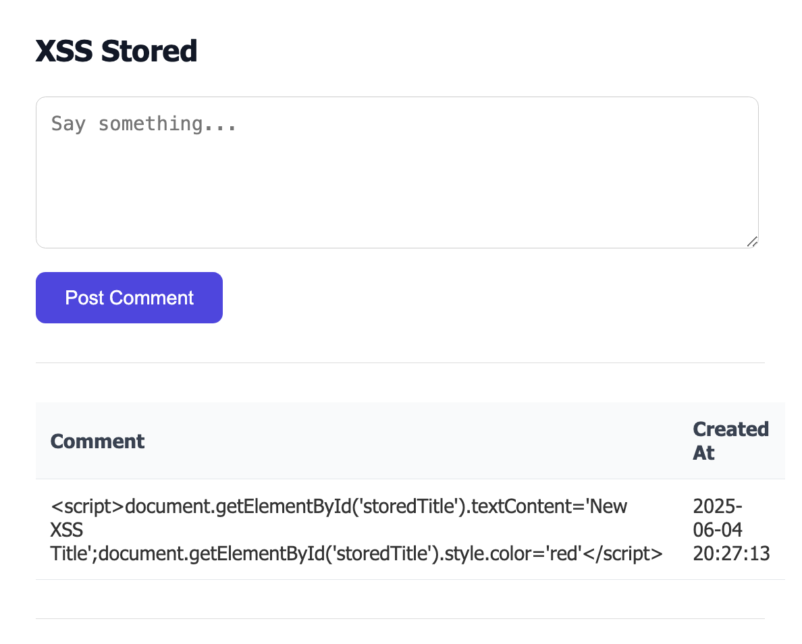{ width="600" }
    </figure>

## Bonus Protection Challenge
You now have a web application that protects against a stored XSS attack but in the comments table you can still see the HTML tags. Update the `xss_app.py` file to remove html tags before storing to the database

- Use the bleach package
- Use `pip` to install `bleach`
- Modify the code to use `bleach` to sanitize user input
- Stop & Restart the application to test

## Congratulations!
You have successfully exploited a vulnerable web page that is susceptible to Stored XSS attacks. 

Things learned: 

- Understand how Stored XSS Works
- Crafted payload that with malicious intent
- How to protect against Stored XSS
- Templating rendering in Python and potential misuse of syntax