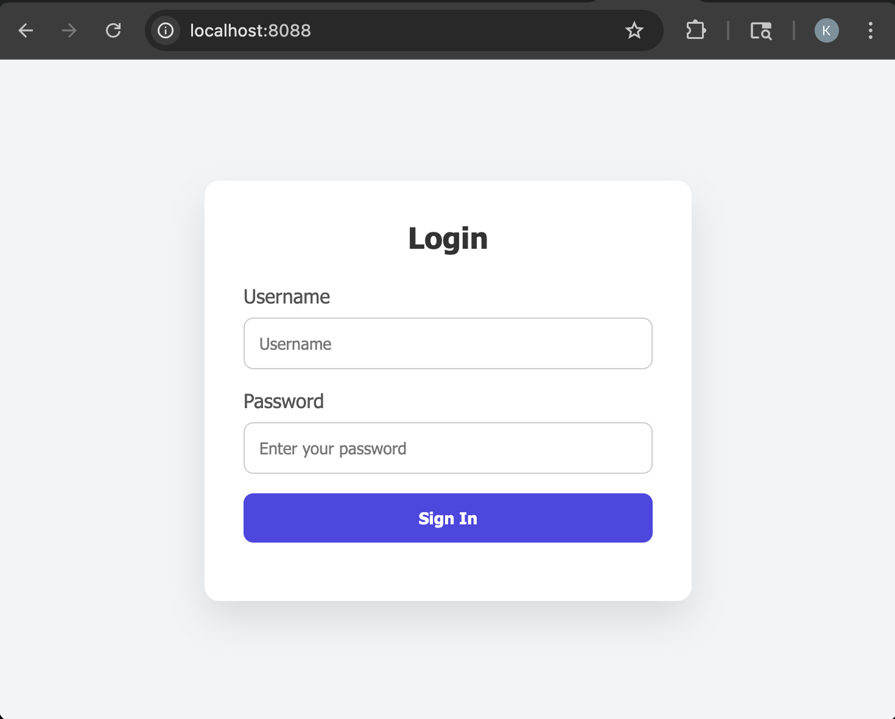
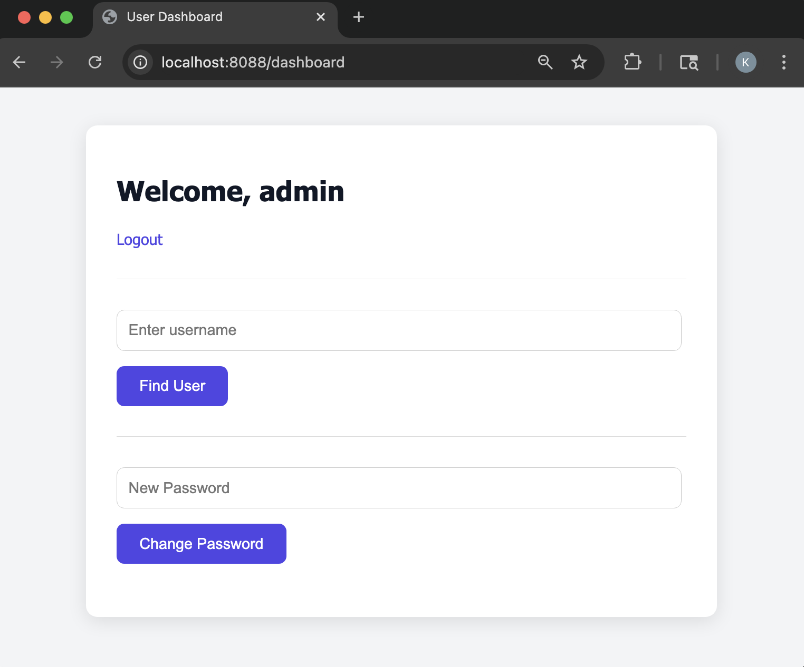
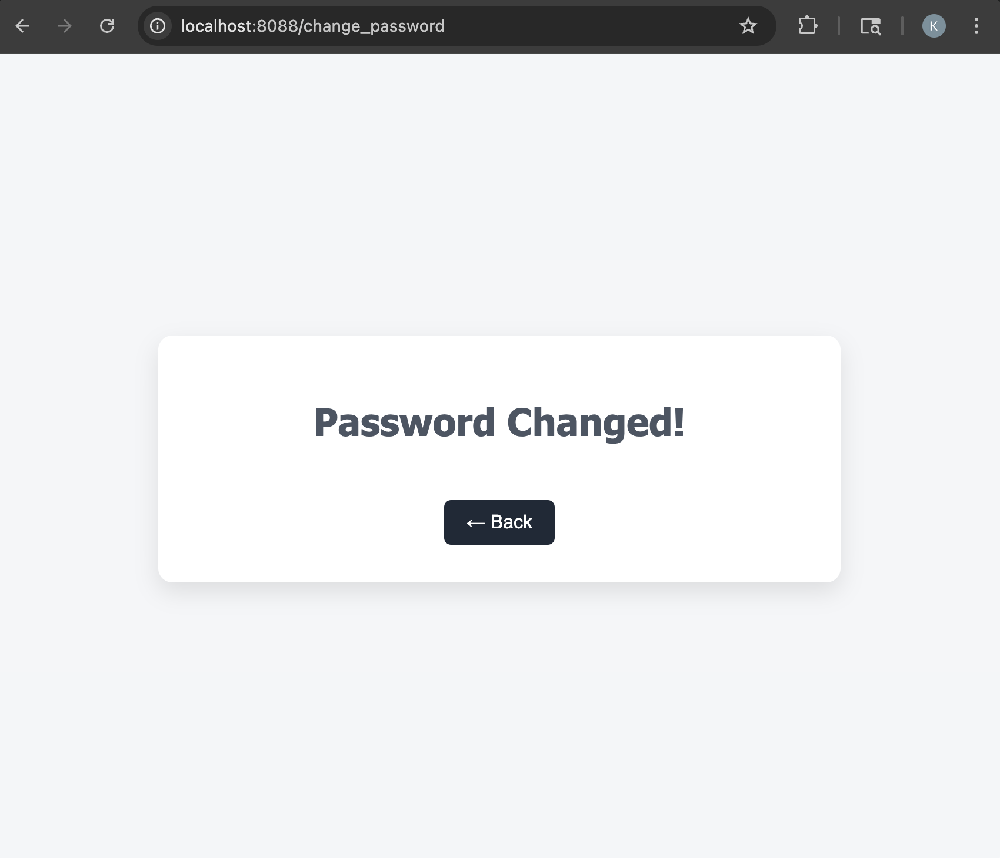
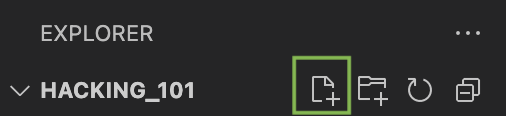
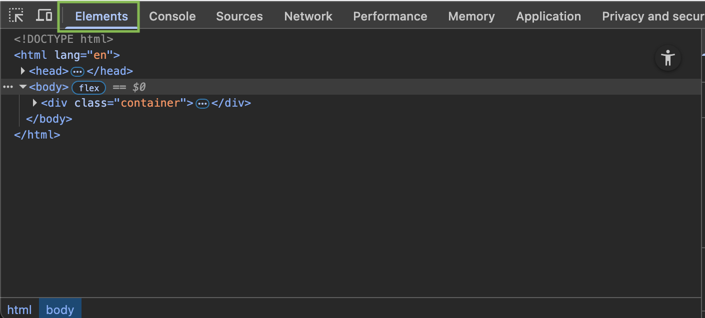
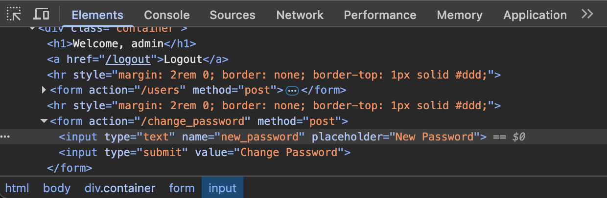
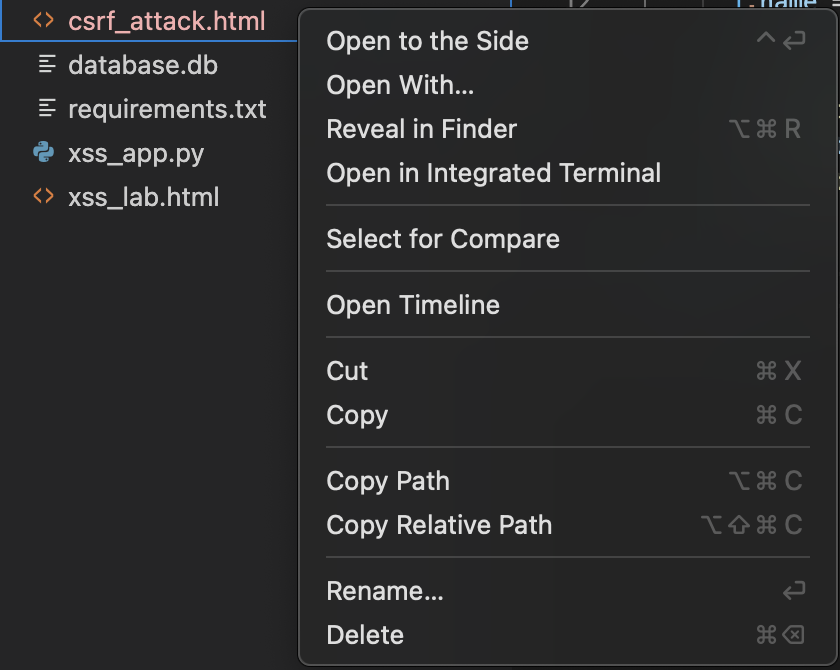
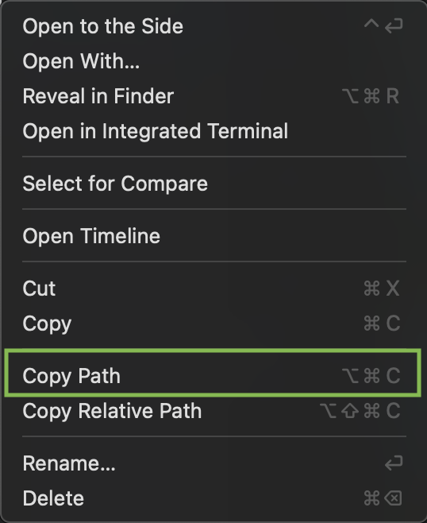
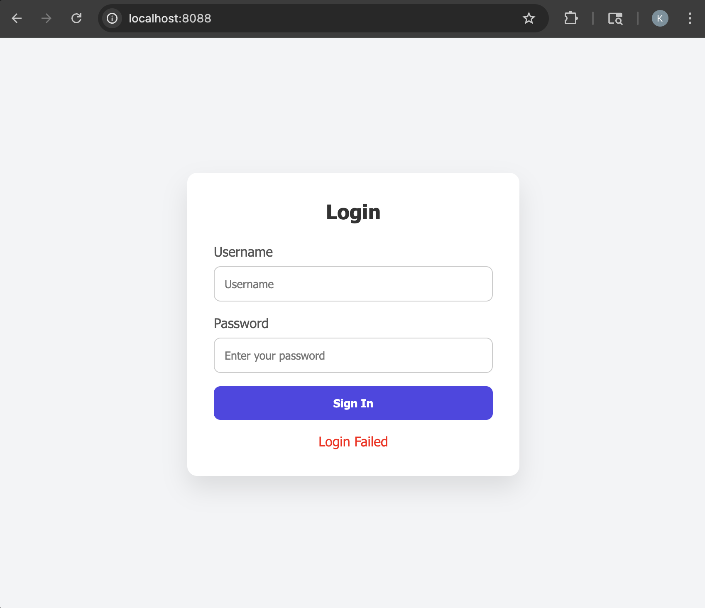
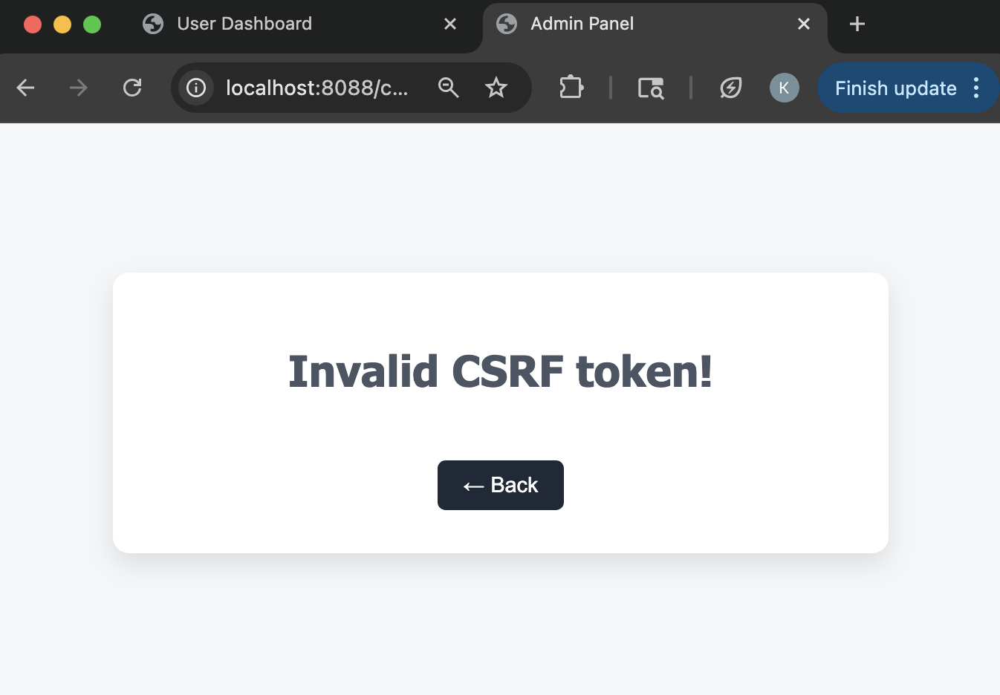

# Task 5 - Cross Site Request Forgery (CSRF)

Cross-Site Request Forgery (CSRF) is list among the OWASP Top vulnerabilities because it exploits a fundamental flaw in how web applications handle user authentication and session management. This vulnerability allows an attacker to trick a victim into performing unintended actions on a web application in whey they are already authenticated. Since the request appears legitimate and comes from the authenticated user, the web application oft processes it without verifying the origin. 

While XSS attacks run code in your browser whether you are logged in or not, CSRF attacks tricks you browser into sending request that relies on a logged-in session.

## What You'll Learn
In this section, you will:

- Understand how CSRF works and how dangerous it is
- Learn how to construct a CSRF attack vector
- See firsthand how authentication is abused
- Discover how to defend against a CSRF attack

## Prerequisite 
Before you begin this section, 

- The deliberate vulnerable web application has been downloaded. If not, follow the guide in the [Getting Started](/getting_started) section.

## Step 1: Login Vulnerable Web Application
First, login to the Vulnerable Web Application. This vulnerability relies on an authenticated session

1. Navigate to the Vulnerable Web Application by clicking this hyperlink [http://localhost:8088](http://localhost:8088) or by typing this url in your Web Browser of choice
    <figure markdown>
    { width="400" }
    </figure>

2. Provide one of the following credentials to login to the application
    - Admin
        - **Username**: `admin`
        - **Password**: `admin`
    - User
        - **Username**: `user`
        - **Password**: `pass`

    <figure markdown>
    { width="400" }
    </figure>

## Step 2: Out-of-the-Box Behavior
To ensure the application does what you would like it to do, change the password for the user you are logged in as. 

1. On the dashboard page of the application, type a new password in the `New Password` text box

2. Click **`Change Password`**
    <figure markdown>
    { width="400" }
    </figure>

3. Verify the password has been changed for the logged in user
    - Click the `<- Back` button
    - Click `Logout`
    - Login as the previous user, with the new password

## Step 3: Create the CSRF Attack Page
CSRF attacks usually will begin with some sort of phishing attempt like an email posed as the site with a message enticing you to click a link. The attack occurs when you click on the link and the moment the page loads a malicious script is executed. However, it assumes you are already logged in as an authenticated user. 

1. In VS Code, Click any where in an open area of the Explorer pane, then click the new file icon, name the file `csrf_attack.html`.
    <figure markdown>
    { width="300" }
    </figure>

2. Create the foundational elements of an HTML file
    ```html 
    <!DOCTYPE html>
    <html>
        <body>
        
        </body>
    </html>
    ```

3. Inside the `body` HTML element, add a `h2` tag with the value `You have a New Message`
    ```{.html hl_lines="4"}
    <!DOCTYPE html>
    <html>
        <body>
            <h2> You have a New Message</h2>
        </body>
    </html>
    ```
4. Next, create a HTML image element that will execute an `onerror` function for a bad image source
    ```{.html hl_lines="5"}
    <!DOCTYPE html>
    <html>
        <body>
            <h2> You have a New Message</h2>
            
        </body>
    </html>
    ```

5. Update the `img` `onerror` attribute with a JavaScript function to create a form
    ```{.html hl_lines="2"}
    
    ```

6. Continue refining the JavaScript to add a form action that will execute a HTTP `POST` request to `http://localhost:8088/change_password`
    ```{.html hl_lines="3 4"}
    
    ```

7. Before you continuing refining the `onerror` JavaScript, you need to get the text box's reference that takes the new password. 
    - Open the Vulnerable Web Application, [http://localhost:8088](http://localhost:8088), and proceed to login if not logged in already.

    - Open the `Inspect` window for the browser

        | Browser           | Instructions       |
        | ----------------- | ----------------- |
        | Google Chrome     | Right-click anywhere on the page, then click `Inspect`        |
        | Mozilla Firefox   | Right-click anywhere on the page, then click `Inspect`        |
        | Microsoft Edge    | Right-click anywhere on the page, then click `Inspect`        |
        | Safari            | Right-click anywhere on the page, the click `Inspect Element` _(Developer Tools must be enabled)_ |

    - Click the `Elements` tab
        <figure markdown>
        { width="600" }
        </figure>

    - In the code shown, unfold the `<body>`, `<div class="container">`, then `<form action="/change_password" method="post">` tags by clicking the arrow to the left side of the tag
        <figure markdown>
        { width="600" }
        </figure>

    - Notice the `<input type="text" name="new_password" placeholder="New Password">`. The `name` is what binds the text you put in the textbox to the HTTP request to change the password. You will use the `name` value `new_password` in your `csrf_attack.html`

8. Back in VS Code inside the `csrf_attack.html` file, define an input element in the JavaScript code
    ```{.html hl_lines="6"}
    
    ```

9. Set the type of input to `hidden` so that its not visible to the user
    ```{.html hl_lines="7"}
    
    ```

10. Set a name reference of the input that will be used to send to the HTTP request. The name reference will be the value you saw in the inspect window of the `Change Password` form
    ```{.html hl_lines="8"}
    
    ```

11. Set the value of the input field. This value will be the new password when the malicious script is executed
    ```{.html hl_lines="9"}
    
    ```

12. Now that you have created both a form and the input elements, you need to associate the input element as a child of the form. 
    ```{.html hl_lines="11"}
    
    ```

13. Next, associate the form to the DOM body
    ```{.html hl_lines="12"}
    
    ```

14. Lastly, you want the form to be submitted once image fails to load
    ```{.html hl_lines="13"}
    
    ```

15. Save `csrf_attack.html` file
    - In the top left corner, click `File`, then `Save` in the drop down menu; <br>or<br>

    - Use the respective shortcuts to save the file 

        - MacOS <br>
        <kbd>Command</kbd> + <kbd>S</kbd>

        - Windows <br>
        <kbd>Ctrl</kbd> + <kbd>S</kbd>

## Step 4: Execute the CSRF Attack

1. In VS Code, right click on the `csrf_attack.html`
    <figure markdown>
    { width="400" }
    </figure>

2. In the drop down menu, click `Copy Path`, this will copy the file's location url
    <figure markdown>
    { width="400" }
    </figure>

3. Ensure you are logged into [http://localhost:8088](http://localhost:8088)
    - Admin
        - **Username**: `admin`
        - **Password**: `admin`
    - User
        - **Username**: `user`
        - **Password**: `pass`

4. Open a new browser tab in the same browser window
    - **Windows:** <kbd>Ctrl</kbd> + <kbd>T</kbd>
    - **Mac:** <kbd>Command</kbd> + <kbd>T</kbd>

5. Paste in the URL/Path that was copied from VS Code, then press <kbd>Enter</kbd>. The page should be redirected to the expected `Password Changed` webpage
    <figure markdown>
    { width="400" }
    </figure>

6. Verify that the password has indeed changed for the user that was logged in
    - Click on the `User Dashboard` browser tab, then `Logout`
    - Try logging into the application with the expected password
        <figure markdown>
        { width="400" }
        </figure>
    - Now try logging in with the password you set in the `csrf_attack.html`
        <figure markdown>
        { width="400" }
        </figure>

## Step 5: Protect Against CSRF Vulnerabilities 
There are many ways to protect against CSRF attacks. The most common and widely recommended approach is the use of CSRF tokens in combination with SameSite cookies. 

In this lab to protect against CSRF, the following steps will guide you through the most common and widely used approach: 
    
- Set the session to use SameSite=Strict, HTTP-Only
- Generate a CSRF Token
- Store it in the user's session
- Inject the CSRF token into the HTML form 
- Validate the CSRF Token from form request against user session

### Configure Session Cookie Settings

1. In VS Code, open the `app.py` file

2. Take a look at the following code block
    ```{.python .no-copy}
    from flask import Flask, request, render_template, redirect, url_for, session
    import sqlite3

    app = Flask(__name__)
    app.secret_key = 'secret'  # Weak session secret
    ```

3. After the `app.secret_key`, use the Flask instance to set the session cookie settings to be more secured
    ```{.python hl_lines="6 7 8 9"}
    from flask import Flask, request, render_template, redirect, url_for, session
    import sqlite3

    app = Flask(__name__)
    app.secret_key = 'secret'  # Weak session secret
    app.config.update(
        SESSION_COOKIE_HTTPONLY=True, 
        SESSION_COOKIE_SAMESITE='Strict'
    )
    ```

    | Key               | Description       |
    | ----------------- | ----------------- |
    | `SESSION_COOKIE_HTTPONLY`   | Restricts the session cookie to be accessible only through HTTP, preventing JavaScript from accessing it and thereby protecting against session theft via XSS attacks.    |
    | `SESSION_COOKIE_SAMESITE`   | Helps reduce the risk of cross-origin requests (CSRF) by ensuring the cookie is only sent when the request originates from your own site, preventing it from being transmitted from external origins.    |
    | `SESSION_COOKIE_SECURE`     | The cookie is only sent over encrypted HTTP connections (HTTPS). ***Not used in this lab as everything is done on the local machine.***  |

### Generate CSRF Token & Store in User Session

1. At the top of the `app.py` file, import the `secrets` built-in library
    ```{.python hl_lines="3"}
    from flask import Flask, request, render_template, redirect, url_for, session
    import sqlite3
    import secrets
    ```

1. Next, take a look at the following code in `app.py`
    ```{.python .no-copy}
    @app.route('/dashboard', methods=['GET', 'POST'])
    def dashboard():
        if 'username' not in session:
            return redirect('/')
        if request.method == 'POST':
            # XSS vulnerability
            comment = request.form['comment']
            return f"<h2>Your Comment:</h2><p>{comment}</p>"
        return render_template('dashboard.html', username=session['username'])
    ```

2. In between the two `return` statements insert the following code to generate a CSRF token and set it in the user's session
    ```{.python hl_lines="9"}
    @app.route('/dashboard', methods=['GET', 'POST'])
    def dashboard():
        if 'username' not in session:
            return redirect('/')
        if request.method == 'POST':
            comment = request.form['comment']
            return f"<h2>Your Comment:</h2><p>{comment}</p>"

        session['csrf_token'] = secrets.token_hex(16)
        return render_template('dashboard.html', username=session['username'])
    ```

    This will create a CSRF Token every time the dashboard page loads. For heighten security, you do not want the CSRF Token to be long standing to avoid reuse. 

3. Update the last `return` statement to include a new parameter with the `csrf_token` that will be passed to the `dashboard.html` template
    ```python
    return render_template('dashboard.html', username=session['username'], csrf_token=session['csrf_token'])
    ```

4. Save `app.py` file
    - In the top left corner, click `File`, then `Save` in the drop down menu; <br>or<br>

    - Use the respective shortcuts to save the file 

        - MacOS <br>
        <kbd>Command</kbd> + <kbd>S</kbd>

        - Windows <br>
        <kbd>Ctrl</kbd> + <kbd>S</kbd>

### Inject CSRF Token in HTML Form

1. Open the `dashboard.html` template that's located under the `templates` folder in VS Code

2. Take a look at the following code

    ```{.html .no-copy}
    <form action="/change_password" method="post">
        <input type="text" name="new_password" placeholder="New Password" />
        <input type="submit" value="Change Password" />
    </form>
    ```

3. Update the form using the Jinja2 template syntax to include the `csrf_token` in a hidden input field. The hidden input field will still be visible in the page source but it will be validated against the session on submission 

    ```{.html hl_lines="2"}
    <form action="/change_password" method="post">
        <input type="hidden" name="csrf_token" value="{{ csrf_token }}" />
        <input type="text" name="new_password" placeholder="New Password" />
        <input type="submit" value="Change Password" />
    </form>
    ```

4. Save `dashboard.html` file
    - In the top left corner, click `File`, then `Save` in the drop down menu; <br>or<br>

    - Use the respective shortcuts to save the file 

        - MacOS <br>
        <kbd>Command</kbd> + <kbd>S</kbd>

        - Windows <br>
        <kbd>Ctrl</kbd> + <kbd>S</kbd>

### Validate CSRF Token 

1. In VS Code, open the `app.py` file

2. Take a look at the following code 
    ```{.python .no-copy}
    @app.route('/change_password', methods=['POST'])
    def change_password():
        # CSRF Vulnerability
        new_pass = request.form['new_password']
        conn = sqlite3.connect('database.db')
        cursor = conn.cursor()
        cursor.executescript(f"UPDATE users SET password = '{new_pass}' WHERE username = '{session['username']}'")
        conn.commit()
        conn.close()
        return render_template('response.html', response="Password Changed!")
    ```

3. Update the `change_password()` method to get the CSRF Token from the form
    ```{.python hl_lines="3"}
    @app.route('/change_password', methods=['POST'])
    def change_password():
        token = request.form['csrf_token']
        
        new_pass = request.form['new_password']
        conn = sqlite3.connect('database.db')
        cursor = conn.cursor()
        cursor.executescript(f"UPDATE users SET password = '{new_pass}' WHERE username = '{session['username']}'")
        conn.commit()
        conn.close()
        return render_template('response.html', response="Password Changed!")
    ```

4. On the next line, get the expected CSRF Token from the user's session
    ```{.python hl_lines="4"}
    @app.route('/change_password', methods=['POST'])
    def change_password():
        token = request.form['csrf_token']
        expected_token = session['csrf_token']
        
        new_pass = request.form['new_password']
        conn = sqlite3.connect('database.db')
        cursor = conn.cursor()
        cursor.executescript(f"UPDATE users SET password = '{new_pass}' WHERE username = '{session['username']}'")
        conn.commit()
        conn.close()
        return render_template('response.html', response="Password Changed!")
    ```

5. Next, check if the `token` exist and that it matches the expected token. If it does not match then return an invalid response
    ```{.python hl_lines="6 7"}
    @app.route('/change_password', methods=['POST'])
    def change_password():
        token = request.form['csrf_token']
        expected_token = session['csrf_token']

        if not token or token != expected_token:
            return render_template('response.html', response="Invalid CSRF Token"), 403
        
        new_pass = request.form['new_password']
        conn = sqlite3.connect('database.db')
        cursor = conn.cursor()
        cursor.executescript(f"UPDATE users SET password = '{new_pass}' WHERE username = '{session['username']}'")
        conn.commit()
        conn.close()
        return render_template('response.html', response="Password Changed!")
    ```

6. Save `app.py` file
    - In the top left corner, click `File`, then `Save` in the drop down menu; <br>or<br>

    - Use the respective shortcuts to save the file 

        - MacOS <br>
        <kbd>Command</kbd> + <kbd>S</kbd>

        - Windows <br>
        <kbd>Ctrl</kbd> + <kbd>S</kbd>

### Test CSRF Attack Protection

1. Navigate to the Vulnerable Web Application by clicking this hyperlink [http://localhost:8088](http://localhost:8088) or by typing this url in your Web Browser of choice
    - If you are already logged in, click `Logout`

2. Provide a different user credential to login into the application. The one you used before password has been changed. So for simplicity, test against another user to make sure their password doesn't change. 
    - Anakin
        - **Username**: `anakin`
        - **Password**: `skywalker123`
    - Vader
        - **Username**: `vader`
        - **Password**: `darth246`

3. In VS Code, right click on the `csrf_attack.html`
    <figure markdown>
    { width="400" }
    </figure>

4. In the drop down menu, click `Copy Path`, this will copy the file's location url
    <figure markdown>
    { width="400" }
    </figure>

5. Open a new browser tab in the same browser window
    - **Windows:** <kbd>Ctrl</kbd> + <kbd>T</kbd>
    - **Mac:** <kbd>Command</kbd> + <kbd>T</kbd>

5. Paste in the URL/Path that was copied from VS Code, then press <kbd>Enter</kbd>. You should receive `Invalid CSRF token!`
    <figure markdown>
    { width="400" }
    </figure>

6. Verify that the password has **not** changed for the user that was logged in
    - Click on the `User Dashboard` browser tab, then `Logout`
    - Try logging into the application with the password you set in the `csrf_attack.html`
        <figure markdown>
        { width="400" }
        </figure>
    - Now try logging in with the original password
        <figure markdown>
        { width="400" }
        </figure>

### Bonus Challenge
In the changed made to protect against a CSRF vulnerability, you have injected the CSRF Token into the HTML form which is now visible in the DOM when viewing the page source. 

- Investigate the DOM of the `User Dashboard` to retrieve the reference and the value for the CSRF Token
- Update the `csrf_attack.html` to include a new `input` element in the JavaScript created form and insert the CSRF Token as the value
- Test that you are not able to update the logged in user's password.

## Congratulations!
In this section of the lab, you have learned and experienced:

- How to identify Cross-Site Request Forgery and the impact it may have
- How to exploit CSRF vulnerabilities
- How to validate request authenticity using CSRF tokens
- How SameSite Cookie controls cross-site cooke behavior by protecting the session from external origins
